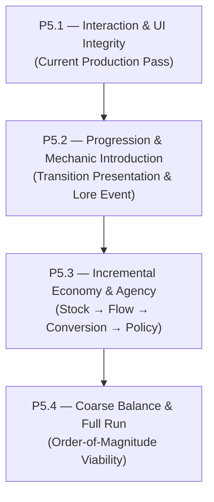

# 09 — P5 Core Loop & Product Cohesion Roadmap

---

## 1. Product Thesis

Following the technical, state-authority, and interaction foundations established across P1–P4, the primary product question is no longer architectural validity. It is product cohesion and incremental engagement:

> **"Players should feel that they are building and operating an increasingly capable physical system, rather than merely clicking the next unlocked button."**

The objective of P5 is to transform the existing discrete upgrade chains into a coherent, deeply engaging incremental engine where physical mechanics feel distinct, progression transitions feel momentous, and player choices produce tangible system outcomes.

---

## 2. Roadmap Phases Overview

### P5.1 — Interaction & UI Integrity (Active Phase)
Eliminates interaction bugs, presentation inconsistencies, and digit jitter across all current surfaces before executing gameplay restructures:
- **Whole-number visible stock balances:** Truncated display floor prevents misleading affordability indicators while retaining underlying high-precision Decimal state.
- **Model-C Contextual Quick Action Integrity:** Resolves stale closure event capture in Era-II Cosmos so enabled contextual actions dispatch and execute reliably.
- **Era-III Buy Max Correction:** Fixes hardcoded unit purchasing on Forge Stellar Core nodes so `Buy 10` and `Buy Max` execute iterative multi-level purchases.
- **Header Alignment Normalization:** Aligns Era-II top-header and Matter Production status panels with existing design system hierarchy.
- **Codex & Archive Geometry Stability:** Locks navigation column geometry so article selection never introduces layout shifts.
- **Cross-Era Information Grammar:** Normalizes resource placement hierarchy (Primary, Support, Rates, Process, Gateway) across Eras I–III.
- **Reduced Motion Settings Simplification:** Removes redundant player-facing setting toggle while preserving 100% OS-level `prefers-reduced-motion: reduce` compliance across CSS and Canvas.

### P5.2 — Progression & Mechanic Introduction (Future Scope)
- Meaningful introduction and onboarding for newly revealed mechanics.
- Qualitative transition presentation for Cosmic Inflation, Recombination, and Stellar Dawn.
- Theatrical Legacy / Supernova prestige presented as a significant cosmic milestone rather than merely a new navigation tab:
  - Transparent communication of what changes, what is sacrificed, what persists, and what is gained.

### P5.3 — Incremental Economy & Agency (Future Scope)
Addresses the symptom of linear upgrade clicking in Era I and early Era III:
- Transition from simple unlock ladders to systemic operations:
  $$\text{STOCK} \longrightarrow \text{FLOW} \longrightarrow \text{CONVERSION} \longrightarrow \text{ALLOCATION / POLICY} \longrightarrow \text{TRANSFORMATION}$$
- Deepen Era-I quantum fluctuation dynamics beyond linear upgrade acquisition.
- Expand Era-III stellar nucleosynthesis and stellar configuration choices prior to Supernova.

### P5.4 — Coarse Balance & Full Run (Future Scope)
- Verify end-to-end viability of all progression routes across orders of magnitude.
- Validate balance between Era-II cooling and matter synthesis pathways.
- Ensure human playtest full runs can smoothly navigate Era I through Supernova reset without artificial bottlenecks.

---

## 3. Reference Benchmark Track (Future Design Input)

To inform P5.2 and P5.3 design without cloning features or destabilizing scope, the following reference incremental titles will be evaluated:

| Candidate Title | Key System Strengths to Study |
| :--- | :--- |
| **Antimatter Dimensions** | Dimension tiering, exponential acceleration, crisp prestige layers, automation unlocking. |
| **CIFI (Cell Idle Factory Incremental)** | Complex loop interconnectivity, loop specialization, mechanical synergy. |
| **ISEPS** | Distinct particle systems, state-switching policies, color/identity differentiation. |
| **Realm Grinder** | Faction identity, deep build differentiation, active vs. passive alignment. |
| **Orb of Creation** | Spatially grounded crafting, resource conversion dynamics, spell/channel allocation. |
| **The Gnorp Apologue** | Expressive visual causality, tangible physical agency, clear conversion pipelines. |

**Key Research Inquiries:**
1. What does the player own and build over time?
2. What physical systems convert into higher-order physical systems?
3. Where do meaningful player decisions take place?
4. What becomes automated or obsolete as new cosmic epochs emerge?
5. How are prestige milestones dramatized?

---

## 4. Graphical Polish & Unity Scenario (Future Strategy)

1. **Current Sequence:**
   $$\text{Gameplay / Concept} \longrightarrow \text{Product Cohesion} \longrightarrow \text{Balance} \longrightarrow \text{Major Visual Polish}$$
2. **Platform Scenarios:**
   - **Path A (Web First):** Continue with current lightweight HTML5/Canvas 2D stack, polishing shaders, background dynamics, and particle causality.
   - **Path B (Visual Slice Exploration):** Build an isolated Unity visual prototype later to benchmark fidelity, development velocity, and deployment overhead.
3. **Execution Guardrail:** No renderer migration or Unity code work in P5.1.

---

## 5. Milestone Tracking & Closure Matrix

| Milestone | Scope Summary | Implementation Status | Publication Status |
| :--- | :--- | :---: | :---: |
| **P4 Overall** | Era-II Postures, Model C, Core Causality, Handoff A | **Complete** | **`p4-stable-v1` Published** |
| **P5.1** | Interaction & UI Integrity (Whole Numbers, Model C, Buy Max, Layouts) | **In Progress** | **Local Only** |
| **P5.2** | Progression & Narrative Transitions (Prestige Onboarding) | *Not Started* | *Pending* |
| **P5.3** | Incremental Systems & Agency (Stock / Flow / Conversion / Policy) | *Not Started* | *Pending* |
| **P5.4** | Coarse Balancing & Playable Full Run Validation | *Not Started* | *Pending* |
