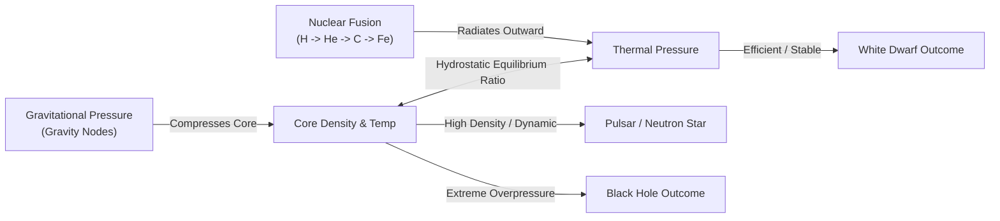
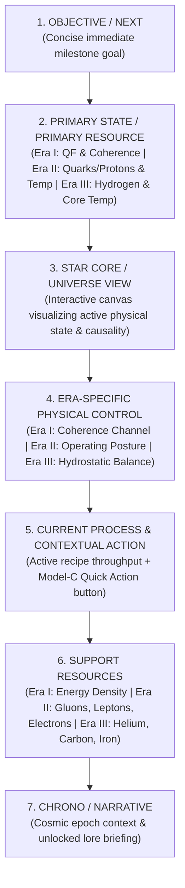

# 10 — P5 Design Synthesis: Defining the Physical Machines of Eras I–III

---

## 1. Executive Summary & Design Scope

### Status & Guardrails
- **Status:** `DESIGN SYNTHESIS — AWAITING HUMAN REVIEW`
- **Scope:** Design only. **Zero gameplay implementation** in this phase.
- **Baseline:** P5.1 is complete, human-approved, and published to `star/main`.
- **Precedent Baseline:** `p4-stable-v1` remains untouched and authoritative.

### Epistemological Distinctions
To maintain strict architectural and design clarity, every statement in this document belongs to one of six explicit categories:
1. `[CURRENT PRODUCTION]`: Authoritative reality currently running in `main` code.
2. `[OBSERVED PLAYTEST PROBLEM]`: Verified human full-run friction or telemetry evidence.
3. `[RESEARCH-DERIVED HYPOTHESIS]`: Theoretical lessons derived from genre benchmarks.
4. `[DESIGN CANDIDATE]`: Evaluated architectural models for future phases.
5. `[DESIGN RECOMMENDATION]`: Recommended design path (**NOT YET HUMAN APPROVED**).
6. `[HUMAN-APPROVED DECISION]`: Formally approved decisions recorded in `DECISIONS.md`.

---

## 2. The Core Product Thesis

> **"Steering the physical conditions of a young universe, reading their consequences, and choosing what that universe becomes."**

### The P5 Product Refinement
> **"Players should feel that they are building and operating an increasingly capable physical system, rather than merely clicking the next unlocked button."**

Star Forge Idle is explicitly **NOT**:
- A spatial factory simulator or conveyor logistics puzzle.
- A real-time strategy or micro-management game.
- A spreadsheet optimizer requiring third-party calculators.
- An upgrade ladder where "progress" is simply buying independent $+X\%$ multipliers.

Instead, Star Forge is an **incremental physical system simulator**:
$$\text{PHYSICAL CONDITION} \longrightarrow \text{OBSERVATION / PROCESS} \longrightarrow \text{COUPLING \& THROUGHPUT} \longrightarrow \text{STRUCTURAL TRANSFORMATION}$$

---

## 3. Current Machine Maps (Production Reality)

```mermaid
graph TD
  subgraph Era_I_Current["Era I: Current Production (Quantum Foam)"]
    QF["Quantum Fluctuations (QF)"] -->|"Fund (10 to 18,000 QF)"| Laws["5 Fundamental Laws\n(Gravity, Weak, EM, Resonance, Strong)"]
    Laws -->|Passive Gen| QF
    Laws -->|Passive Gen| ED["Energy Density (ED)"]
    Laws -->|Harmony Synergy| Mult["+5% Harmony Bonus / Tier"]
    Obs["Core Observation (Click)"] -->|+1 QF / +0.5% Coherence| QF
    Obs --> VC["Vacuum Coherence (0-100%)"]
    ED -->|Log Cooling| Temp1["Era I Temp (1e32 -> 1e27 K)"]
    Gate1{"Cosmic Inflation\n(100k QF, 50k ED, 100% VC)"}
  end

  subgraph Era_II_Current["Era II: Current Production (Primordial Soup)"]
    Posture["Operating Posture\n(ACCUMULATE | BALANCE | CONDENSE)"]
    QC["Quark Condenser"] -->|Quarks| Synth["Proton Synthesizer\n(3 Q + 1 G -> 1 P)"]
    GM["Gluon Matrix"] -->|Gluons| Synth
    LC["Lepton Collector"] -->|Leptons| Decay["Lepton Decay (<500k K)\n(1 L -> 1 e-)"]
    Synth -->|Protons| Radiator["Baryo Radiator\n(2 P -> 7,500 K Cool)"]
    Synth -->|Protons| RecombP["Recombination Pathway"]
    Decay -->|Electrons| RecombP
    Radiator -->|Cools Plasma| Temp2["Plasma Temp (1e9 -> 3,000 K)"]
    RecombP -->|"Passive (Temp <100k K)"| H2["Primordial Hydrogen"]
    Gate2{"Recombination Transition\n(1M Protons OR Temp <= 3,000 K)"}
  end

  subgraph Era_III_Current["Era III: Current Production (Stellar Dawn)"]
    Grav["Gravity Nodes"] -->|Produces| Hyd["Hydrogen"]
    Fusers["Fuser Nodes"] -->|"Consumes H (10 H -> 1 He)"| Hel["Helium"]
    Compress["Compression Action"] -->|"Consumes He (+3.5M K)"| Temp3["Core Temperature"]
    Temp3 -->|">= 500M K"| Carb["Carbon Synthesis\n(50 He -> 1 C)"]
    Temp3 -->|">= 2.0B K"| Iron["Iron Synthesis\n(250 C -> 1 Fe)"]
    Builds["Stellar Builds\n(Efficient, Massive, Compact)"] --> Remnant["Remnant Archetype Prediction"]
    Gate3{"Supernova Prestige\n(Main Sequence, >=100M K, 1k Fe)"}
  end
```



### Era I: Current Production Reality
- **What does the player currently build?** 5 sequential Fundamental Law upgrades (`gravityForce`, `weakForce`, `electromagneticForce`, `vacuumResonance`, `strongForce`).
- **What flows through it?** Quantum Fluctuations (currency) and Energy Density (threshold metric).
- **What is the current bottleneck?** Passive generation waiting time; Vacuum Coherence accumulation ($0.1\%/\text{s}$ passive).
- **What does the player currently control?** Core Observation click timing; sequential purchase order of 5 upgrades.
- **What event currently proves mastery?** Reaching static numeric thresholds: $100,000\text{ QF} + 50,000\text{ ED} + 100\%\text{ Coherence}$.
- **What currently becomes automated?** Passive QF and ED production are automated by purchasing laws.
- **Current Machine Classification:** `UPGRADE LADDER` (with embryonic synergy via Harmony tiers).

### Era II: Current Production Reality
- **What does the player currently build?** Hadronic infrastructure (Quark Condenser, Gluon Matrix, Lepton Collector, Proton Synthesizer, Baryogenesis Radiator).
- **What flows through it?** Quarks, Gluons, Leptons, Protons, Electrons, and Plasma Thermal Energy.
- **What is the current bottleneck?** Dynamically shifts between Quarks (early), Gluons/Binding (mid), Proton capacity vs. Thermal Cooling (late).
- **What does the player currently control?** 
  1. Operating Postures (`ACCUMULATE` for $+50\%$ flux / $-30\%$ cool, `BALANCE` for $1.0\times$, `CONDENSE` for $+50\%$ binding / $+50\%$ cool / $-30\%$ flux).
  2. Model-C Contextual Quick Actions (`BUY_UPGRADE_PLASMA`).
  3. Strategic transition route choice (Matter Path: 1,000,000 Protons vs. Thermal Path: $\le 3,000\text{ K}$).
- **What event currently proves mastery?** Navigating the phase transition to Recombination readiness (either via thermal management or matter accumulation).
- **What currently becomes automated?** Raw particle generation, Lepton decay, and passive Recombination ($T < 100,000\text{ K}$).
- **Current Machine Classification:** `SYSTEM MACHINE` (Coupled multi-variable physical network).

### Era III: Current Production Reality
- **What does the player currently build?** Gravity generators, Auto-Fusers, Compression thermal pulses, Carbon/Iron synthesizers, and 3 Stellar Archetype investments (Efficient, Massive, Compact).
- **What flows through it?** Nuclear fuel chain: $\text{Hydrogen} \to \text{Helium} \to \text{Carbon} \to \text{Iron}$, coupled with Core Temperature.
- **What is the current bottleneck?** 
  - *Early Era III:* Hydrogen generation and Helium accumulation for manual Compression pulses.
  - *Mid Era III:* Core Temperature thresholds ($500\text{M K}$ for Carbon, $2.0\text{B K}$ for Iron).
  - *Late Era III:* Iron accumulation ($1,000\text{ Fe}$) and Archetype configuration.
- **What does the player currently control?** 
  1. Gravity and Fuser scaling.
  2. Compression timing.
  3. Archetype investment balance (Efficient vs. Massive vs. Compact) which dictates the predicted stellar collapse outcome (White Dwarf, Black Hole, Pulsar, Neutron Star).
  4. Deliberate Supernova reset trigger.
- **What event proves mastery?** Successful synthesis of Iron, achieving Main Sequence stability, and executing a deliberate Supernova with predicted remnant rewards.
- **What currently becomes automated?** Hydrogen generation, auto-fusion, and (via Pulsar Shards) auto-compression.
- **Current Machine Classification:** `MIXED` (Early Era III is an Upgrade Ladder; Late Era III is a System Machine with meaningful prestige steering).

---

## 4. Why Era II Agency Works: The Internal Control Case

`[OBSERVED PLAYTEST FINDING]`: Human playtesting confirmed that Era II feels substantially more engaging and player-directed than Era I or early Era III.

### The Concrete Agency Mechanism in Era II
The perceived agency in Era II is **not** magic, nor is it merely "having three posture buttons." It stems from seven structural properties:

1. **Coupled Multi-Variable State:** A single action changes a multi-dimensional system rather than an isolated scalar. Activating `CONDENSE` simultaneously increases cooling rate, accelerates proton synthesis, and suppresses raw quark flux.
2. **Visible Trade-offs without Permanent Penalty:** The player visibly trades raw intake for processing efficiency. The trade-off is immediately reversible (zero switch penalty, zero cooldown lock-in, zero build trap).
3. **Legible Bottleneck Shifting:** The player can look at the Cosmos HUD and immediately diagnose *why* production stalled (e.g. "Gluons are depleted while Quarks are full $\to$ switch to `ACCUMULATE`" or "Temperature is stalling Proton survival $\to$ switch to `CONDENSE`").
4. **Multiple Viable Strategic Routes:** Recombination provides two genuine physical pathways:
   - *The Thermodynamic Pathway:* Radiate heat down to $3,000\text{ K}$ (favors `CONDENSE` and high Radiator investment).
   - *The Baryonic Mass Pathway:* Overpower thermal barriers by accumulating $1,000,000\text{ Protons}$ (favors `ACCUMULATE` and high Synthesizer investment).
5. **Clear Physical Meaning:** Every resource represents a real physical entity (Quark, Gluon, Lepton, Proton, Electron, Kelvin) behaving according to physical principles (hadron binding, beta decay, radiative cooling).
6. **Zero Micro-Management Trap:** `BALANCE` ($1.0\times$ baseline) guarantees steady, non-punishing progression for passive/idle play, while active posture steering rewards attention with a $2\times$ throughput advantage.
7. **Immediate Sensory Feedback:** The Star Core Canvas and HUD instantly reflect the active posture through color temperature, particle agitation, and rate indicators.

```text
ERA-II AGENCY MECHANISM (ABSTRACT REUSABLE PRINCIPLE):
"Agency emerges when player intent modulates the RELATIONSHIPS between coupled
physical flows, shifting legible bottlenecks toward a chosen physical outcome
without irreversible build penalties."
```

---

## 5. The Six Machine Questions

Every candidate system machine in Star Forge must provide definitive answers to these six architectural questions:

1. **WHAT DO I BUILD?** (What is the physical infrastructure?)
2. **WHAT FLOWS THROUGH IT?** (What are the inputs, working mediums, and outputs?)
3. **WHAT IS THE BOTTLENECK?** (What limits progression at each stage?)
4. **WHAT DO I CONTROL?** (What decisions modulate or reconfigure the system?)
5. **WHAT EVENT PROVES I MASTERED IT?** (How does the system test player competence?)
6. **WHAT THEN BECOMES AUTOMATED?** (What routine shifts into background execution?)

---

## 6. Era I Candidates: The Quantum Foam

### Design Constraints for Era I
- **Role:** Onboarding era. Must remain accessible and clean.
- **Vocabulary:** Strictly Quantum Fluctuations, Energy Density, Vacuum Coherence, Observation, Inflation. (No Hydrogen, stars, or complex networks).
- **Complexity Budget:** $0\text{–}1$ new persistent system concept; $1$ meaningful decision surface; zero build traps; zero required mathematical optimizers.

---

### Candidate I-A: Field Resonance Coupling (Allocation Engine)

```text
CONCEPT:
The 5 Fundamental Laws are not merely independent generators; they form a
resonant quantum field. The player allocates "Quantum Focus" (Coherence potential)
between two coupled modes:
  1. FLUCTUATION EXPANSION (High QF generation, low Energy Density)
  2. VACUUM CONDENSATION (High Energy Density & Coherence, low QF)
```

1. **What do I build?** The 5 Fundamental Laws, which increase total Field Capacity.
2. **What flows through it?** Quantum potential converting into Quantum Fluctuations (currency) and Energy Density (structure).
3. **What is the bottleneck?** Early: Field Capacity. Mid: Balancing QF spend on upgrades vs. maintaining enough Energy Density to cool the initial universe. Late: Vacuum Coherence reaching 100%.
4. **What do I control?** The **Coupling Focus Slider / Mode** (`EXPAND` vs. `STABILIZE`).
5. **What event proves mastery?** Achieving simultaneous Field Resonance (tuning the laws into harmonic ratio) to trigger **Cosmic Inflation**.
6. **What becomes automated?** Passive QF generation is locked into baseline throughput.
- **Retained Mechanics:** All 5 Fundamental Laws, Core Observation, QF, ED, Coherence, Cosmic Inflation.
- **Transformed Mechanics:** Fundamental Law synergy moves from a hidden harmony milestone to active field resonance coupling.
- **New State Required:** `state.era1.couplingMode` (`'EXPAND' | 'HARMONIZE' | 'STABILIZE'`).
- **New Player Controls:** 1 selector on Cosmos / Core context (3 discrete states).
- **Earliest Decision:** After unlocking Weak Nuclear Vector (Law 2), choosing whether to maximize QF buying speed or start building Energy Density.
- **Why not just an upgrade button?** It changes the conversion ratio of all existing generators dynamically.

---

### Candidate I-B: Wave-Packet Confinement & Superposition (Pulse & Squeeze)

```text
CONCEPT:
Quantum fluctuations spawn as unconfined probability waves. Observing the Core
"collapses" wave packets into discrete energy packets. Upgrades increase
Confinement Volume and Superposition Stability.
```

1. **What do I build?** Confinement boundaries (Fundamental Laws establish boundary strength).
2. **What flows through it?** Superposition wave amplitudes condensing into settled Energy Density.
3. **What is the bottleneck?** Wave decoherence rate: unobserved fluctuations leak into the void if confinement volume is insufficient.
4. **What do I control?** Observation Timing and Confinement Policy (Loose/Permissive vs. Tight/Coherent).
5. **What event proves mastery?** Sustaining Maximum Superposition across all 5 force sectors without decoherence collapse, triggering Inflation.
6. **What becomes automated?** Boundary maintenance becomes passive as higher laws unlock.
- **Retained Mechanics:** QF, ED, Coherence, 5 Laws.
- **Transformed Mechanics:** Observation becomes a wave-packet collapse trigger rather than a simple clicker.
- **New State Required:** `state.era1.superpositionPhase`, `state.era1.confinementState`.
- **New Player Controls:** Confinement mode switch (`PERMISSIVE` vs `CONFINED`).
- **Earliest Decision:** Deciding when to collapse accumulated superposition for a surge of Energy Density.
- **Why not just an upgrade button?** Involves temporal phase alignment between active observation and passive wave growth.

---

### Candidate I-C: Vacuum Coherence Channeling (Polarized Stabilizer)

```text
CONCEPT:
Vacuum Coherence is not an isolated slow timer; it is the physical medium that
amplifies all fundamental forces. The player channels Vacuum Coherence between
Force Propagation (QF boost) and Horizon Expansion (Energy Density boost).
```

1. **What do I build?** Fundamental Law nodes that channel coherence.
2. **What flows through it?** Vacuum Coherence flowing into Force Vectors.
3. **What is the bottleneck?** Coherence dissipation rate under high fluctuation turbulence.
4. **What do I control?** Channeling priority on the Cosmos HUD:
   - *Vector A: Force Propagation* ($+100\%\text{ QF Rate}$, $+0.05\%\text{ Coherence/s}$)
   - *Vector B: Vacuum Stabilization* ($+25\%\text{ QF Rate}$, $+0.30\%\text{ Coherence/s}$)
5. **What event proves mastery?** Stabilizing the vacuum at $100\%\text{ Coherence}$ while sustaining $\ge 50,000\text{ Energy Density}$.
6. **What becomes automated?** Base coherence stabilization becomes autonomous upon unlocking Strong Force.
- **Retained Mechanics:** 5 Laws, QF, ED, Coherence formulas, Inflation requirements.
- **Transformed Mechanics:** Coherence pacing directly responds to player allocation, resolving the observed "Coherence is too slow" playtest problem without arbitrary balance tweaks.
- **New State Required:** `state.era1.coherenceChannel` (`'PROPAGATION' | 'STABILIZATION'`).
- **New Player Controls:** 1 binary toggle / 2-state channel selector in Cosmos Core context.
- **Earliest Decision:** At Law 3 (Electromagnetic Tensor), deciding whether to speed up QF purchasing or accelerate Coherence stabilization toward Inflation.
- **Why not just an upgrade button?** It directly addresses the rate-limiting bottleneck of Era I through player intent.

---

### Era I Evaluation Matrix & Recommendation

| Criteria (Scale 1–5) | Candidate I-A (Field Resonance) | Candidate I-B (Wave Confinement) | Candidate I-C (Coherence Channeling) |
| :--- | :---: | :---: | :---: |
| **Ownership** | 4 | 4 | 4 |
| **Agency** | 4 | 4 | 4 |
| **Physical Coherence** | 5 | 4 | 5 |
| **Legibility** | 4 | 3 | 5 |
| **Incremental Satisfaction** | 4 | 4 | 5 |
| **Low UI Complexity** | 4 | 3 | 5 |
| **Low Guide Dependency** | 4 | 3 | 5 |
| **Reversibility** | 5 | 4 | 5 |
| **Reuse of Existing Systems** | 5 | 3 | 5 |
| **Implementation Cost** | 4 | 2 | 5 |
| **Total Score** | **43 / 50** | **34 / 50** | **48 / 50** |

```text
ERA-I DESIGN RECOMMENDATION (NOT HUMAN APPROVED):
CANDIDATE I-C: VACUUM COHERENCE CHANNELING (POLARIZED STABILIZER)

Rationale:
Candidate I-C achieves the exact onboarding agency goal with zero bloat. It takes
the single biggest playtest complaint ("Vacuum Coherence feels like waiting on a
slow timer") and transforms it into a meaningful physical operating decision:
channeling vacuum stability into raw fluctuation flux vs. horizon stabilization.
It requires only 1 clean selector, introduces 0 new currencies, and reuses 100% of
existing production state variables.
```

---

## 7. Era II Target Machine: The Primordial Soup

`[CURRENT PRODUCTION STATUS]`: Era II is already the strongest early machine in the game. It does not require a ground-up redesign.

```text
ERA-II TARGET MACHINE FLOW:
RAW HADRON INFLOW (Quarks + Gluons)
        ↓ [Hadron Binding Capacity]
BARYONIC MATTER (Protons + Leptons -> Electrons)
        ↓ [Radiative Thermal Dissipation]
SUB-MILLION KELVIN PLASMA
        ↓ [Recombination Reaction Rate]
PRIMORDIAL HYDROGEN & NEUTRAL GAS EMERGENCE
```

### What is Already Working in Era II
1. The 3 Operating Postures (`ACCUMULATE`, `BALANCE`, `CONDENSE`) create tangible physical agency.
2. The dual transition routes (Thermal $3,000\text{ K}$ vs. Mass $1\text{M Protons}$) reward distinct strategic playstyles.
3. Model-C Contextual Quick Actions provide immediate mechanical connection to the active bottleneck.
4. Canvas 2D thermal visualization reflects live plasma state.

### Identified Areas for Future Deepening (P5.3 Scope)
- **What still feels linear:** The Lepton Collector $\to$ Lepton Decay $\to$ Electron sub-chain currently operates largely behind the scenes as a passive temperature check ($T < 500,000\text{ K}$).
- **Future Systemic Opportunity:** In P5.3, make the Lepton-Electron ratio a visible catalytic component of Recombination efficiency without adding new currencies.

---

## 8. Era III Candidates: The Stellar Dawn

### Design Constraints for Era III
- **Role:** Mid-game engine and gateway to repeatable prestige.
- **Problem Statement:** Early Era III currently reverts to linear upgrade clicking (Gravity $\to$ Fuser $\to$ Compression clicks) until late stellar configuration unlocks.
- **Preserved Core Strength:** Late Era III configuration, remnant prediction, and deliberate Supernova reset must remain the grand payoff.
- **Complexity Budget:** Existing resources ($\text{H}, \text{He}, \text{C}, \text{Fe}, \text{Temp}$) + 1 coherent relationship layer. Zero new currencies.

---

### Candidate III-A: Hydrostatic Balance & Core Convection (Pressure-Thermal Engine)

```text
CONCEPT:
A star is a balance between Gravitational Inward Pressure and Thermal Outward
Radiation. The player manages the Hydrostatic Balance:
  - Inward Gravity increases Core Density (accelerating Fusion rate and Compression yield).
  - Outward Radiation increases Thermal Expansion (unlocking higher elemental burning).
If Gravity outpaces Radiation, the core heats faster but burns fuel rapidly.
If Radiation outpaces Gravity, the star stabilizes and burns fuel efficiently.
```



1. **What do I build?** Gravity nodes (inward force) and Fusion burning stages (outward thermal force).
2. **What flows through it?** Hydrogen/Helium fuel converting into thermal pressure and heavier elemental ashes.
3. **What is the bottleneck?** Hydrostatic stability: over-compressing without sufficient fusion causes fuel starvation; under-compressing stalls core heating below the Carbon ignition threshold ($500\text{M K}$).
4. **What do I control?** 
   - **Stellar Operating Balance:** Fuel Feed Rate vs. Gravitational Containment.
   - Compression pulse timing.
   - Allocation between stellar expansion and dense core burning.
5. **What event proves mastery?** Igniting the Iron Core ($2.0\text{B K}$) while maintaining hydrostatic containment, achieving a planned Remnant collapse.
6. **What becomes automated?** Baseline hydrogen collection and auto-fusion are automated as the star enters Main Sequence.
- **Connection to Existing Remnant System:** The hydrostatic pressure balance directly drives the three archetype metrics (`efficient` = high radiation stability, `massive` = extreme gravitational overpressure, `compact` = balanced high-density collapse).

---

### Candidate III-B: Multi-Shell Stellar Nucleosynthesis (Concentric Reactor)

```text
CONCEPT:
As Core Temperature rises, the star forms concentric burning shells:
  - Outer Shell: Hydrogen -> Helium
  - Middle Shell: Helium -> Carbon (Triple-Alpha, >=500M K)
  - Core Shell: Carbon -> Iron (Silicon Burning, >=2B K)
The player regulates "Convective Dredge-Up" between burning shells.
```

1. **What do I build?** Shell catalysts and convective transport channels.
2. **What flows through it?** Elemental fuel cascading from outer envelope to dense core.
3. **What is the bottleneck?** Thermal transport: heat from the core must migrate outward to keep the hydrogen envelope burning, while ashes must sink inward.
4. **What do I control?** **Convective Transport Policy** (`ENVELOPE DREDGE` vs. `CORE COMPRESSION` vs. `BALANCED BURNING`).
5. **What event proves mastery?** Sustaining all three concentric burning shells simultaneously to accumulate $1,000\text{ Fe}$.
6. **What becomes automated?** Outer hydrogen shell burning becomes autonomous once Helium burning ignites.
- **Connection to Existing Remnant System:** Envelope-dominant stars become White Dwarfs; Core-burning behemoths collapse into Black Holes; balanced shells form Pulsars.

---

### Candidate III-C: Stellar Ignition & Thermal Runaway (Ignition Staging)

```text
CONCEPT:
Early Era III is divided into explicit thermodynamic ignition phases:
  Phase 1: Protostellar Accretion (accumulating critical mass)
  Phase 2: Core Flash (Hydrogen ignition at 10M K)
  Phase 3: Main Sequence Equilibrium (steady Helium accumulation)
  Phase 4: Degenerate Core Compression (Carbon & Iron synthesis)
The player triggers explicit "Ignition Thresholds" that permanently transform
the Forge into higher-order operations.
```

1. **What do I build?** Accretion mass collectors and ignition conduits.
2. **What flows through it?** Gravitational potential energy converting into stellar luminescence and synthesized elements.
3. **What is the bottleneck?** Reaching the next thermal ignition threshold ($10\text{M K} \to 500\text{M K} \to 2\text{B K}$).
4. **What do I control?** Ignition trigger timing and fuel pre-loading before each ignition flash.
5. **What event proves mastery?** Triggering the final Iron Core Collapse (Supernova).
6. **What becomes automated?** Prior phase mechanics become self-sustaining upon triggering the next phase ignition.
- **Connection to Existing Remnant System:** The efficiency and speed of each ignition phase feed into the final remnant score.

---

### Era III Evaluation Matrix & Recommendation

| Criteria (Scale 1–5) | Candidate III-A (Hydrostatic Balance) | Candidate III-B (Concentric Shells) | Candidate III-C (Ignition Staging) |
| :--- | :---: | :---: | :---: |
| **Ownership** | 5 | 4 | 4 |
| **Agency** | 5 | 4 | 4 |
| **Physical Coherence** | 5 | 5 | 4 |
| **Legibility** | 4 | 3 | 4 |
| **Incremental Satisfaction** | 5 | 4 | 4 |
| **Low UI Complexity** | 4 | 3 | 4 |
| **Low Guide Dependency** | 4 | 3 | 5 |
| **Reversibility** | 5 | 4 | 4 |
| **Reuse of Existing Systems** | 5 | 4 | 5 |
| **Implementation Cost** | 4 | 3 | 4 |
| **Total Score** | **46 / 50** | **38 / 50** | **42 / 50** |

```text
ERA-III DESIGN RECOMMENDATION (NOT HUMAN APPROVED):
CANDIDATE III-A: HYDROSTATIC BALANCE & CORE CONVECTION

Rationale:
Candidate III-A elevates the entire stellar arc into a coherent physical machine.
Instead of early Era III feeling like buying disconnected Gravity and Fuser buttons,
the player is actively managing the fundamental physical balance of a living star:
Gravitational Inward Pressure vs. Outward Fusion Radiation.
Crucially, this flows seamlessly into the existing late-game archetype system:
- High Radiation Stability -> White Dwarf (Efficient Build)
- Extreme Gravitational Pressure -> Black Hole (Massive Build)
- High-Density Equilibrium -> Pulsar / Neutron Star (Compact Build)
It reuses 100% of existing currencies and variables without adding factory bloat.
```

---

## 9. Abstract Infrastructure: "Building" Without Factory Buildings

Star Forge avoids fictional industrial tropes ("Space Factories", "Quantum Mines"). Instead, infrastructure represents **physical systemic capability**:

| Era | Physical Infrastructure Concept | What it Physically Represents | Authoritative Anchor |
| :--- | :--- | :--- | :--- |
| **Era I** | **Field Capacity** | Maximum coherent energy density the local vacuum geometry can sustain before decohering. | Fundamental Law levels & Vacuum Resonance. |
| **Era I** | **Stabilization Throughput** | The rate at which quantum wave fluctuations settle into structured spacetime metrics. | Vacuum Coherence generation & Observation coupling. |
| **Era II** | **Hadron Binding Capacity** | The strong-force capacity to assemble free Quarks and Gluons into stable Baryons. | Proton Synthesizer level & Gluon Matrix density. |
| **Era II** | **Thermal Radiative Area** | Effective surface area for dissipating primeval plasma heat into dark vacuum. | Baryogenesis Radiator capacity & cooling flux. |
| **Era III** | **Gravitational Containment** | Inward pressure capable of binding hydrogen gas and compressing the stellar core. | Gravity node levels & Stellar Mass Index. |
| **Era III** | **Fusion Reaction Cross-Section** | Probability and rate of nuclear fusion per unit core volume at a given temperature. | Auto-Fusers, Carbon/Iron synthesis yield rates. |
| **Legacy** | **Cosmic Memory Matrix** | Invariant physical laws and constants that persist across universal resets. | Stardust Forge, Pulsar Engines, Tuning constants. |

---

## 10. The Automation Ladder

Automation in Star Forge is a **reward for conceptual mastery**, not an immediate skip button. The progression follows five distinct rungs:

```text
RUNG 1: MANUAL LOCAL ACTION
The player directly intervenes (e.g. Core Observation click, manual Compression pulse).
        ↓
RUNG 2: REPEATABLE SYSTEM
The player constructs continuous passive flow (e.g. Fundamental Law generation, Auto-Fusers).
        ↓
RUNG 3: AUTOMATED ROUTINE
The game executes basic maintenance automatically (e.g. Lepton decay, Auto-Buy Gravity, Auto-Compressor).
        ↓
RUNG 4: POLICY & ALLOCATION CONTROL
The player no longer buys units; they steer the system's operational balance (e.g. Era-II Postures, Era-I Coherence Channeling, Era-III Hydrostatic Balance).
        ↓
RUNG 5: TRANSFORMATION CONTROL
The player governs epochal phase shifts and universal resets (e.g. Cosmic Inflation, Recombination, Supernova, Galactic Ignition).
```

### Current Systems Mapped to the Automation Ladder

| System | Current Rung | Target Post-P5 Rung | Progression Trigger |
| :--- | :---: | :---: | :--- |
| **Era I Fluctuations** | Rung 2 (Passive Laws) | Rung 2 $\to$ 4 | Unlocking Law 3 unlocks Coherence Channeling. |
| **Era I Observation** | Rung 1 (Manual Click) | Rung 1 (Active Boost) | Remains optional manual acceleration. |
| **Era II Particle Inflow** | Rung 2 (Generators) | Rung 4 (Postures) | Posture selection modulates whole inflow network. |
| **Era II Recombination** | Rung 2 (Passive $T<100\text{k}$) | Rung 3 (Automated) | Occurs autonomously once thermal criteria are met. |
| **Era III Gravity Buying** | Rung 1 $\to$ 3 (AutoBuyer) | Rung 3 (Automated) | Stardust AutoBuyer unlocks at Carbon threshold. |
| **Era III Compression** | Rung 1 (Manual Action) | Rung 3 (Pulsar AutoCompress) | Pulsar Shard engine automates routine compression. |
| **Era III Archetype Steering** | Rung 4 (Build Selection) | Rung 4 (Hydrostatic Steering) | Balance between Gravity and Fusion dictates Remnant. |
| **Supernova Reset** | Rung 5 (Observer Decision) | Rung 5 (Meta Transformation) | Permanent player-authored prestige trigger. |

---

## 11. Mastery Events: Skill Demonstration vs. Numeric Waiting

```text
PRINCIPLE:
A true mastery event tests whether the player has structured a functional physical
system, not merely whether they left the tab open long enough to accumulate a number.
```

| Transition | Current Production Requirement | Mastery Demonstration (Systemic Intent) |
| :--- | :--- | :--- |
| **Era I $\to$ Era II (Inflation)** | $100\text{k QF} + 50\text{k ED} + 100\%\text{ VC}$ | Proving the vacuum is stable enough ($100\%\text{ Coherence}$) to withstand exponential metric expansion without tearing. |
| **Era II $\to$ Era III (Recombination)** | $1\text{M Protons}$ OR $T \le 3,000\text{ K}$ | Proving the player has either cooled the plasma to atomic binding temperatures or created enough matter density to overcome thermal dispersion. |
| **Era III $\to$ Supernova (Collapse)** | Main Sequence $+ T \ge 100\text{M K} + 1\text{k Fe}$ | Proving the star has completed the full stellar nucleosynthesis cycle down to the Iron core and configured its planned remnant fate. |
| **Era III $\to$ Era IV (Galactic Ignition)** | $T \ge 2.0\text{B K} + 1\text{k Fe}$ | Permanent transition gateway unlocking macro-scale galactic orbital structures. |

---

## 12. Legacy & Prestige: The Meta-Physical Connection

In P5.2 and beyond, the Legacy layer must not appear as "just another menu tab." It represents **Universal Meta-Physics**:

1. **What has the player built that Supernova transforms?** The physical star collapses, but its synthesized matter is blasted across the cosmos as **Stardust** ($\text{Fe} \to \text{Stardust}$), its collapsed core becomes a **Pulsar Shard Engine** or **Singularity Mass**, and its structural stability modifies the baseline constants of the next stellar cycle.
2. **What does a reset demonstrate about player control?** In the first run, the player was a victim of chaotic stellar collapse. In subsequent runs, the player is the **Stellar Architect**, deliberately selecting the mass, fuel efficiency, and density to sculpt specific universal remnants.
3. **Qualitative Shift:** Prestige does not simply give $+10\%$ generic speed. It provides:
   - *Stardust Forge:* Fundamental physical discounts and thermal insulation.
   - *Pulsar Engine:* Structural automation (Auto-Compressor, Catalytic Synthesizers).
   - *Singularity Horizon:* Exponential scaling factors that bend the rules of gravity and temperature.

---

## 13. The Cross-Era Abstraction Ladder

```text
ERA I: LOCAL PHYSICAL CONDITION
"I am stabilizing a quantum point in the void, tuning fundamental forces so that space does not collapse."
        ↓
ERA II: INTERACTING PHYSICAL FLOWS
"I am governing a boiling thermodynamic soup, balancing raw particle flux against cooling to forge the first atoms."
        ↓
ERA III: SELF-SUSTAINING STELLAR SYSTEM
"I am operating a living star, balancing gravity against nuclear fire to synthesize elements and determine its cosmic fate."
        ↓
LEGACY / PRESTIGE: METAPHYSICAL LAWS
"I am tuning the fundamental constants that govern all future stars and galaxies."
```

---

## 14. Red-Team Analysis of Candidate Models

### Red-Teaming Era-I Candidates

#### Candidate I-A (Field Resonance)
- **Dominant Strategy Risk:** Medium. Players might find one mathematical ratio of laws that is objectively optimal, turning it into a "set and forget" slider.
- **UI Burden:** Medium. Requires showing resonance ratios on 5 upgrade cards.

#### Candidate I-B (Wave-Packet Confinement)
- **Rapid-Toggle / Active Micro Risk:** **HIGH**. Players might feel compelled to click Observation at specific sub-second intervals to "catch the peak wave amplitude." (Violates Anti-Pattern 6).
- **Idle Incompatibility:** High. Punishes players who leave the game unattended if waves decohere.

#### Candidate I-C (Coherence Channeling) — Recommended
- **Dominant Strategy Risk:** Low. Early game demands QF propagation; late game demands Coherence stabilization. The optimal mode naturally flips as the player approaches the Inflation requirements.
- **Fake Choice Risk:** Low. Both modes provide massive clear benefits to distinct progression axes.
- **Idle Compatibility:** Excellent. Passive generation continues uninterrupted regardless of channel mode.
- **UI Burden:** Minimal. 1 two-state toggle in the Cosmos header context.

---

### Red-Teaming Era-III Candidates

#### Candidate III-A (Hydrostatic Balance) — Recommended
- **Dominant Strategy Risk:** Low. Different remnant targets require fundamentally different balance profiles (White Dwarf requires radiation dominance; Black Hole requires massive gravitational overpressure; Pulsar requires tight equilibrium).
- **Build Trap Risk:** Zero. Hydrostatic balance is dynamic and reversible at any time without resetting the run.
- **UI Burden:** Low. Projects inward pressure vs outward pressure on the existing Cosmos Core canvas and status block.

#### Candidate III-B (Concentric Shells)
- **Complexity / Guide Dependency Risk:** High. Managing 3 separate convective transfer rates risks turning Era III into a miniature logistics puzzle.
- **Factory Game Drift:** Medium-High. Pushes the game dangerously close to a resource pipeline simulator.

#### Candidate III-C (Ignition Staging)
- **Upgrade Ladder Drift:** High. If ignition phases are just sequential threshold buttons, it risks reverting back to an upgrade ladder with fancy narrative names.

---

## 15. Candidate Principles Review

We evaluate the 8 candidate design principles from research:

| # | Principle | Status | Detailed Reasoning |
| :--- | :--- | :---: | :--- |
| **P1** | **Build systems, not upgrade ladders.** | **KEEP** | Essential to Star Forge identity. Upgrades should enhance or reconfigure interacting physical capabilities, not just provide isolated $+X\%$ scalars. |
| **P2** | **Each era needs at least one meaningful operating decision (not necessarily a posture).** | **KEEP** | Proven by Era II. Era I needs Coherence Channeling; Era III needs Hydrostatic Balance. Postures are one UI manifestation, but the core requirement is *meaningful operational intent*. |
| **P3** | **New layers transform old layers.** | **KEEP** | When Era II unlocks, Era I energy density becomes plasma heat. When Era III unlocks, Era II hydrogen becomes stellar fuel. When Supernova occurs, Era III iron becomes stardust. |
| **P4** | **Automation is a mastery reward.** | **KEEP** | Routine manual operations (clicking, simple buying, basic compression) should automate only after the player has mastered the underlying physical relationship. |
| **P5** | **Bottlenecks should be legible and mutable.** | **KEEP** | The player must always be able to answer "Why is my progress slow right now?" and have a clear physical tool to influence that constraint. |
| **P6** | **Decisions should be recoverable before they are punishing.** | **REFINE** | *Refinement:* Operational decisions (postures, channels, balances) must be **100% reversible with zero penalty**. Major epochal commitments (Inflation, Recombination, Supernova) are irreversible transformations, but are transparently previewed before confirmation. |
| **P7** | **Prestige changes the player's level of control.** | **KEEP** | Supernova must not just give a numeric $+20\%$ production boost; it must unlock meta-level tools (Automation engines, Constant tuning, Remnant tailoring). |
| **P8** | **Physical meaning is the interface to the economy.** | **KEEP** | The vocabulary of the game is astrophysics and thermodynamics. Mechanics must reflect physical principles (binding energy, radiative cooling, hydrostatic pressure) rather than arbitrary game tokens. |

---

## 16. Resource & UI Grammar Implications

Following the P5.1 durable principle:
> *"Era identity may change WHAT occupies a semantic information slot, but should not unnecessarily change WHERE the player looks for that slot."*

Applying our synthesized machine models, the unified cross-era information hierarchy maps as follows:



| Semantic Slot | Era I: Quantum Foam | Era II: Primordial Soup | Era III: Stellar Dawn |
| :--- | :--- | :--- | :--- |
| **1. Objective / Next** | Current Quantum Milestone (e.g. "Establish Strong Force") | Current Phase Goal (e.g. "Cool Plasma to 3,000 K") | Current Stellar Threshold (e.g. "Synthesize 1,000 Fe") |
| **2. Primary State / Resource** | Quantum Fluctuations (QF) | Active Hadron Stock (Quarks $\to$ Protons) | Accumulated Hydrogen (H) |
| **3. Star Core Visualizer** | Quantum Singularity / Foam Fluctuation Canvas | Primordial Plasma Thermal Canvas | Living Protostar / Main Sequence Star Canvas |
| **4. Era Physical Control** | **Vacuum Coherence Channel** (`PROPAGATE` vs `STABILIZE`) | **Operating Posture Controller** (`ACCUMULATE`, `BALANCE`, `CONDENSE`) | **Hydrostatic Balance Controller** (`PRESSURE` vs `RADIATION`) |
| **5. Current Process & Quick Action** | Passive Law Generation + Model-C Next Law Action | Active Hadronic Recipe + Model-C Quick Upgrade Action | Active Fusion Stage + Model-C Quick Forge Action |
| **6. Support Resources** | Energy Density, Vacuum Coherence % | Gluons, Leptons, Electrons, Plasma Temperature | Helium, Carbon, Iron, Core Temperature |
| **7. Chrono / Context** | Quantum Epoch Log & Inflation Readiness | Primordial Cauldron Log & Recombination Halo | Stellar Evolution Log & Remnant Prediction |

---

## 17. Summary of Recommendations & Next Steps

```text
============================================================
P5 DESIGN SYNTHESIS SUMMARY:

ERA I RECOMMENDATION:
Candidate I-C: Vacuum Coherence Channeling
(2-State Polarized Stabilizer: Force Propagation vs Vacuum Stabilization)

ERA II TARGET:
Preserve existing 3-Posture & Dual-Route Recombination Architecture.
Deepen Lepton catalytic relationships in P5.3.

ERA III RECOMMENDATION:
Candidate III-A: Hydrostatic Balance & Core Convection
(Dynamic Equilibrium between Gravitational Pressure and Nuclear Radiation,
flowing directly into existing Remnant Collapse Archetypes)

CANDIDATE PRINCIPLES:
P1-P5, P7-P8 APPROVED AS CANDIDATES (KEEP)
P6 REFINED (100% reversible operations; transparently previewed transformations)

UI GRAMMAR:
7-Slot Cross-Era Information Architecture established for future layout normalization.

CURRENT STATUS:
AWAITING HUMAN REVIEW & APPROVAL
ZERO GAMEPLAY CODE MODIFIED
============================================================
```
