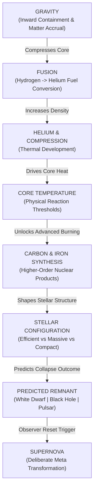
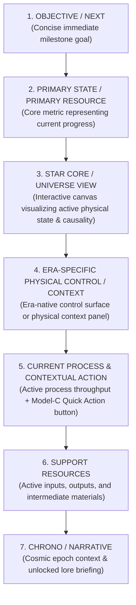

# 10 — P5 Design Synthesis: Defining the Physical Machines of Eras I–III

---

## 1. Executive Summary & Design Scope

### Status & Guardrails
- **Status:** `HUMAN APPROVED & PUBLISHED`
- **Scope:** Design only. **Zero gameplay implementation** in this phase.
- **Baseline:** P5.1 is complete, human-approved, and published to `star/main`.
- **Precedent Baseline:** `p4-stable-v1` remains untouched and authoritative.

### Epistemological Distinctions
To maintain strict architectural and design clarity, every statement in this document belongs to one of six explicit categories:
1. `[CURRENT PRODUCTION]`: Authoritative reality currently running in `main` code.
2. `[OBSERVED PLAYTEST PROBLEM]`: Verified human full-run friction or telemetry evidence.
3. `[RESEARCH-DERIVED HYPOTHESIS]`: Theoretical lessons derived from genre benchmarks.
4. `[DESIGN CANDIDATE]`: Evaluated architectural models for future phases.
5. `[DESIGN RECOMMENDATION]`: Recommended design path (**SUBJECT TO PROTOTYPING & APPROVAL**).
6. `[HUMAN-APPROVED DECISION]`: Formally approved decisions recorded in `DECISIONS.md` or approved review passes.

---

## 2. The Core Product Thesis

> **"Steering the physical conditions of a young universe, reading their consequences, and choosing what that universe becomes."**

### The P5 Product Refinement
> **"Players should feel that they are building and operating an increasingly capable physical system, rather than merely clicking the next unlocked button."**

Star Forge Idle is explicitly **NOT**:
- A spatial factory simulator or conveyor logistics puzzle.
- A real-time strategy or micro-management game.
- A spreadsheet optimizer requiring third-party calculators.
- An upgrade ladder where "progress" is simply buying independent $+X\%$ multipliers.

Instead, Star Forge is an **incremental physical system simulator**:
$$\text{PHYSICAL CONDITION} \longrightarrow \text{OBSERVATION / PROCESS} \longrightarrow \text{COUPLING \& THROUGHPUT} \longrightarrow \text{STRUCTURAL TRANSFORMATION}$$

### Low-Attention Incremental Play Requirement
Meaningful agency must remain compatible with low-attention incremental play. A valid future system must support:
1. **Active / Adaptive Operation:** Informed strategic decisions provide modest efficiency gains.
2. **Low-Attention Operation:** Safe default configurations guarantee steady, non-punishing progression.
3. **Idle Progression:** Unattended progression advances reliably through authoritative ticks.

The design must **NOT** reward:
- Rapid toggling or frantic button-switching;
- Constant babysitting or micro-management;
- Short fixed rotation schedules;
- Macro-style timing optimization.

A safe low-attention strategy must remain fully viable even if it is not mathematically optimal.

---

## 3. Current Machine Maps (Production Reality)

```mermaid
graph TD
  subgraph Era_I_Current["Era I: Current Production (Quantum Foam)"]
    QF["Quantum Fluctuations (QF)"] -->|"Fund (10 to 18,000 QF)"| Laws["5 Fundamental Laws\n(Gravity, Weak, EM, Resonance, Strong)"]
    Laws -->|Passive Gen| QF
    Laws -->|Passive Gen| ED["Energy Density (ED)"]
    Laws -->|Harmony Synergy| Mult["+5% Harmony Bonus / Tier"]
    Obs["Core Observation (Click)"] -->|+1 QF / +0.5% Coherence| QF
    Obs --> VC["Vacuum Coherence (0-100%)"]
    ED -->|Log Cooling| Temp1["Era I Temp (1e32 -> 1e27 K)"]
    Gate1{"Cosmic Inflation\n(100k QF, 50k ED, 100% VC)"}
  end

  subgraph Era_II_Current["Era II: Current Production (Primordial Soup)"]
    Posture["Operating Posture\n(ACCUMULATE | BALANCE | CONDENSE)"]
    QC["Quark Condenser"] -->|Quarks| Synth["Proton Synthesizer\n(3 Q + 1 G -> 1 P)"]
    GM["Gluon Matrix"] -->|Gluons| Synth
    LC["Lepton Collector"] -->|Leptons| Decay["Lepton Decay (<500k K)\n(1 L -> 1 e-)"]
    Synth -->|Protons| Radiator["Baryo Radiator\n(2 P -> 7,500 K Cool)"]
    Synth -->|Protons| RecombChemistry["Passive Recombination Chem (<100k K)\n(1 P + 1 e- -> 1 Primordial H)"]
    Decay -->|Electrons| RecombChemistry
    Radiator -->|Cools Plasma| Temp2["Plasma Temp (1e9 -> 3,000 K)"]
    Gate2{"Explicit Recombination Action\n(1M Protons OR Temp <= 3,000 K)"}
  end

  subgraph Era_III_Current["Era III: Current Production (Stellar Dawn)"]
    Grav["Gravity Nodes"] -->|Produces| Hyd["Hydrogen"]
    Fusers["Fuser Nodes"] -->|"Consumes H (10 H -> 1 He)"| Hel["Helium"]
    Compress["Compression Action"] -->|"Consumes He (+3.5M K)"| Temp3["Core Temperature"]
    Temp3 -->|">= 500M K"| Carb["Carbon Synthesis\n(50 He -> 1 C)"]
    Temp3 -->|">= 2.0B K"| Iron["Iron Synthesis\n(250 C -> 1 Fe)"]
    Builds["Stellar Builds\n(Efficient, Massive, Compact)"] --> Remnant["Remnant Archetype Prediction"]
    Gate3{"Supernova Prestige\n(Main Sequence, >=100M K, 1k Fe)"}
  end
```



### Era I: Current Production Reality
- **What does the player currently build?** 5 sequential Fundamental Law upgrades (`gravityForce`, `weakForce`, `electromagneticForce`, `vacuumResonance`, `strongForce`).
- **What flows through it?** Quantum Fluctuations (currency) and Energy Density (threshold metric).
- **What is the current bottleneck?** Passive generation waiting time; Vacuum Coherence accumulation ($0.1\%/\text{s}$ passive base rate).
- **What does the player currently control?** Core Observation click timing; sequential purchase order of the 5 upgrades.
- **What event currently proves mastery?** Reaching static numeric thresholds: $100,000\text{ QF} + 50,000\text{ ED} + 100\%\text{ Vacuum Coherence}$.
- **What currently becomes automated?** Passive QF and ED production are automated by purchasing laws.
- **Current Machine Classification:** `UPGRADE LADDER` (with embryonic synergy via Harmony tiers).

### Era II: Current Production Reality
- **What does the player currently build?** Hadronic infrastructure (Quark Condenser, Gluon Matrix, Lepton Collector, Proton Synthesizer, Baryogenesis Radiator).
- **What flows through it?** Quarks, Gluons, Leptons, Protons, Electrons, and Plasma Thermal Energy.
- **What is the current bottleneck?** Dynamically shifts between Quarks (early), Gluons/Binding (mid), Proton capacity vs. Radiative Cooling (late).
- **What does the player currently control?** 
  1. **Operating Postures:** Configured in `src/eras/plasma/constants.js` with exact production multipliers:
     - `ACCUMULATE`: `particleFlux: 1.50` ($+50\%$), `coolingMult: 0.50` ($-50\%$), `bindingMult: 0.70` ($-30\%$).
     - `BALANCE`: `particleFlux: 1.00`, `coolingMult: 1.00`, `bindingMult: 1.00` ($1.0\times$ across all axes).
     - `CONDENSE`: `particleFlux: 0.50` ($-50\%$), `coolingMult: 1.50` ($+50\%$), `bindingMult: 1.30` ($+30\%$).
  2. **Model-C Contextual Quick Actions:** (`BUY_UPGRADE_PLASMA`).
  3. **Transition Route Selection:** Choosing whether to pursue the Thermodynamic cooling pathway ($T \le 3,000\text{ K}$) or the Baryonic Mass pathway ($1,000,000\text{ Protons}$).
- **Recombination Distinction:**
  - *Passive Recombination Chemistry:* At $T < 100,000\text{ K}$, protons and electrons continuously bind into primordial hydrogen in the background.
  - *Explicit Recombination Transition:* When either $T \le 3,000\text{ K}$ or $\text{Protons} \ge 1,000,000$ is met, the player explicitly clicks `TRIGGER_RECOMBINATION` to advance to Era III. **Major era transitions never auto-fire.**
- **What currently becomes automated?** Raw particle generation, Lepton decay ($T < 500,000\text{ K}$), and passive hydrogen formation ($T < 100,000\text{ K}$).
- **Current Machine Classification:** `SYSTEM MACHINE` (Coupled multi-variable physical network).

### Era III: Current Production Reality
- **What does the player currently build?** Gravity generators, Auto-Fusers, Compression thermal pulses, Carbon/Iron synthesizers, and 3 Stellar Archetype investments (Efficient, Massive, Compact).
- **What flows through it?** Nuclear fuel chain: $\text{Hydrogen} \to \text{Helium} \to \text{Carbon} \to \text{Iron}$, coupled with Core Temperature.
- **What is the current bottleneck?** 
  - *Early Era III:* Hydrogen generation and Helium accumulation for manual Compression pulses.
  - *Mid Era III:* Core Temperature thresholds ($500\text{M K}$ for Carbon, $2.0\text{B K}$ for Iron).
  - *Late Era III:* Iron accumulation ($1,000\text{ Fe}$) and Archetype configuration.
- **What does the player currently control?** Gravity and Fuser scaling, Compression timing, Archetype investment balance (dictating the predicted collapse outcome), and the deliberate Supernova reset trigger.
- **What event proves mastery?** Synthesis of $1,000\text{ Iron}$, achieving Main Sequence stability, and executing a deliberate Supernova with predicted remnant rewards.
- **What currently becomes automated?** Hydrogen generation, auto-fusion, and (via Pulsar Shard upgrades) auto-compression.
- **Current Machine Classification:** `MIXED` (Early Era III is an Upgrade Ladder; Late Era III is a System Machine with meaningful prestige steering).

---

## 4. Why Era II Agency Works: The Internal Control Case

`[OBSERVED PLAYTEST FINDING]`: Human playtesting confirmed that Era II feels substantially more engaging and player-directed than Era I or early Era III.

### The Concrete Agency Mechanism in Era II
The perceived agency in Era II is rooted in seven structural properties:

1. **Coupled Multi-Variable State:** A single action changes a multi-dimensional system rather than an isolated scalar. Activating `CONDENSE` simultaneously increases cooling rate ($1.50\times$), accelerates proton synthesis ($1.30\times$), and suppresses raw particle flux ($0.50\times$).
2. **Visible Trade-offs without Permanent Penalty:** The player visibly trades raw intake for processing efficiency. The trade-off is immediately reversible (zero switch penalty, zero cooldown lock-in, zero build trap).
3. **Legible Bottleneck Shifting:** The player can look at the Cosmos HUD and immediately diagnose *why* production stalled (e.g. "Gluons are depleted while Quarks are full $\to$ switch to `ACCUMULATE`" or "Temperature is stalling Proton survival $\to$ switch to `CONDENSE`").
4. **Two Designed Recombination Routes Exist:** The architecture explicitly supports two distinct physical criteria:
   - *The Thermodynamic Pathway:* Radiate heat down to $3,000\text{ K}$.
   - *The Baryonic Mass Pathway:* Overpower thermal barriers by accumulating $1,000,000\text{ Protons}$.
   - `[OBSERVED PLAYTEST EVIDENCE]`: Human playtesting found that the Cooling route currently appears dramatically more practical than the 1,000,000-Proton route. **Their practical balance / equal viability is NOT yet validated** and is explicitly deferred to P5.4 coarse route balancing.
5. **Clear Physical Meaning:** Every resource represents a real physical entity (Quark, Gluon, Lepton, Proton, Electron, Kelvin) behaving according to physical principles (hadron binding, beta decay, radiative cooling).
6. **Zero Micro-Management Trap:** `BALANCE` ($1.0\times$ baseline) guarantees steady, non-punishing progression for passive/idle play, while active posture steering rewards attention with faster throughput.
7. **Immediate Sensory Feedback:** The Star Core Canvas and HUD instantly reflect the active posture through color temperature, particle agitation, and rate indicators.

```text
ERA-II AGENCY MECHANISM (ABSTRACT REUSABLE PRINCIPLE):
"Agency emerges when player intent modulates the RELATIONSHIPS between coupled
physical flows, shifting legible bottlenecks toward a chosen physical outcome
without irreversible build penalties."
```

---

## 5. The Six Machine Questions

Every candidate system machine in Star Forge must provide definitive answers to these six architectural questions:

1. **WHAT DO I BUILD?** (What is the physical infrastructure?)
2. **WHAT FLOWS THROUGH IT?** (What are the inputs, working mediums, and outputs?)
3. **WHAT IS THE BOTTLENECK?** (What limits progression at each stage?)
4. **WHAT DO I CONTROL?** (What decisions modulate or reconfigure the system?)
5. **WHAT EVENT PROVES I MASTERED IT?** (How does the system test player competence?)
6. **WHAT THEN BECOMES AUTOMATED?** (What routine shifts into background execution?)

---

## 6. Era I Machine Direction: Vacuum Field Allocation

```text
ERA-I DIRECTION:
HUMAN APPROVED

WORKING DESIGN LABEL:
VACUUM FIELD ALLOCATION

EXACT MECHANIC STATUS:
PROTOTYPE REQUIRED
```

### Approved Design Intent
**"Turn Vacuum Coherence from a passive waiting timer into one small, legible player-controlled physical allocation."**

- **Role:** Onboarding era. Must remain accessible and simple.
- **Vocabulary:** Strictly Quantum Fluctuations, Energy Density, Vacuum Coherence, Observation, Inflation.
- **Complexity Budget:** Minimal new terminology; 0 new currencies; zero build traps; zero required mathematical optimizers.
- **Balance Rule:** Exact numerical multipliers, mode names, unlock timing, and number of modes remain open and excluded from this synthesis phase.

### Conceptual Trade-off Model (Qualitative Relationships)
Rather than hardcoding numbers, the machine operates on qualitative physical trade-offs:
- **Fluctuation / Propagation Priority:** Increases short-term fluctuation and law-building throughput at the expense of stabilization progress.
- **Stabilization Priority:** Increases Vacuum Coherence and horizon stabilization progress at the expense of short-term production throughput.

### The Six Machine Questions for Vacuum Field Allocation
1. **What do I build?** Fundamental Law nodes that expand field capacity and establish physical forces.
2. **What flows through it?** Quantum potential converting into Quantum Fluctuations (currency) and Energy Density (structure).
3. **What is the bottleneck?** Early: Fluctuation buying power for initial laws. Mid: Sustaining Energy Density. Late: Vacuum Coherence reaching 100%.
4. **What do I control?** The **Vacuum Field Allocation** focus between force propagation and vacuum stabilization.
5. **What event proves mastery?** Reaching full stability ($100\%\text{ Coherence}$) while sustaining the required Energy Density to trigger Cosmic Inflation.
6. **What becomes automated?** Passive baseline generation continues unhindered in all modes.

### Major Unresolved Prototype Question (Fake-Choice Red Team)
```text
CRITICAL RED-TEAM INQUIRY:
Does Vacuum Field Allocation produce a real situational decision, or is the solved
strategy always:
  1. Set to Propagation mode early to buy all laws
  2. Flip to Stabilization mode late to wait for 100% Coherence
  3. Trigger Inflation?

If the optimal path is strictly linear, the mechanic fails the agency goal and
becomes another scripted sequence.

PROTOTYPE ACCEPTANCE CRITERION:
The prototype must demonstrate at least two reasonable decision timings /
operating approaches under representative play rather than one trivial dominant
sequence.

GUARDRAIL:
Do NOT attempt to force agency through artificial switch penalties, cooldowns,
thermal hysteresis, or rapid-toggle incentives.
```

---

## 7. Era II Target Machine: The Primordial Soup

```text
ERA-II TARGET STATUS:
CURRENT MACHINE DIRECTION HUMAN APPROVED
NO NEW P5.3 MECHANICS APPROVED
ROUTE BALANCE DEFERRED TO P5.4
```

```text
ERA-II TARGET MACHINE FLOW:
RAW HADRON INFLOW (Quarks + Gluons)
        ↓ [Hadron Binding Capacity]
BARYONIC MATTER (Protons + Leptons -> Electrons)
        ↓ [Radiative Thermal Dissipation]
SUB-MILLION KELVIN PLASMA
        ↓ [Recombination Reaction Rate]
PRIMORDIAL HYDROGEN & NEUTRAL GAS EMERGENCE
```

### Current Scope Boundaries for Era II
1. **Preserve Functioning Model:** Retain the 3 Operating Postures (`ACCUMULATE`, `BALANCE`, `CONDENSE`), Model-C contextual quick actions, and Canvas thermal visualization as-is.
2. **No Feature Bloat:** The proposed "Lepton-Electron catalytic ratio as a visible Recombination mechanic" is classified as:
   `UNVALIDATED FUTURE IDEA / NOT CURRENT ROADMAP`.
3. **Balance Responsibility:** P5.4 owns validating and balancing the two Recombination routes (Cooling vs. Proton accumulation).

---

## 8. Era III Machine Direction: Hydrostatic Stellar Engine

```text
ERA-III DIRECTION:
HUMAN APPROVED

APPROVED PHYSICAL MODEL:
HYDROSTATIC STELLAR ENGINE

CONTROL DESIGN STATUS:
REMAINS OPEN — COUPLED EXISTING SYSTEMS FIRST
NEW POLICY SELECTOR NOT APPROVED
```

### Approved Physical Model
The human review approves the physical concept of a **Hydrostatic Stellar Engine**: making EXISTING systems behave and read as coupled parts of one unified stellar machine:



### Control-Design Boundary: Coupled Economy First
The research lesson from Era II is that *player intent changes system relationships*. The reusable lesson is **NOT** "every era must receive posture buttons."

```text
PRIMARY DESIGN HYPOTHESIS:
Make existing investment, conversion, and compression relationships create the
decision space BEFORE adding another mode selector.

PROTOTYPE RESEARCH QUESTION:
Can Gravity, Fuser, Compression, Temperature, Carbon, and Iron be coupled strongly
enough that the player diagnoses and invests against a changing bottleneck
WITHOUT adding a separate policy selector?

PREFERRED OUTCOME:
YES. A new operating policy selector is justified ONLY if the coupled economy alone
does not provide enough meaningful agency.
```

### The Six Machine Questions for the Hydrostatic Stellar Engine
1. **What do I build?** Gravity infrastructure (inward containment) and Fusion burning stages (outward thermal energy).
2. **What flows through it?** Nuclear fuel cascading from Hydrogen to Helium, Carbon, and Iron, coupled with Core Temperature.
3. **What is the bottleneck?** Hydrostatic stability: compressing without sufficient fuel stalls fusion; fusing without compression stalls core temperature below Carbon/Iron thresholds.
4. **What do I control?** The balance of investment between Gravity containment, Fusion capacity, and Compression timing, directly steering toward a chosen stellar archetype.
5. **What event proves mastery?** Successfully synthesizing $1,000\text{ Fe}$, igniting the degenerate core at $2.0\text{B K}$, and executing a planned Supernova collapse.
6. **What becomes automated?** Baseline hydrogen accumulation and auto-fusion as the star reaches Main Sequence.

---

## 9. Abstract Infrastructure: "Building" Without Factory Buildings

Star Forge avoids fictional industrial tropes ("Space Factories", "Quantum Mines"). Instead, infrastructure represents **physical systemic capability**:

| Era | Physical Infrastructure Concept | What it Physically Represents | Authoritative Anchor |
| :--- | :--- | :--- | :--- |
| **Era I** | **Field Capacity** | Maximum coherent energy density local vacuum geometry can sustain before decohering. | Fundamental Law levels & Vacuum Resonance. |
| **Era I** | **Stabilization Throughput** | The rate at which quantum wave fluctuations settle into structured spacetime metrics. | Vacuum Coherence generation & Observation coupling. |
| **Era II** | **Hadron Binding Capacity** | The strong-force capacity to assemble free Quarks and Gluons into stable Baryons. | Proton Synthesizer level & Gluon Matrix density. |
| **Era II** | **Thermal Radiative Area** | Effective surface area for dissipating primeval plasma heat into dark vacuum. | Baryogenesis Radiator capacity & cooling flux. |
| **Era III** | **Gravitational Containment** | Inward pressure capable of binding hydrogen gas and compressing the stellar core. | Gravity node levels & Stellar Mass Index. |
| **Era III** | **Fusion Reaction Cross-Section** | Probability and rate of nuclear fusion per unit core volume at a given temperature. | Auto-Fusers, Carbon/Iron synthesis yield rates. |
| **Legacy** | **Cosmic Memory Matrix** | Invariant physical laws and constants that persist across universal resets. | Stardust Forge, Pulsar Engines, Tuning constants. |

---

## 10. The Automation Ladder

Automation in Star Forge is a **reward for conceptual mastery**, not an immediate skip button. It must replace mastered routines with higher-level decisions, not merely delete gameplay.

```text
RUNG 1: MANUAL LOCAL ACTION
Direct player intervention (e.g. Core Observation click, manual Compression pulse).
        ↓
RUNG 2: REPEATABLE SYSTEM
Continuous passive flow established by player construction (e.g. Fundamental Law generation, Auto-Fusers).
        ↓
RUNG 3: AUTOMATED ROUTINE
Background execution of mastered sub-routines (e.g. Lepton beta decay, Stardust Auto-Buy Gravity, Pulsar Auto-Compressor).
        ↓
RUNG 4: POLICY & ALLOCATION CONTROL
Steering operational balance rather than buying individual units (e.g. Era-II Postures, Era-I Vacuum Field Allocation, Era-III Hydrostatic Balance).
        ↓
RUNG 5: TRANSFORMATION CONTROL
Governing epochal phase shifts and universal resets (e.g. Cosmic Inflation, Recombination, Supernova, Galactic Ignition).
```

### Production Reality vs. Future Design in Automation

| System | Current Production Classification | Future Target Classification | Progression Trigger / Anchor |
| :--- | :--- | :--- | :--- |
| **Era I Fluctuations** | `[CURRENT PRODUCTION]`: Rung 2 (Passive Laws) | Rung 2 $\to$ 4 | Unlocking Law 3 introduces Vacuum Field Allocation. |
| **Era I Observation** | `[CURRENT PRODUCTION]`: Rung 1 (Manual Click) | Rung 1 (Active Boost) | Remains optional manual acceleration. |
| **Era II Particle Inflow** | `[CURRENT PRODUCTION]`: Rung 4 (Postures) | Rung 4 (Postures) | Posture selection modulates whole inflow network. |
| **Era II Lepton Decay** | `[CURRENT PRODUCTION]`: Rung 3 (Automated $T<500\text{k}$) | Rung 3 (Automated) | Occurs autonomously as plasma cools. |
| **Era III Gravity AutoBuyer**| `[CURRENT PRODUCTION]`: Rung 3 (Stardust Upgrade) | Rung 3 (Automated) | Stardust `autoBuyer` upgrade unlocks at Carbon temp. |
| **Era III Auto-Compressor** | `[CURRENT PRODUCTION]`: Rung 3 (Pulsar Upgrade) | Rung 3 (Automated) | Pulsar Shard `autoCompress` upgrade automates compression. |
| **Era III Archetype Steering**| `[CURRENT PRODUCTION]`: Rung 4 (Build Selection) | Rung 4 (Coupled Balance) | Investment balance dictates Remnant. |
| **Supernova Reset** | `[CURRENT PRODUCTION]`: Rung 5 (Observer Decision) | Rung 5 (Meta Transformation) | Permanent player-authored prestige trigger. |

---

## 11. Mastery Events: Skill Demonstration vs. Numeric Waiting

```text
PRINCIPLE:
A true mastery event tests whether the player has structured a functional physical
system, not merely whether they left the tab open long enough to accumulate a number.
```

| Transition | Current Production Requirement | Mastery Demonstration (Systemic Intent) |
| :--- | :--- | :--- |
| **Era I $\to$ Era II (Inflation)** | $100\text{k QF} + 50\text{k ED} + 100\%\text{ VC}$ | Proving the vacuum is stable enough ($100\%\text{ Coherence}$) to withstand exponential metric expansion without tearing. |
| **Era II $\to$ Era III (Recombination)** | $1\text{M Protons}$ OR $T \le 3,000\text{ K}$ | Proving the player has either cooled the plasma to atomic binding temperatures or created enough matter density to overcome thermal dispersion. |
| **Era III $\to$ Supernova (Collapse)** | Main Sequence $+ T \ge 100\text{M K} + 1\text{k Fe}$ | Proving the star has completed the full stellar nucleosynthesis cycle down to the Iron core and configured its planned remnant fate. |
| **Era III $\to$ Era IV (Galactic Ignition)** | $T \ge 2.0\text{B K} + 1\text{k Fe}$ | Permanent transition gateway unlocking macro-scale galactic orbital structures. |

---

## 12. Legacy & Prestige: The Meta-Physical Connection

In P5.2 and beyond, the Legacy layer must not appear as "just another menu tab." It represents **Universal Meta-Physics**:

1. **What has the player built that Supernova transforms?** The physical star collapses, but its synthesized matter is blasted across the cosmos as **Stardust** ($\text{Fe} \to \text{Stardust}$), its collapsed core becomes a **Pulsar Shard Engine** or **Singularity Mass**, and its structural stability modifies the baseline constants of the next stellar cycle.
2. **What does a reset demonstrate about player control?** In the first run, the player was a victim of chaotic stellar collapse. In subsequent runs, the player is the **Stellar Architect**, deliberately selecting the mass, fuel efficiency, and density to sculpt specific universal remnants.
3. **Qualitative Shift:** Prestige does not simply give $+10\%$ generic speed. It provides:
   - *Stardust Forge:* Fundamental physical discounts and thermal insulation.
   - *Pulsar Engine:* Structural automation (Auto-Compressor, Catalytic Synthesizers).
   - *Singularity Horizon:* Exponential scaling factors that bend the rules of gravity and temperature.

---

## 13. The Cross-Era Abstraction Ladder

```text
ERA I: LOCAL PHYSICAL CONDITION
"I am stabilizing a quantum point in the void, tuning fundamental forces so that space does not collapse."
        ↓
ERA II: INTERACTING PHYSICAL FLOWS
"I am governing a boiling thermodynamic soup, balancing raw particle flux against cooling to forge the first atoms."
        ↓
ERA III: SELF-SUSTAINING STELLAR SYSTEM
"I am operating a living star, balancing gravity against nuclear fire to synthesize elements and determine its cosmic fate."
        ↓
LEGACY / PRESTIGE: METAPHYSICAL LAWS
"I am tuning the fundamental constants that govern all future stars and galaxies."
```

---

## 14. Evaluated Candidate Design Principles (P1–P8)

Following human review, the 8 candidate design principles are formalized as follows:

| # | Principle | Status | Authoritative Definition & Nuance |
| :--- | :--- | :---: | :--- |
| **P1** | **Build systems, not upgrade ladders.** | **APPROVED** | Upgrades should primarily improve capabilities or relationships within an understandable system rather than exist as isolated next-step gates. |
| **P2** | **Each era should contain at least one meaningful decision that changes how its physical system develops or operates.** | **APPROVED AS REFINED** | Forms of decision include allocation, investment, configuration, timing, policy, or transformation. Does not mandate a dedicated posture/widget for every era. |
| **P3** | **New layers should transform old layers.** | **APPROVED AS REFINED** | Transformation may mean automation, amplification, aggregation, changed relevance, changed context, or new interaction. Does not require literal resource carry-over; the fixed 250 H handoff remains authoritative. |
| **P4** | **Automation is a mastery reward.** | **APPROVED** | Automation should replace mastered routines with higher-level decisions, not simply delete gameplay. |
| **P5** | **Bottlenecks should be legible and mutable.** | **APPROVED** | The player must always be able to identify, understand, and influence the active constraint. |
| **P6** | **Routine decisions should be safely reversible; transformations must be deliberate.** | **APPROVED AS REFINED** | Routine operational decisions should be safely reversible or recoverable without punitive lock-in. Irreversible transformations must be deliberate, previewed, and meaningful. Consequences are allowed; build traps are not. |
| **P7** | **Prestige changes the player's level of control.** | **APPROVED** | Prestige should create qualitative strategic capability, not merely a flat production multiplier. |
| **P8** | **Physical meaning is the interface to the economy.** | **APPROVED AS REFINED** | Economic relationships should be explainable through the physical fiction of the universe. Star Forge prefers legible causal physical meaning over literal astrophysics simulator complexity. |

---

## 15. Resource & UI Grammar Implications

Following the P5.1 durable principle:
> *"Era identity may change WHAT occupies a semantic information slot, but should not unnecessarily change WHERE the player looks for that slot."*

```text
STATUS:
CANDIDATE DESIGN DIRECTION — NOT YET HUMAN APPROVED
```

The unified cross-era information hierarchy maps into seven abstract semantic slots:



| Semantic Slot | Era I: Quantum Foam | Era II: Primordial Soup | Era III: Stellar Dawn |
| :--- | :--- | :--- | :--- |
| **1. Objective / Next** | Current Quantum Milestone | Current Phase Goal | Current Stellar Threshold |
| **2. Primary State / Resource** | Quantum Fluctuations (QF) | Active Hadron Stock (Quarks $\to$ Protons) | Accumulated Hydrogen (H) |
| **3. Star Core Visualizer** | Quantum Singularity / Foam Canvas | Primordial Plasma Thermal Canvas | Living Protostar / Main Sequence Canvas |
| **4. Era Control / Context** | Era-I Physical Allocation Context | Operating Posture Controller | Stellar Physical Context / Balance |
| **5. Current Process & Quick Action** | Passive Law Generation + Quick Action | Active Hadronic Recipe + Quick Action | Active Fusion Stage + Quick Action |
| **6. Support Resources** | Energy Density, Vacuum Coherence % | Gluons, Leptons, Electrons, Plasma Temp | Helium, Carbon, Iron, Core Temperature |
| **7. Chrono / Context** | Quantum Epoch Log & Inflation Readiness | Primordial Cauldron Log & Recombination Halo | Stellar Evolution Log & Remnant Prediction |

*Note: Exact slot population and ordering remain subject to dedicated layout normalization in P5.2/P5.3.*

---

## 16. Formal Design Status & Next Steps

```text
============================================================
P5 DESIGN SYNTHESIS STATUS MATRIX:

ERA I:
- MACHINE DIRECTION: HUMAN APPROVED (Vacuum Field Allocation)
- EXACT MECHANIC: PROTOTYPE REQUIRED (Must resolve fake-choice risk)

ERA II:
- CURRENT MACHINE DIRECTION: HUMAN APPROVED (Coupled Flows & 3 Postures)
- NEW P5.3 MECHANICS: NONE APPROVED (Feature accumulation rejected)
- ROUTE BALANCING: DEFERRED TO P5.4

ERA III:
- MACHINE DIRECTION: HUMAN APPROVED (Hydrostatic Stellar Engine)
- CONTROL DESIGN: COUPLED EXISTING SYSTEMS FIRST (Policy selector not approved)

PRINCIPLES P1–P8:
- P1, P4, P5, P7: APPROVED
- P2, P3, P6, P8: APPROVED AS REFINED

UI 7-SLOT HIERARCHY:
- CANDIDATE DESIGN DIRECTION (Not yet human approved)

NEXT PHASE:
- PROTOTYPE VACUUM FIELD ALLOCATION & HYDROSTATIC COUPLING (P5.3 PREPARATION)
- PRESTIGE & TRANSITION PRESENTATION (P5.2 ROADMAP)
============================================================
```
