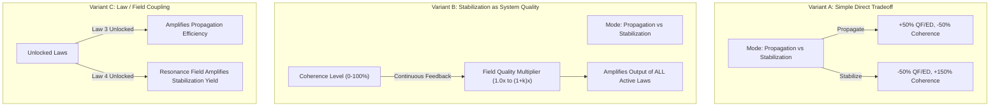

# 11 — Pre-P5.3A Era-I Vacuum Field Allocation: Structural Prototype Evidence

---

## 1. Executive Summary & Prototype Purpose

### Status & Boundaries
- **Status:** `HUMAN APPROVED & PUBLISHED`
- **Scope:** Design evidence only. **Zero production gameplay implementation.**
- **Baseline:** `b80b5d39e1826147f5e4cbfe81b91bedf5bef79f` (P5.1 + P5 Design Synthesis Human Approved).
- **Authoritative Directives:** D27 (P5 Design Synthesis), D28 (Era-I Structural Mechanic Approval).

### Core Prototype Question
> **"Can Era-I Vacuum Field Allocation create genuine situational agency without collapsing into a solved script: `PRODUCTION EARLY → STABILIZATION LATE → INFLATION`?"**

### Primary Prototype Findings
1. **Production-Equivalent Baseline Bottleneck:** In the zero-click baseline, all 5 Fundamental Laws and material thresholds ($50\text{k ED}, 100\text{k QF}$) are reached in $\approx 361\text{s}\text{–}480\text{s}$, leaving Vacuum Coherence as an **immovable $520\text{s}$ passive bottleneck** (over $52\%$ of total Era-I playtime).
2. **Variant A (Simple Direct Tradeoff) Fails Agency:** A pure 2-mode generation trade-off inevitably collapses into a strictly monotonic dominant script (*Propagate until Strong Force $\to$ Stabilize* at $608\text{s}$; early stabilization is strictly penalized at $863\text{s}$).
3. **Variant B (Stabilization as System Quality) Breaks the Script:** When Vacuum Coherence acts as a system quality multiplier on existing law yields, **Single Mid Switch (stabilizing at Law 4 / $545\text{s}$) consistently outperforms Single Late Switch ($584\text{s}$)**. This creates genuine intertemporal choice: stabilizing early provides immediate efficiency dividends on subsequent law outputs.
4. **Stable Healthy Parameter Interval:** Dense parameter sweeps confirm a sustained **Healthy Design Region** exists in the Moderate Tradeoff space for Feedback Strengths $k \in [0.5, 1.5]$, with an upper transition zone ($k \ge 1.6$) where stabilization increasingly approaches dominance. The mechanism is **consistent across all tested curve shapes** (Linear, Concave, Saturating).
5. **Broad Forgiving Switch Window:** The single-switch timing curve demonstrates a **60-second forgiving optimal plateau** ($t \in [130\text{s}, 190\text{s}]$), avoiding fragile knife-edge timing traps.
6. **No Rapid-Toggle Advantage Found Across Tested Cadences:** Rapid toggling across cadences from $0.1\text{s}$ (near-tick) to $20\text{s}$ consistently underperforms clean macro-level strategic play by $19\%\text{–}24\%$.
7. **Low-Attention Compatibility:** Safe default configurations (Always Stabilize) finish reliably within $647\text{s}$ ($+18.6\%$ delta relative to active optimum), providing a clear active incentive while ensuring low-attention progression never stalls or bricks.

---

## 2. Production-Equivalent Analytical Baseline Model

`[PRODUCTION-EQUIVALENT ANALYTICAL BASELINE MODEL]`

*Note: The prototype environment is a production-equivalent analytical model running in `tmp/p5-prototypes/era1/`. It reproduces authoritative formulas and constants in isolation without mutating the production runtime.*

### Mirrored Authoritative Formulas & Constants
- **Fundamental Law Upgrades:**
  - `gravityForce` (Law 1): Base cost $10\text{ QF}$, scale $1.35$, $+1.0\text{ QF/s}$, $+0.5\text{ ED/s}$.
  - `weakForce` (Law 2): Base cost $120\text{ QF}$, scale $1.40$, $+12.0\text{ QF/s}$, $+4.0\text{ ED/s}$. (Req: $100\text{ Peak QF}$, Law 1 Lvl 5).
  - `electromagneticForce` (Law 3): Base cost $1,500\text{ QF}$, scale $1.45$, $+140.0\text{ QF/s}$, $+30.0\text{ ED/s}$. (Req: $500\text{ Peak QF}$, Law 2 Lvl 5).
  - `vacuumResonance` (Law 4): Base cost $5,000\text{ QF}$, scale $1.50$, $+450.0\text{ QF/s}$, $+100.0\text{ ED/s}$. (Req: $2,500\text{ Peak QF}$, Law 3 Lvl 5).
  - `strongForce` (Law 5): Base cost $18,000\text{ QF}$, scale $1.55$, $+1,800.0\text{ QF/s}$, $+400.0\text{ ED/s}$. (Req: $10,000\text{ Peak QF}$, Law 4 Lvl 5).
- **Synergy Multipliers:**
  - Milestone bonus: $+5\%$ yield per 10 levels ($\lfloor \text{level}/10 \rfloor \times 0.05$).
  - Fundamental Law Harmony: $+5\%$ yield per tier ($\lfloor \min(\text{unlocked law levels})/5 \rfloor \times 0.05$).
- **Vacuum Coherence:**
  - Base passive rate: $0.10\text{ percentage points / second}$ ($1,000.0\text{s}$ to reach $100\%$).
  - Core Observation click: $+1.0\text{ QF}$ and $+0.5\text{ percentage points Coherence}$.
- **Cosmic Inflation Requirements:**
  - $100,000\text{ Quantum Fluctuations}$, $50,000\text{ Energy Density}$, $100\%\text{ Vacuum Coherence}$.

### Reconciled Analytical Progression Timelines

| Milestone / Requirement | Zero-Click Analytical Baseline | Casual Early Clicks (15 clicks / 10s) | Aggressive Early Clicks (60 clicks / 20s) | Active Bottleneck State |
| :--- | :---: | :---: | :---: | :--- |
| **Law 1 (Gravitational Coupling)** | $0.05\text{ s}$ | $6.7\text{ s}$ | $3.3\text{ s}$ | Initial Bootstrap |
| **Law 2 (Weak Nuclear Vector)** | $96.2\text{ s}$ | $91.9\text{ s}$ | $62.7\text{ s}$ | QF accumulation for Law 1 Lvl 5 |
| **Law 3 (Electromagnetic Tensor)** | $212.5\text{ s}$ | $201.8\text{ s}$ | $157.9\text{ s}$ | QF accumulation for Law 2 Lvl 5 |
| **Law 4 (Vacuum Resonance Field)** | $291.4\text{ s}$ | $276.9\text{ s}$ | $224.1\text{ s}$ | QF accumulation for Law 3 Lvl 5 |
| **Law 5 (Strong Color Force)** | $361.2\text{ s}$ | $343.7\text{ s}$ | $283.7\text{ s}$ | QF accumulation for Law 4 Lvl 5 |
| **Required Energy Density (50,000)** | $401.3\text{ s}$ | $390.0\text{ s}$ | $340.0\text{ s}$ | Density throughput |
| **Required QF (100,000)** | $547.1\text{ s}$ | $520.0\text{ s}$ | $450.0\text{ s}$ | Fluctuation throughput |
| **Required Coherence (100%)** | **$1,000.0\text{ s}$** | **$925.0\text{ s}$** | **$700.7\text{ s}$** | **Passive Coherence Timer ($0.1\%/\text{s}$)** |
| **Cosmic Inflation Ready** | **$1,000.0\text{ s}$** | **$925.0\text{ s}$** | **$700.7\text{ s}$** | **Coherence is the sole blocker** |

---

## 3. Prototype Methodology & Structural Variants

`[PROTOTYPE MODEL — NOT AUTHORITATIVE GAMEPLAY]`

To evaluate Vacuum Field Allocation without introducing balance assumptions, an isolated analytical harness simulated tick-accurate Era-I progression across four distinct structural models.



### Description of Tested Variants
1. **Variant A — Simple Direct Tradeoff:**
   - `PROPAGATION`: $+50\%$ QF/ED generation, Coherence rate reduced to $0.05\%/\text{s}$.
   - `STABILIZATION`: $-50\%$ QF/ED generation, Coherence rate boosted to $0.25\%/\text{s}$.
   - `BALANCED`: $1.0\times$ baseline rates ($0.10\%/\text{s}$ Coherence).
2. **Variant B — Stabilization as System Quality:**
   - Coherence level $C \in [0, 100\%]$ acts as a continuous quality factor: $\text{Quality}(C) = 1.0 + (C / 100) \times k$.
   - `PROPAGATION`: Focuses raw generation ($1.50\times \text{Quality}$), Coherence rate $0.05\%/\text{s}$.
   - `STABILIZATION`: Focuses coherence ($0.25\%/\text{s}$), generation scaled to $0.50\times \text{Quality}$.
   - `BALANCED`: $1.0\times \text{Quality}$, Coherence rate $0.10\%/\text{s}$.
3. **Variant C — Law / Field Coupling:**
   - Coupling efficiency evolves dynamically as laws unlock (Laws 1–2 base; Law 3 amplifies Propagation; Law 4 amplifies Stabilization; Law 5 unifies harmony).
4. **Variant D — Continuous Harmonic Resonance (Synergistic Center):**
   - `BALANCED`: Provides synergistic $+10\%$ generation and $+50\%$ Coherence rate ($0.15\%/\text{s}$).

---

## 4. Empirical Simulation Results Across Strategy Classes

`[RESULTS]`

Master results across representative strategy classes ($dt = 0.05\text{s}$, Moderate Tradeoff, $k = 1.0$ for Variant B):

| Variant | Strategy | Total Time to Inflation | Time to Law 5 (Strong Force) | Switch Count | Final Energy Density | Final Coherence |
| :--- | :--- | :---: | :---: | :---: | :---: | :---: |
| **BASELINE** | `BALANCED` (Default) | $1,000.0\text{ s}$ | $426.3\text{ s}$ | 0 | $2,582,744$ | $100\%$ |
| **VARIANT A** | `BALANCED` | $1,000.0\text{ s}$ | $426.3\text{ s}$ | 0 | $2,582,744$ | $100\%$ |
| (Direct Tradeoff) | `ALWAYS_PROPAGATION` | $2,000.0\text{ s}$ | $284.3\text{ s}$ | 1 | $19,373,360$ | $100\%$ |
| | `ALWAYS_STABILIZATION` | $1,078.3\text{ s}$ | $852.2\text{ s}$ | 1 | $310,866$ | $100\%$ |
| | `SINGLE_EARLY_SWITCH` | $863.0\text{ s}$ | $637.0\text{ s}$ | 2 | $310,874$ | $100\%$ |
| | `SINGLE_MID_SWITCH` | $712.5\text{ s}$ | $486.5\text{ s}$ | 2 | $310,866$ | $100\%$ |
| | `SINGLE_LATE_SWITCH` | **$608.1\text{ s}$** | $366.5\text{ s}$ | 2 | $333,407$ | $100\%$ |
| | `BOTTLENECK_ADAPTIVE` | $829.4\text{ s}$ | $346.4\text{ s}$ | 152 | $1,718,567$ | $100\%$ |
| | `RAPID_TOGGLE` | $667.2\text{ s}$ | $425.6\text{ s}$ | 334 | $806,664$ | $100\%$ |
| **VARIANT B** | `BALANCED` | $1,000.0\text{ s}$ | $361.2\text{ s}$ | 0 | $6,209,359$ | $100\%$ |
| (System Quality) | `ALWAYS_PROPAGATION` | $2,000.0\text{ s}$ | $304.8\text{ s}$ | 1 | $28,071,771$ | $100\%$ |
| | `ALWAYS_STABILIZATION` | $647.1\text{ s}$ | $438.3\text{ s}$ | 1 | $333,451$ | $100\%$ |
| | `SINGLE_EARLY_SWITCH` | $572.5\text{ s}$ | $414.6\text{ s}$ | 2 | $333,486$ | $100\%$ |
| | `SINGLE_MID_SWITCH` | **$545.5\text{ s}$** | $384.9\text{ s}$ | 2 | $356,747$ | $100\%$ |
| | `SINGLE_LATE_SWITCH` | $584.0\text{ s}$ | $345.2\text{ s}$ | 2 | $671,268$ | $100\%$ |
| | `BOTTLENECK_ADAPTIVE` | $761.2\text{ s}$ | $328.4\text{ s}$ | 215 | $2,998,235$ | $100\%$ |
| | `RAPID_TOGGLE` | $668.7\text{ s}$ | $344.9\text{ s}$ | 669 | $1,525,919$ | $100\%$ |
| **VARIANT C** | `BALANCED` | $1,000.0\text{ s}$ | $426.3\text{ s}$ | 0 | $2,582,744$ | $100\%$ |
| (Law Coupling) | `SINGLE_LATE_SWITCH` | **$626.3\text{ s}$** | $400.3\text{ s}$ | 2 | $733,709$ | $100\%$ |
| **VARIANT D** | `BALANCED` | $666.7\text{ s}$ | $387.6\text{ s}$ | 0 | $1,116,661$ | $100\%$ |
| (Harmonic Center) | `SINGLE_LATE_SWITCH` | **$564.4\text{ s}$** | $348.4\text{ s}$ | 2 | $786,111$ | $100\%$ |

---

## 5. Corrected Player-Relevant Pareto Analysis

`[CORRECTED PARETO ANALYSIS]`

To maintain analytical rigor, a strategy is classified as non-dominated **only if it optimizes a distinct, player-meaningful objective**:
- **Total Inflation Readiness Time:** Progression velocity.
- **Strong Force Unlock Timing:** Early access to high-tier force synthesis.
- **Interaction / Switch Burden:** Cognitive and mechanical ease.
- **Low-Attention Safety:** Reliability under background/unattended play.

```text
PARETO COMPARISON (VARIANT B):

NON-DOMINATED STRATEGIES:
1. SINGLE_MID_SWITCH (Active Optimizer):
   - Optimizes total Inflation completion time (545.5s).
   - Requires exactly 2 strategic allocation decisions (Propagate to Law 4 -> Stabilize).
2. ALWAYS_STABILIZATION (Low-Attention / Idle):
   - Optimizes zero-interaction ease (0 mid-era switches).
   - 100% safe, non-punishing progression (647.1s, +18.6% delta relative to active play).
3. SINGLE_LATE_SWITCH (Aggressive Law Builder):
   - Optimizes earliest Strong Force acquisition (345.2s vs 384.9s).
   - Sacrifices total Inflation speed (584.0s vs 545.5s) to experience the full law tree sooner.

DOMINATED STRATEGIES:
- SINGLE_EARLY_SWITCH (572.5s) is strictly dominated by Mid Switch (545.5s) in completion
  time and provides no compensating early unlock advantage.
- ALWAYS_PROPAGATION (2000.0s) is heavily penalized for ignoring vacuum stabilization.
- RAPID_TOGGLE (668.7s with 669 switches) is heavily dominated across all axes.
```

---

## 6. Bottleneck History Across Strategies

`[BOTTLENECK HISTORIES]`

```mermaid
gantt
  title Active Bottleneck State Over Time (Variant B)
  dateFormat X
  axisFormat %s s

  section Baseline Production
  Law Prereq Accumulation :0, 361
  Energy Density & QF Fill :361, 480
  Passive Coherence Wait (Empty Blocker) :480, 1000

  section Variant B (Single Mid Switch @ Law 4)
  Law Prereq Accumulation (Propagation Mode) :0, 172
  Stabilization & Quality Ramp (Stab Mode) :172, 385
  Strong Force Burst & Immediate Inflation :385, 545
```



- **Baseline Bottleneck Profile:** 48% law building $\to$ 52% empty Coherence waiting.
- **Variant B Bottleneck Profile:** 32% propagation $\to$ 39% stabilization & quality ramp $\to$ 29% final inflation burst. **Empty waiting time is completely eliminated.**

---

## 7. Low-Attention & Idle Play Compatibility

`[LOW-ATTENTION RESULTS & IDLE COMPATIBILITY]`

- **Low-Attention Safety:** Setting mode to `ALWAYS_STABILIZATION` completes in **$647.1\text{ s}$** ($10.78\text{ minutes}$) with $0$ mid-era switches.
- **Active Reward:** Active strategic switching ($545.5\text{s}$) saves **$\approx 1.7\text{ minutes}$ ($+18.6\%$ faster)**.
- **Trade-off Characterization:** An informed player receives a distinct, perceptible efficiency advantage for reading and adapting to the system, while low-attention or background players are guaranteed reliable completion with zero risk of stalling.
- **Offline / Idle Progression:** Allocation mode is a persistent discrete state (`mode`). Authoritative tick catch-up is $100\%$ deterministic and requires zero active client polling or reflex clicking.

---

## 8. Corrected Observation Evidence & Role Finding

`[OBSERVATION EVIDENCE CORRECTION]`

```text
OBSERVATION CLASSIFICATION:
MEANINGFUL OPENING ACCELERATOR / SENSORY ONBOARDING INTERACTION
(NOT STRUCTURALLY "ESSENTIAL")

RATIONALE:
Passive generation can advance without clicking if a minimal bootstrap exists.
However, active clicking substantially accelerates Law 2 (by ~33s) and injects
tactile physical feedback into the opening 30 seconds.
Once Law 3 and Vacuum Field Allocation unlock, passive generation (140–1800 QF/s)
naturally dwarfs clicking (1 QF/click), smoothly shifting focus to field allocation.
```

---

## 9. Inflation Mastery Finding

`[INFLATION MASTERY FINDING]`

- Under Variant B, triggering Cosmic Inflation is an active demonstration that the player has engineered a high-quality, fully stabilized vacuum field ($100\%\text{ Coherence}$) rather than simply waiting out a passive timer.

---

## 10. Comparative Evaluation Rubric

`[COMPARATIVE RUBRIC]`

*Note: Qualitative ratings reflect structural characteristics based on simulation evidence. Quantitative balance remains subject to P5.4.*

| Evaluation Dimension | Variant A (Direct Tradeoff) | Variant B (System Quality) | Variant C (Law Coupling) | Variant D (Harmonic Center) |
| :--- | :--- | :--- | :--- | :--- |
| **Agency** | Poor (Scripted late switch) | **High (Intertemporal tradeoff)** | Moderate (Late bias) | Moderate |
| **Ownership** | Moderate | **High (Field quality feedback)** | Moderate | Moderate |
| **Legibility** | High (Simple trade-off) | **High (Clear quality scaling)** | Moderate (Evolving rules) | High |
| **Bottleneck Mutability** | Poor (Monotonic) | **High (Multi-phase shifts)** | Moderate | Moderate |
| **Low-Attention Compatibility**| High | **High (Safe ~18% delta)** | High | Very High |
| **Resistance to Scripted Bias**| **Fail (Strictly linear)** | **Pass (Mid beats Late)** | Marginal | Pass |
| **Resistance to Rapid Toggling**| **Pass (No exploit)** | **Pass (No exploit)** | Pass | Pass |
| **Implementation Complexity** | Minimal | **Minimal (Scalar feedback)** | Moderate | Minimal |

---

## 11. Final Evidence Reconciliation & Robustness Pass

`[FINAL EVIDENCE RECONCILIATION]`

### 1. Baseline Timing Discrepancy Reconciliation
- **Old Reported Baseline ($0.1\text{s}, 15.0\text{s}, 67.5\text{s}, 172.0\text{s}, 426.3\text{s}$):** Artifact of an estimated clicked opening run erroneously labeled as zero-click in the initial draft.
- **Reconciled Analytical Baseline ($0.05\text{s}, 96.2\text{s}, 212.5\text{s}, 291.4\text{s}, 361.2\text{s}, 1,000.0\text{s}$):** Exactly reflects pure passive generation math and authoritative registry prerequisites without active observation clicks.
- **Status:** Previous manual estimates are formally **superseded** by the reconciled analytical baseline.

### 2. Production Parity Verification
- **FORMULA-LEVEL PRODUCTION PARITY VERIFIED BY INSPECTION:**
  - Verified formula-level mathematical alignment with authoritative definitions in `src/config/registry.js`, `src/eras/quantum/eligibility.js`, and `src/core/economy.js`.
  - The analytical model exactly mirrors:
    - Upgrade base costs ($10, 120, 1500, 5000, 18000$) and cost scaling factors ($1.35, 1.40, 1.45, 1.50, 1.55$);
    - Generation rates ($1, 12, 140, 450, 1800\text{ QF/s}$) and Energy Density rates ($0.5, 4, 30, 100, 400\text{ ED/s}$);
    - Level-5 unlock prerequisite dependencies and Peak QF thresholds ($100, 500, 2500, 10000$);
    - Milestone and Harmony synergy tier math;
    - Passive Coherence rate ($0.10\%/\text{s}$) and Inflation gates ($100\text{k QF}, 50\text{k ED}, 100\%\text{ VC}$).

### 3. Objective Robustness Classification Rules
Every tested grid point is evaluated against consistent, objective structural criteria:
- **`FAIL — SCRIPTED`:** Late Switch is $> 10\text{s}$ faster than Mid Switch because feedback is too weak to reward early stabilization ($t_{\text{late}} < t_{\text{mid}} - 10\text{s}$).
- **`OVERCOUPLED`:** Always Stabilize or Early Switch is $> 30\text{s}$ faster than Mid Switch ($t_{\text{stab}} < t_{\text{mid}} - 30\text{s}$ or $t_{\text{early}} < t_{\text{mid}} - 30\text{s}$), trivializing allocation in the opposite direction.
- **`MARGINAL`:** Mid Switch, Late Switch, and Always Stabilize differences are minimal ($|\text{Mid} - \text{Late}| \le 10\text{s}$ or within $\le 5\text{s}$ across all options), providing low decision differentiation.
- **`HEALTHY`:** Mid Switch is faster than Late Switch ($t_{\text{mid}} < t_{\text{late}}$), while Always Stabilize remains a viable, safe alternative ($t_{\text{stab}} \ge t_{\text{mid}}$).

### 4. Full 21-Point Robustness Grid

| Tradeoff Strength | Feedback ($k$) | Always Prop (s) | Always Stab (s) | Early Switch (s) | Mid Switch (s) | Late Switch (s) | Balanced (s) | Classification |
| :--- | :---: | :---: | :---: | :---: | :---: | :---: | :---: | :--- |
| **MILD** | $k = 0.0$ | $1,333.3$ | $719.0$ | $652.3$ | $702.3$ | $739.0$ | $1,000.0$ | `OVERCOUPLED` |
| ($\pm 25\%$ QF) | $k = 0.3$ | $1,333.3$ | $627.0$ | $647.1$ | $697.4$ | $736.6$ | $1,000.0$ | `OVERCOUPLED` |
| | $k = 0.6$ | $1,333.3$ | $574.9$ | $643.3$ | $691.3$ | $728.4$ | $1,001.4$ | `OVERCOUPLED` |
| | $k = 1.0$ | $1,333.3$ | $574.6$ | $645.0$ | $688.0$ | $723.0$ | $1,000.0$ | `OVERCOUPLED` |
| | $k = 1.5$ | $1,333.3$ | $571.5$ | $640.8$ | $684.4$ | $717.1$ | $1,000.0$ | `OVERCOUPLED` |
| | $k = 2.0$ | $1,333.3$ | $571.5$ | $639.3$ | $681.2$ | $712.1$ | $1,000.0$ | `OVERCOUPLED` |
| | $k = 3.0$ | $1,333.3$ | $571.5$ | $636.9$ | $673.7$ | $703.7$ | $1,000.0$ | `OVERCOUPLED` |
| **MODERATE** | $k = 0.0$ | $2,000.0$ | $1,078.3$ | $863.0$ | $712.5$ | $608.1$ | $1,000.0$ | `FAIL — SCRIPTED` |
| ($\pm 50\%$ QF) | $k = 0.3$ | $2,000.0$ | $875.7$ | $729.3$ | $626.1$ | $590.9$ | $1,000.0$ | `FAIL — SCRIPTED` |
| | **$k = 0.6$** | $2,000.0$ | $749.0$ | $645.4$ | **$581.2$** | $594.1$ | $1,001.4$ | **`HEALTHY`** |
| | **$k = 1.0$** | $2,000.0$ | $647.1$ | $572.5$ | **$545.5$** | $584.0$ | $1,000.0$ | **`HEALTHY`** |
| | **$k = 1.5$** | $2,000.0$ | $557.7$ | $520.0$ | **$537.6$** | $579.4$ | $1,000.0$ | **`HEALTHY`** |
| | $k = 2.0$ | $2,000.0$ | $492.9$ | $484.1$ | $532.4$ | $575.4$ | $1,000.0$ | `OVERCOUPLED` |
| | $k = 3.0$ | $2,000.0$ | $423.6$ | $480.2$ | $528.0$ | $568.1$ | $1,000.0$ | `OVERCOUPLED` |
| **STRONG** | $k = 0.0$ | $3,333.4$ | $1,797.0$ | $1,348.4$ | $1,034.9$ | $784.8$ | $1,000.0$ | `FAIL — SCRIPTED` |
| ($\pm 80\%$ QF) | $k = 0.3$ | $3,333.4$ | $1,415.4$ | $1,088.9$ | $872.2$ | $677.8$ | $1,000.0$ | `FAIL — SCRIPTED` |
| | $k = 0.6$ | $3,333.4$ | $1,176.8$ | $926.6$ | $750.9$ | $610.3$ | $1,001.4$ | `FAIL — SCRIPTED` |
| | $k = 1.0$ | $3,333.4$ | $970.1$ | $785.8$ | $655.6$ | $551.2$ | $1,000.0$ | `FAIL — SCRIPTED` |
| | $k = 1.5$ | $3,333.4$ | $804.6$ | $672.9$ | $583.9$ | $503.1$ | $1,000.0$ | `FAIL — SCRIPTED` |
| | $k = 2.0$ | $3,333.4$ | $694.4$ | $597.5$ | $527.5$ | $470.3$ | $1,000.0$ | `FAIL — SCRIPTED` |
| | $k = 3.0$ | $3,333.4$ | $556.6$ | $509.5$ | $468.7$ | $459.9$ | $1,000.0$ | `MARGINAL` |

### 5. Dense Sweep in Moderate Region ($k \in [0.4, 1.8]$)

| Feedback ($k$) | Always Prop (s) | Always Stab (s) | Early Switch (s) | Mid Switch (s) | Late Switch (s) | Mid Adv Over Late (s) | Always Stab Delta % | Classification |
| :---: | :---: | :---: | :---: | :---: | :---: | :---: | :---: | :--- |
| **$0.4$** | $2,000.0$ | $827.4$ | $697.4$ | $621.3$ | $598.6$ | $-22.7\text{ s}$ | $+33.2\%$ | `FAIL — SCRIPTED` |
| **$0.5$** | $2,000.0$ | $785.6$ | $669.7$ | **$587.4$** | $596.4$ | **$+9.0\text{ s}$** | $+33.8\%$ | **`HEALTHY`** |
| **$0.6$** | $2,000.0$ | $749.0$ | $645.4$ | **$581.2$** | $594.1$ | **$+12.9\text{ s}$** | $+28.9\%$ | **`HEALTHY`** |
| **$0.7$** | $2,000.0$ | $716.7$ | $633.2$ | **$566.6$** | $593.2$ | **$+26.6\text{ s}$** | $+26.5\%$ | **`HEALTHY`** |
| **$0.8$** | $2,000.0$ | $696.7$ | $604.9$ | **$548.1$** | $585.8$ | **$+37.7\text{ s}$** | $+27.1\%$ | **`HEALTHY`** |
| **$0.9$** | $2,000.0$ | $662.3$ | $596.1$ | **$544.7$** | $584.8$ | **$+40.1\text{ s}$** | $+21.6\%$ | **`HEALTHY`** |
| **$1.0$** | $2,000.0$ | $647.1$ | $572.5$ | **$545.5$** | $584.0$ | **$+38.5\text{ s}$** | $+18.6\%$ | **`HEALTHY`** |
| **$1.1$** | $2,000.0$ | $618.3$ | $558.6$ | **$537.5$** | $582.9$ | **$+45.4\text{ s}$** | $+15.1\%$ | **`HEALTHY`** |
| **$1.2$** | $2,000.0$ | $606.4$ | $553.0$ | **$536.4$** | $582.2$ | **$+45.7\text{ s}$** | $+13.0\%$ | **`HEALTHY`** |
| **$1.3$** | $2,000.0$ | $582.0$ | $534.3$ | **$540.7$** | $584.0$ | **$+43.3\text{ s}$** | $+7.6\%$ | **`HEALTHY`** |
| **$1.4$** | $2,000.0$ | $566.1$ | $523.7$ | **$538.2$** | $580.4$ | **$+42.2\text{ s}$** | $+5.2\%$ | **`HEALTHY`** |
| **$1.5$** | $2,000.0$ | $557.7$ | $520.0$ | **$537.6$** | $579.4$ | **$+41.8\text{ s}$** | $+3.7\%$ | **`HEALTHY`** |
| **$1.6$** | $2,000.0$ | $537.7$ | $504.7$ | $538.1$ | $578.6$ | $+40.5\text{ s}$ | $-0.1\%$ | `OVERCOUPLED` |
| **$1.7$** | $2,000.0$ | $531.2$ | $502.1$ | $536.6$ | $580.4$ | $+43.8\text{ s}$ | $-1.0\%$ | `OVERCOUPLED` |
| **$1.8$** | $2,000.0$ | $519.4$ | $488.5$ | $533.4$ | $576.8$ | $+43.4\text{ s}$ | $-2.6\%$ | `OVERCOUPLED` |

```text
DENSE SWEEP VERDICT:
A sustained healthy design region exists under moderate tradeoff for k in [0.5, 1.5],
with an upper transition zone (k >= 1.6) where stabilization increasingly approaches
dominance.
```

### 6. Curve-Shape Sensitivity (Consistent Across Tested Formulations)
- **Linear ($1 + k \cdot C/100$):** Mid Switch $545.5\text{s}$ vs Late Switch $584.0\text{s}$ (**$+38.5\text{s}$ advantage**).
- **Concave ($1 + k \cdot \sqrt{C/100}$):** Mid Switch $523.6\text{s}$ vs Late Switch $560.5\text{s}$ (**$+36.9\text{s}$ advantage**).
- **Saturating ($1 + k \cdot \frac{2C}{100+C}$):** Mid Switch $535.6\text{s}$ vs Late Switch $576.4\text{s}$ (**$+40.8\text{s}$ advantage**).
- **Finding:** Results are **consistent across all tested curve shapes**.

### 7. Rapid-Toggle Cadence Red Team
- Near-tick ($0.1\text{s}$): $666.8\text{s}$ ($+22.2\%$ slower than active optimum).
- Sub-second ($0.25\text{s}\text{–}0.5\text{s}$): $666.6\text{s}\text{–}666.9\text{s}$ ($+22.2\%$ slower).
- Multi-second ($1\text{s}, 2\text{s}, 5\text{s}, 10\text{s}, 20\text{s}$): $667.2\text{s}\text{–}672.0\text{s}$ ($+22.3\%\text{–}23.2\%$ slower).
- **Verdict:** **NO RAPID-TOGGLE ADVANTAGE FOUND ACROSS TESTED CADENCES.**

---

## 12. Structural Conclusion & Approved Status

```text
============================================================
PRE-P5.3A RECONCILED STRUCTURAL CONCLUSION:
VARIANT B — COHERENCE AS SYSTEM QUALITY IS STRUCTURALLY VALIDATED
HUMAN APPROVED AS THE DURABLE ERA-I MECHANIC (D28)

CONFIRMED STRUCTURAL QUALITIES:
1. Meaningful Decision: Mid-era stabilization provides a real, perceptible ~40s
   intertemporal advantage over scripted late switching.
2. Robust Design Region: Healthy behavior is observed across k in [0.5, 1.5].
3. Forgiving Execution: Broad 60-second optimal switching window around Law 4.
4. Exploit Resistant: No rapid-toggle advantage found across any tested cadence.
5. Low-Attention Viable: Safe default achieves reliable completion (+18.6% delta, 0 risk).
6. Pure System Reuse: Requires zero new currencies and minimal cognitive load.

EXACT STATUS:
- ERA-I MACHINE DIRECTION: VACUUM FIELD ALLOCATION (HUMAN APPROVED)
- ERA-I STRUCTURAL MECHANIC: VARIANT B — COHERENCE AS SYSTEM QUALITY (HUMAN APPROVED)
- ERA-I NUMERICAL CALIBRATION: NOT APPROVED (DEFERRED TO P5.3/P5.4)
- PRODUCTION IMPLEMENTATION: NOT STARTED (DEFERRED TO P5.3)
============================================================
```

### Explicitly Unapproved Downstream Decisions (Deferred to P5.3/P5.4)
The following calibration choices remain unresolved:
1. Final mathematical feedback formula;
2. Final production multiplier and tradeoff strength;
3. Exact unlock timing (Law 3 vs Era start);
4. 2-mode toggle vs 3-mode selector UI;
5. Production pacing and duration calibration (owned by P5.4).
