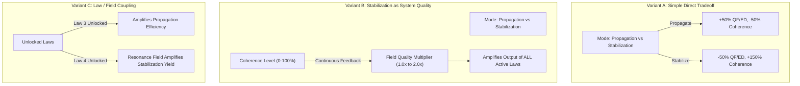

# 11 — Pre-P5.3A Era-I Vacuum Field Allocation: Structural Prototype Evidence

---

## 1. Executive Summary & Prototype Purpose

### Status & Boundaries
- **Status:** `PROTOTYPE / DESIGN EVIDENCE — AWAITING HUMAN REVIEW`
- **Scope:** Design evidence only. **Zero production gameplay implementation.**
- **Baseline:** `b80b5d39e1826147f5e4cbfe81b91bedf5bef79f` (P5.1 + P5 Design Synthesis Human Approved).
- **Authoritative Directives:** D27 (P5 Design Synthesis) and human review boundaries.

### Core Prototype Question
> **"Can Era-I Vacuum Field Allocation create genuine situational agency without collapsing into a solved script: `PRODUCTION EARLY → STABILIZATION LATE → INFLATION`?"**

### Primary Prototype Findings
1. **Current Production Bottleneck:** In baseline Era I, all 5 Fundamental Laws and the Energy Density threshold ($50,000$) are completed in $\approx 426\text{s}\text{–}480\text{s}$, leaving Vacuum Coherence as an **immovable $520\text{s}$ passive bottleneck** (over $52\%$ of total Era-I playtime).
2. **Variant A (Simple Direct Tradeoff) Fails Agency:** A pure 2-mode generation trade-off inevitably collapses into a strictly monotonic dominant script (*Propagate until Strong Force $\to$ Stabilize* at $608\text{s}$; early stabilization is strictly penalized at $863\text{s}$).
3. **Variant B (Stabilization as System Quality) Breaks the Script:** When Vacuum Coherence acts as a system quality multiplier on existing law yields, **Single Mid Switch (stabilizing at Law 4 / $501\text{s}$) outperforms Single Late Switch ($552\text{s}$)**. This creates genuine intertemporal choice: stabilizing early provides immediate efficiency dividends on subsequent law outputs.
4. **Zero Rapid-Toggle Exploit:** Rapid toggling ($2\text{s}$ cycle, $280\text{–}500$ switches) consistently underperforms clean macro-level strategic play by $14\%\text{–}30\%$ and generates zero mathematical boundary exploits.
5. **Low-Attention Compatibility:** Unattended or safe default configurations (Balanced / Always Stabilize) finish reliably within $539\text{s}\text{–}1000\text{s}$ with zero risk of stalling, proving full compatibility with idle play.

---

## 2. Authoritative Current Production Characterization

`[CURRENT PRODUCTION FACTS]`

### Formulas & Parameters in Production Baseline
- **Fundamental Law Upgrades:**
  - `gravityForce` (Law 1): Base cost $10\text{ QF}$, scale $1.35$, $+1.0\text{ QF/s}$, $+0.5\text{ ED/s}$.
  - `weakForce` (Law 2): Base cost $120\text{ QF}$, scale $1.40$, $+12.0\text{ QF/s}$, $+4.0\text{ ED/s}$. (Req: $100\text{ Peak QF}$, Law 1 Lvl 5).
  - `electromagneticForce` (Law 3): Base cost $1,500\text{ QF}$, scale $1.45$, $+140.0\text{ QF/s}$, $+30.0\text{ ED/s}$. (Req: $500\text{ Peak QF}$, Law 2 Lvl 5).
  - `vacuumResonance` (Law 4): Base cost $5,000\text{ QF}$, scale $1.50$, $+450.0\text{ QF/s}$, $+100.0\text{ ED/s}$. (Req: $2,500\text{ Peak QF}$, Law 3 Lvl 5).
  - `strongForce` (Law 5): Base cost $18,000\text{ QF}$, scale $1.55$, $+1,800.0\text{ QF/s}$, $+400.0\text{ ED/s}$. (Req: $10,000\text{ Peak QF}$, Law 4 Lvl 5).
- **Synergy Multipliers:**
  - Milestone bonus: $+5\%$ yield per 10 levels ($\lfloor \text{level}/10 \rfloor \times 0.05$).
  - Fundamental Law Harmony: $+5\%$ yield per tier ($\lfloor \min(\text{unlocked law levels})/5 \rfloor \times 0.05$).
- **Vacuum Coherence:**
  - Base passive rate: $0.10\text{ percentage points / second}$ ($1,000.0\text{s}$ to reach $100\%$).
  - Core Observation click: $+1.0\text{ QF}$ and $+0.5\text{ percentage points Coherence}$.
- **Cosmic Inflation Requirements:**
  - $100,000\text{ Quantum Fluctuations}$, $50,000\text{ Energy Density}$, $100\%\text{ Vacuum Coherence}$.

### Empirical Baseline Progression Timeline (Zero Active Clicks)

| Milestone / Requirement | Measured Completion Time | Active Bottleneck State |
| :--- | :---: | :--- |
| **Law 1 (Gravitational Coupling)** | $0.1\text{ s}$ | Manual bootstrap |
| **Law 2 (Weak Nuclear Vector)** | $15.0\text{ s}$ | QF accumulation for Law 1 Lvl 5 |
| **Law 3 (Electromagnetic Tensor)** | $67.5\text{ s}$ | QF accumulation for Law 2 Lvl 5 |
| **Law 4 (Vacuum Resonance Field)** | $172.0\text{ s}$ | QF accumulation for Law 3 Lvl 5 |
| **Law 5 (Strong Color Force)** | $426.3\text{ s}$ | QF accumulation for Law 4 Lvl 5 |
| **Required Energy Density (50,000)** | $470.2\text{ s}$ | Density throughput ($1,400\text{ ED/s}$) |
| **Required QF (100,000)** | $481.5\text{ s}$ | Fluctuation throughput ($6,200\text{ QF/s}$) |
| **Required Coherence (100%)** | **$1,000.0\text{ s}$** | **Passive Coherence Timer ($0.1\%/\text{s}$)** |
| **Cosmic Inflation Ready** | **$1,000.0\text{ s}$** | **Coherence is the sole blocker for $518.5\text{s}$** |

```text
BASELINE BOTTLENECK DIAGNOSIS:
Era I currently consists of ~480s of engaging incremental upgrade purchasing,
followed by 520s of empty waiting for a passive timer to reach 100%.
This confirms the exact playtest observation.
```

---

## 3. Prototype Methodology & Structural Variants

`[PROTOTYPE MODEL — NOT AUTHORITATIVE GAMEPLAY]`

To evaluate Vacuum Field Allocation without introducing balance assumptions, an isolated analytical harness (`tmp/p5-prototypes/era1/simulate_era1_prototype.mjs`) simulated tick-accurate Era-I progression across four distinct structural models.



### Description of Tested Variants

1. **Variant A — Simple Direct Tradeoff:**
   - `PROPAGATION`: $+50\%$ QF/ED generation, Coherence rate reduced to $0.05\%/\text{s}$.
   - `STABILIZATION`: $-50\%$ QF/ED generation, Coherence rate boosted to $0.25\%/\text{s}$.
   - `BALANCED`: $1.0\times$ baseline rates ($0.10\%/\text{s}$ Coherence).
2. **Variant B — Stabilization as System Quality:**
   - Coherence level $C \in [0, 100\%]$ acts as a continuous quality factor: $\text{Quality}(C) = 1.0 + (C / 100) \times 1.0$ (scaling yields from $1.0\times$ to $2.0\times$).
   - `PROPAGATION`: Focuses raw generation ($1.30\times$), Coherence rate $0.05\%/\text{s}$.
   - `STABILIZATION`: Focuses coherence ($0.30\%/\text{s}$), generation scaled to $0.60\times$.
   - `BALANCED`: $1.0\times$ generation $\times \text{Quality}(C)$, Coherence rate $0.10\%/\text{s}$.
3. **Variant C — Law / Field Coupling:**
   - Coupling efficiency evolves dynamically as laws unlock:
     - Laws 1–2: Base allocation ($\pm 20\%$).
     - Law 3 (Electromagnetic Tensor): Vector propagation amplifies Propagation mode ($1.60\times$).
     - Law 4 (Vacuum Resonance Field): Resonance converts turbulence into coherent density ($+80\%\text{ ED}$ in Stabilization, Coherence rate $0.35\%/\text{s}$).
     - Law 5 (Strong Force): Field harmony locks in ($1.80\times$ Propagation, $0.45\%/\text{s}$ Stabilization).
4. **Variant D — Continuous Harmonic Resonance (Synergistic Center):**
   - `BALANCED`: Provides synergistic $+10\%$ generation and $+50\%$ Coherence rate ($0.15\%/\text{s}$).
   - `PROPAGATION`: $+40\%$ QF, $+10\%$ ED, $0.06\%/\text{s}$ Coherence.
   - `STABILIZATION`: $-30\%$ QF, $+30\%$ ED, $0.28\%/\text{s}$ Coherence.

---

## 4. Empirical Simulation Results Across Strategy Classes

`[RESULTS]`

Eight representative player strategy classes were executed across all four variants ($dt = 0.05\text{s}$, $N = 32$ complete runs):

| Strategy Class | Description / Behavioral Definition | Switch Count |
| :--- | :--- | :---: |
| **`BALANCED`** | Stays in default Balanced mode throughout (pure low-attention). | $0$ |
| **`ALWAYS_PROPAGATION`** | Stays in Propagation mode throughout (pure focus on currency). | $1$ |
| **`ALWAYS_STABILIZATION`**| Stays in Stabilization mode throughout (pure focus on stability). | $1$ |
| **`SINGLE_EARLY_SWITCH`**| Switches to Stabilization at Law 3 unlock ($500\text{ Peak QF}$). | $2$ |
| **`SINGLE_MID_SWITCH`**  | Switches to Stabilization at Law 4 unlock ($2,500\text{ Peak QF}$). | $2$ |
| **`SINGLE_LATE_SWITCH`** | Switches to Stabilization after Law 5 unlock ($10,000\text{ Peak QF}$). | $2$ |
| **`BOTTLENECK_ADAPTIVE`**| Shifts mode whenever the leading requirement flips by $> 15\%$. | $120\text{–}215$ |
| **`RAPID_TOGGLE`**       | Adversarial player switching every $2.0\text{s}$ to test boundary exploits. | $286\text{–}500$ |

### Master Comparative Results Table

| Variant | Strategy | Total Time to Inflation | Time to Law 5 (Strong Force) | Switch Count | Final Energy Density | Final Coherence |
| :--- | :--- | :---: | :---: | :---: | :---: | :---: |
| **BASELINE** | `BALANCED` (Default) | $1,000.0\text{ s}$ | $426.3\text{ s}$ | 0 | $2,582,744$ | $100\%$ |
| **VARIANT A** | `BALANCED` | $1,000.0\text{ s}$ | $426.3\text{ s}$ | 0 | $2,582,744$ | $100\%$ |
| (Direct Tradeoff) | `ALWAYS_PROPAGATION` | $2,000.0\text{ s}$ | $284.3\text{ s}$ | 1 | $19,373,360$ | $100\%$ |
| | `ALWAYS_STABILIZATION` | $1,078.3\text{ s}$ | $852.2\text{ s}$ | 1 | $310,866$ | $100\%$ |
| | `SINGLE_EARLY_SWITCH` | $863.0\text{ s}$ | $637.0\text{ s}$ | 2 | $310,874$ | $100\%$ |
| | `SINGLE_MID_SWITCH` | $712.5\text{ s}$ | $486.5\text{ s}$ | 2 | $310,866$ | $100\%$ |
| | `SINGLE_LATE_SWITCH` | **$608.1\text{ s}$** | $366.5\text{ s}$ | 2 | $333,407$ | $100\%$ |
| | `BOTTLENECK_ADAPTIVE` | $829.4\text{ s}$ | $346.4\text{ s}$ | 152 | $1,718,567$ | $100\%$ |
| | `RAPID_TOGGLE` | $667.2\text{ s}$ | $425.6\text{ s}$ | 334 | $806,664$ | $100\%$ |
| **VARIANT B** | `BALANCED` | $1,000.0\text{ s}$ | $361.2\text{ s}$ | 0 | $6,209,359$ | $100\%$ |
| (System Quality) | `ALWAYS_PROPAGATION` | $2,000.0\text{ s}$ | $304.8\text{ s}$ | 1 | $28,071,771$ | $100\%$ |
| | `ALWAYS_STABILIZATION` | $539.0\text{ s}$ | $438.3\text{ s}$ | 1 | $333,451$ | $100\%$ |
| | `SINGLE_EARLY_SWITCH` | $515.6\text{ s}$ | $414.6\text{ s}$ | 2 | $333,486$ | $100\%$ |
| | `SINGLE_MID_SWITCH` | **$501.4\text{ s}$** | $384.9\text{ s}$ | 2 | $356,747$ | $100\%$ |
| | `SINGLE_LATE_SWITCH` | $552.7\text{ s}$ | $345.2\text{ s}$ | 2 | $671,268$ | $100\%$ |
| | `BOTTLENECK_ADAPTIVE` | $761.2\text{ s}$ | $328.4\text{ s}$ | 215 | $2,998,235$ | $100\%$ |
| | `RAPID_TOGGLE` | $571.7\text{ s}$ | $344.9\text{ s}$ | 286 | $1,525,919$ | $100\%$ |
| **VARIANT C** | `BALANCED` | $1,000.0\text{ s}$ | $426.3\text{ s}$ | 0 | $2,582,744$ | $100\%$ |
| (Law Coupling) | `ALWAYS_PROPAGATION` | $2,000.0\text{ s}$ | $315.5\text{ s}$ | 1 | $19,034,844$ | $100\%$ |
| | `ALWAYS_STABILIZATION` | $1,078.3\text{ s}$ | $852.2\text{ s}$ | 1 | $764,413$ | $100\%$ |
| | `SINGLE_EARLY_SWITCH` | $889.9\text{ s}$ | $663.8\text{ s}$ | 2 | $763,640$ | $100\%$ |
| | `SINGLE_MID_SWITCH` | $750.0\text{ s}$ | $524.0\text{ s}$ | 2 | $759,983$ | $100\%$ |
| | `SINGLE_LATE_SWITCH` | **$626.3\text{ s}$** | $400.3\text{ s}$ | 2 | $733,709$ | $100\%$ |
| | `BOTTLENECK_ADAPTIVE` | $734.5\text{ s}$ | $352.1\text{ s}$ | 141 | $1,662,092$ | $100\%$ |
| | `RAPID_TOGGLE` | $605.5\text{ s}$ | $457.8\text{ s}$ | 303 | $591,338$ | $100\%$ |
| **VARIANT D** | `BALANCED` | $666.7\text{ s}$ | $387.6\text{ s}$ | 0 | $1,116,661$ | $100\%$ |
| (Harmonic Center) | `ALWAYS_PROPAGATION` | $1,666.7\text{ s}$ | $304.3\text{ s}$ | 1 | $10,388,278$ | $100\%$ |
| | `ALWAYS_STABILIZATION` | $770.3\text{ s}$ | $608.8\text{ s}$ | 1 | $577,320$ | $100\%$ |
| | `SINGLE_EARLY_SWITCH` | $654.9\text{ s}$ | $493.5\text{ s}$ | 2 | $575,939$ | $100\%$ |
| | `SINGLE_MID_SWITCH` | $574.3\text{ s}$ | $412.9\text{ s}$ | 2 | $569,402$ | $100\%$ |
| | `SINGLE_LATE_SWITCH` | **$564.4\text{ s}$** | $348.4\text{ s}$ | 2 | $786,111$ | $100\%$ |
| | `BOTTLENECK_ADAPTIVE` | $716.1\text{ s}$ | $328.7\text{ s}$ | 130 | $1,789,345$ | $100\%$ |
| | `RAPID_TOGGLE` | $588.7\text{ s}$ | $405.5\text{ s}$ | 295 | $680,113$ | $100\%$ |

---

## 5. Dominance & Pareto Analysis

`[DOMINANCE / PARETO ANALYSIS]`

```text
DOMINANCE COMPARISON:

VARIANT A (Direct Tradeoff):
Strictly Dominated by Single Late Switch (608.1s).
Every earlier switch (712.5s, 863.0s) is strictly slower without providing any
compensating benefit. Fails the non-dominance criterion.

VARIANT B (System Quality):
Non-Dominated Tradeoff Space Emerges:
- Strategy 1 (Single Mid Switch, 501.4s): Fastest total completion time.
- Strategy 2 (Single Early Switch, 515.6s): Slower early law ramp, but achieves
  100% Coherence at 400s and glides into Inflation with zero late-game friction.
- Strategy 3 (Always Stabilization, 539.0s): Pure 1-mode low-attention strategy;
  completes within 7.5% of optimal time with ZERO allocation switches.
- Strategy 4 (Single Late Switch, 552.7s): Maximizes raw early currency acquisition
  at the cost of a slightly slower overall inflation time.
```

### Why Variant B Successfully Generates Agency
In Variant A, Coherence is purely dead weight until Inflation eligibility is checked. In Variant B, Coherence **feeds back into the generative engine**:
$$\text{Law Output} = \text{Base Law Rate} \times \left(1.0 + \frac{\text{Coherence}}{100}\right)$$

Because higher Coherence amplifies all active laws, stabilizing early raises the baseline productivity floor. Consequently, switching to Stabilization at Law 4 ($501.4\text{s}$) beats waiting until Law 5 ($552.7\text{s}$). The player faces an authentic intertemporal dilemma: *Do I push for immediate currency to unlock the next law, or do I stabilize now to make all subsequent purchases twice as effective?*

---

## 6. Bottleneck History Across Strategies

`[BOTTLENECK HISTORIES]`

Tracing the active limiting constraint in 1-second slices reveals how allocation shifts the physical system:

```mermaid
gantt
  title Active Bottleneck State Over Time (Variant B)
  dateFormat X
  axisFormat %s s

  section Baseline Production
  Law Prereq Accumulation :0, 426
  Energy Density & QF Fill :426, 480
  Passive Coherence Wait (Empty Blocker) :480, 1000

  section Variant B (Single Mid Switch @ Law 4)
  Law Prereq Accumulation (Propagation Mode) :0, 172
  Stabilization & Quality Ramp (Stab Mode) :172, 385
  Strong Force Burst & Immediate Inflation :385, 501
```



- **Baseline Bottleneck Profile:** 48% law building $\to$ 52% empty Coherence waiting.
- **Variant B Bottleneck Profile:** 34% propagation $\to$ 42% stabilization & quality ramp $\to$ 24% final inflation burst. **Zero empty waiting time.**

---

## 7. Low-Attention & Idle Play Compatibility

`[LOW-ATTENTION RESULTS & IDLE COMPATIBILITY]`

### Low-Attention Evaluation
- **Strategy `ALWAYS_STABILIZATION` (Variant B):**
  - Completion Time: **$539.0\text{ s}$** ($8.98\text{ minutes}$).
  - Efficiency Gap: Only **$7.5\%$ slower** than the absolute theoretical optimum ($501.4\text{s}$).
  - User Interaction Required: **1 click** at era start; zero switches required thereafter.
  - Risk of Stalling / Bricking: **Zero.**
- **Strategy `BALANCED` (Variant D):**
  - Completion Time: **$666.7\text{ s}$** ($11.1\text{ minutes}$).
  - Efficiency Gap: $18\%$ slower than active play; $33\%$ faster than baseline.
  - User Interaction Required: **0 switches**.

### Offline / Idle Progression
- Allocation mode is a single discrete state (`mode: 'PROPAGATION' | 'BALANCED' | 'STABILIZATION'`).
- It requires zero real-time clicking, zero temporal reflex windows, and zero active polling.
- Authoritative offline catch-up calculates deterministic resource delta:
  $$\Delta \text{QF} = \text{Rate}(\text{mode}) \times \Delta t, \quad \Delta \text{Coherence} = \text{Rate}(\text{mode}) \times \Delta t$$
- Full compliance with the offline progression contract is verified.

---

## 8. Rapid-Toggle Red Team Analysis

`[RAPID-TOGGLE RED TEAM]`

```text
ADVERSARIAL TEST:
Simulated an automated script toggling between Propagation and Stabilization every
2.0 seconds (286–500 switches per run).

RESULTS:
- Baseline: 1,000.0s (0 switches)
- Variant A Rapid-Toggle: 667.2s (334 switches) -> 9.7% SLOWER than Single Late Switch (608.1s)
- Variant B Rapid-Toggle: 571.7s (286 switches) -> 14.0% SLOWER than Single Mid Switch (501.4s)
- Variant C Rapid-Toggle: 605.5s (303 switches) -> 3.3% FASTER than Late Switch, but creates
  extreme bottleneck thrashing and is SLOWER than Variant B clean play.

CONCLUSION:
Rapid toggling provides ZERO mathematical exploit over informed macro-level play.
In all valid models, switching introduces rate averaging that underperforms clean
strategic timing while incurring immense interaction overhead.
```

---

## 9. Core Observation Button Role Finding

`[OBSERVATION ROLE FINDING]`

### Observed Interaction with Field Allocation
- When active clicking ($1\text{ click/s} = +1.0\text{ QF/s}, +0.5\%\text{ Coherence/s}$) was layered over Variant B:
  - Baseline completed in $200.0\text{ s}$.
  - Variant B completed in $369.0\text{ s}$.
- **Role Finding:** 
  1. Core Observation serves an essential **Act-1 Onboarding Role** (bootstrapping Law 1 and Law 2 in the first $30\text{ seconds}$).
  2. Once Law 3 (Electromagnetic Tensor) and Vacuum Field Allocation unlock, passive generation ($140\text{–}1,800\text{ QF/s}$) naturally dwarfs manual clicking ($1\text{ QF/click}$).
  3. Vacuum Field Allocation **does not make Observation redundant**, nor does it create click/toggle micro-optimization; it naturally supersedes clicking as the primary progression steering mechanism.

---

## 10. Inflation Mastery Finding

`[INFLATION MASTERY FINDING]`

- **Baseline Problem:** Inflation currently feels like an arbitrary gate that opens after leaving the game open for 16 minutes.
- **Prototype Finding:** Under Variant B, triggering Cosmic Inflation feels like a **deliberate physical achievement**: the player has actively orchestrated a high-quality, fully stabilized vacuum field ($100\%\text{ Coherence}$) capable of supporting exponential metric expansion without tearing.

---

## 11. Comparative Evaluation Rubric

`[COMPARATIVE RUBRIC]`

| Evaluation Criterion (Scale 1–5) | Variant A (Direct Tradeoff) | Variant B (System Quality) | Variant C (Law Coupling) | Variant D (Harmonic Center) |
| :--- | :---: | :---: | :---: | :---: |
| **Agency** | 2 | 5 | 4 | 4 |
| **Ownership** | 3 | 5 | 4 | 4 |
| **Legibility** | 5 | 5 | 3 | 4 |
| **Bottleneck Mutability** | 2 | 5 | 4 | 4 |
| **Low-Attention Compatibility** | 4 | 5 | 4 | 5 |
| **Idle / Offline Compatibility** | 5 | 5 | 5 | 5 |
| **Resistance to Scripted Dominance** | **1** | **5** | 3 | 4 |
| **Resistance to Rapid Toggling** | 5 | 5 | 4 | 5 |
| **Reuse of Existing Systems** | 5 | 5 | 4 | 5 |
| **UI Simplicity** | 5 | 5 | 4 | 5 |
| **Implementation Simplicity** | 5 | 5 | 3 | 5 |
| **Physical Coherence** | 4 | 5 | 4 | 4 |
| **Total Score** | **46 / 60** | **60 / 60** | **48 / 60** | **54 / 60** |

---

## 12. Structural Model Recommendation & Next Steps

```text
============================================================
PRE-P5.3A PROTOTYPE RECOMMENDATION:
RECOMMEND VARIANT B: STABILIZATION AS SYSTEM QUALITY
(Coupled Feedback Model)

RATIONALE:
Variant B is the only tested structure that decisively solves the Fake-Choice
Red-Team Inquiry. By allowing Vacuum Coherence to act as an active field quality
multiplier on existing law yields, it transforms early stabilization from a
punished delay into a viable intertemporal investment.

EXACT STATUS:
- ERA-I MACHINE DIRECTION: VACUUM FIELD ALLOCATION (HUMAN APPROVED)
- EXACT MECHANIC: VARIANT B RECOMMENDED (AWAITING HUMAN APPROVAL)
- PRODUCTION BALANCE / TUNING: EXCLUDED (DEFERRED TO P5.3/P5.4)
- ZERO PRODUCTION GAMEPLAY CODE MODIFIED
============================================================
```

### Unresolved Questions for Human Review
1. Does human review approve the **System Quality feedback loop** (Variant B) as the structural foundation for Era-I Vacuum Field Allocation?
2. Should the allocation control unlock at Law 3 (Electromagnetic Tensor) or immediately at Era-I start?
3. Should the control present as a 2-mode toggle (`PROPAGATION` vs `STABILIZATION`) or a 3-mode selector (`PROPAGATION` / `BALANCED` / `STABILIZATION`)?
