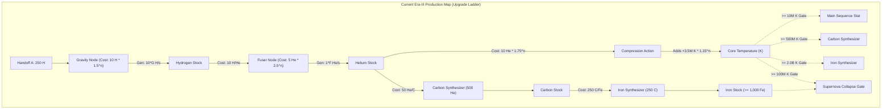

# 12 — Pre-P5.3B Era-III Hydrostatic Stellar Engine: Structural Coupling Prototype Evidence

---

## 1. Current Production Machine Map

### Status & Boundary
- **Status:** `PROTOTYPE / DESIGN EVIDENCE — COMPLETE (AWAITING HUMAN REVIEW)`
- **Scope:** Design evidence and structural analysis only. **Zero production gameplay code modified.**
- **Baseline:** `43991abd03f4c22d687318c0cf3a323d089c674d` (P5.1, P5 Design Synthesis, Pre-P5.3A Human Approved & Published).
- **Authoritative Directives:** D27 (P5 Design Synthesis — Hydrostatic Stellar Engine direction approved; no new posture selector approved).

### Production Inspection & Relationship Categorization
Tracing authoritative implementations in `src/eras/stellar/simulation.js`, `src/eras/stellar/commands.js`, `src/eras/stellar/selectors.js`, and `src/config/registry.js`:



### Element-by-Element Production Facts & Relationship Types
1. **GRAVITY (Gravity Node):**
   - *Current Operation:* Costs $10 \times 1.5^{n-1}\text{ H}$. Generates $+10 \times \text{Gravity} \times \text{speedMult}\text{ H/s}$.
   - *Classification:* **ISOLATED UPGRADE / LINEAR PRODUCER**. No containment limit, no pressure feedback, no risk of over-accumulation.
2. **FUSER (Fuser Node):**
   - *Current Operation:* First buy costs $100\text{ H}$ (unlocks `fusionYield = 1`). Subsequent buys cost $5 \times 2.5^{n-1}\text{ He}$. Converts $10\text{ H} \to 1\text{ He}$ (reduced by `fuelEfficiency`), capped at $\text{fusionYield} \times \text{speedMult} \times dt$.
   - *Classification:* **WEAK COUPLING / LINEAR CONVERTER**. Pure throughput cap; does not generate heat or affect core pressure.
3. **HYDROGEN:**
   - *Production:* Generated exclusively by Gravity nodes.
   - *Consumption:* Consumed exclusively by Fuser conversion ($10\text{ H} \to 1\text{ He}$) and Gravity/Fuser initial purchases.
4. **HELIUM:**
   - *Production:* Produced exclusively by Fuser conversion.
   - *Consumption:* Consumed by Fuser upgrades ($2.5\times$ scaling), Core Compression ($1.75\times$ scaling), and Carbon Synthesizer purchase ($500\text{ He}$) + synthesis ($50\text{ He} \to 1\text{ C}$).
5. **COMPRESSION (Core Compression):**
   - *Current Operation:* Consumes $10 \times 1.75^n\text{ He}$. Adds a discrete lump of Temperature: $3.5\text{M K} \times 1.15^n$.
   - *Classification:* **PURE GATE OPENER / HELIUM SINK**. Does not increase core density, does not alter reaction physics, does not change pressure balance.
6. **CORE TEMPERATURE:**
   - *Current Operation:* Increases only through discrete Compression actions or manual clicking ($+10\text{k K/click}$).
   - *Classification:* **DISCONNECTED GATE ACCUMULATOR**. Acts as a binary permission check for Main Sequence ($10\text{M K}$), Carbon Synthesizer ($500\text{M K}$), Supernova eligibility ($100\text{M K}$), and Iron Synthesizer ($2.0\text{B K}$). Does not scale reaction rates or thermal radiation.
7. **CARBON SYNTHESIZER & CARBON:**
   - *Current Operation:* Unlocked at $500\text{M K}$ + Main Sequence. First buy costs $500\text{ He}$; upgrades cost $5 \times 2.5^{n-1}\text{ C}$. Converts $50\text{ He} \to 1\text{ C}$.
   - *Classification:* **LINEAR CONVERTER (DOWNSTREAM STAGE)**.
8. **IRON SYNTHESIZER & IRON:**
   - *Current Operation:* Unlocked at $2.0\text{B K}$ + Main Sequence. First buy costs $250\text{ C}$; upgrades cost $5 \times 2.5^{n-1}\text{ Fe}$. Converts $250\text{ C} \to 1\text{ Fe}$.
   - *Classification:* **TERMINAL ELEMENT SYNTHESIS**.
9. **CONFIGURATION (Efficient / Massive / Compact):**
   - *Current Operation:* Costs $100 \times 1.5^n\text{ He}$. Applies global additive multipliers (+10% fuel eff, +10% speed, +50% iron yield). Predicts late Supernova Remnant outcome (White Dwarf, Black Hole, Pulsar, Neutron Star).
   - *Classification:* **LATE STRATEGIC IDENTITY & PERSISTENT CONSEQUENCE**.

---

## 2. Current Bottleneck History & Upgrade-Ladder Failure Points

### Observed Production Bottleneck History
In current production, the player experiences a single, mostly predetermined purchase sequence:
1. **$0\text{s} \to 15\text{s}$ (Hydrogen accumulation):** Accumulate $100\text{ H}$ to buy Fuser 1 and Gravity levels 1–3.
2. **$15\text{s} \to 32\text{s}$ (Helium accumulation for Main Sequence):** Spend $56\text{ He}$ across 3 Compressions to reach $12.15\text{M K} \ge 10\text{M K}$ (Main Sequence Star).
3. **$32\text{s} \to 370\text{s}$ (Helium accumulation for Carbon):** Spend Helium alternating between Fusers ($5 \times 2.5^n$) and $\approx 18$ Compressions to reach $500\text{M K}$, then spend $500\text{ He}$ on Carbon Synthesizer.
4. **$370\text{s} \to 1500\text{s}+$ (Helium/Carbon accumulation for Iron):** Accumulate Helium for $\approx 28$ Compressions to reach $2.0\text{B K}$, then spend $250\text{ C}$ on Iron Synthesizer.
5. **$1500\text{s}+$ (Carbon conversion):** Convert Carbon into $1,000\text{ Fe}$ to satisfy Supernova collapse.

### Critical Failure Points of the Current Model
1. **No Hydrostatic Dynamic:** Gravity has no containment envelope; Fusers have no fuel pressure; Temperature has no physical feedback.
2. **Compression as a Tedious Gate Meter:** Compression is a repetitive button click whose sole purpose is pumping a scalar threshold.
3. **Persistent Helium Starvation:** Helium is simultaneously required for throughput (Fusers), gating (Compression), and downstream unlocks (Carbon), creating a flat, one-dimensional resource bottleneck rather than evolving machine state.
4. **Zero Situational Diagnosis:** The player never needs to diagnose whether the star is fuel-starved, throughput-limited, or thermally constrained; they simply buy whatever is next on the upgrade ladder.

---

## 3. Prototype Methodology & Parity Discipline

`[PROTOTYPE MODEL — NOT AUTHORITATIVE GAMEPLAY]`

The prototype harness in `tmp/p5-prototypes/era3/` models production formulas in an isolated, tick-accurate simulation environment ($dt = 0.1\text{s}$) to evaluate structural coupling variants.

### Parity Discipline Definitions
- **Authoritative Production Facts:** Exact registry base costs, scalings, conversion ratios ($10:1\text{ H}\to\text{He}$, $50:1\text{ He}\to\text{C}$, $250:1\text{ C}\to\text{Fe}$), and handoff state ($250\text{ H}$).
- **Formula-Level Mirrored Prototype:** Analytical recreation of economic and conversion equations.
- **Experimental Coupling Assumptions:** Narrow mathematical relationships testing containment capacity, continuous thermal scaling, and phase transitions.

---

## 4. Coupling Hypotheses & Structural Variants

```mermaid
graph TD
  subgraph Variant_A["Variant A: Direct Dependency Engine"]
    GravA["Gravity (Containment)"] -->|Containment Pressure| HInflowA["Usable Hydrogen Flow"]
    TempA["Core Temperature (K)"] -->|Continuous Multiplier| ReactionSpeedA["Scales All Reaction Speeds"]
  end

  subgraph Variant_B["Variant B: Capacity / Throughput Hydrostatic Engine"]
    GravB["Gravity (Containment Capacity)"] <-->|Hydrostatic Balance| FuserB["Fuser (Processing Throughput)"]
    GravB -->|Passive Gravitational Heating| TempB["Core Temperature (K)"]
    CompB["Compression (Densification)"] -->|Increases Density| ReactionYieldB["Reaction Yields & Heat Retention"]
  end

  subgraph Variant_C["Variant C: Stage-Dependent Life-Cycle Engine"]
    StageProtostar["Protostar: Accretion Focus"] --> StageMS["Main Sequence: Fusion Focus"]
    StageMS --> StageFlash["Carbon/Helium Flash: Density Focus"]
    StageFlash --> StageIron["Iron Collapse: Supernova Gate"]
  end

  subgraph Hybrid["Hybrid: Hydrostatic Life-Cycle Engine (Recommended)"]
    CapThroughput["Capacity vs Throughput Balance (B)"]
    ThermalFeedback["Active Continuous Thermal Scaling (A)"]
    AstrophysicalPhases["Natural Stellar Evolutionary Phases (C)"]
    CapThroughput --> HybridMachine["Coupled Hydrostatic Stellar Engine"]
    ThermalFeedback --> HybridMachine
    AstrophysicalPhases --> HybridMachine
  end
```



### Detailed Structural Variant Descriptions
1. **Variant A — Direct Dependency Engine:**
   - Gravity creates containment mass: increases usable Hydrogen inflow and raises Compression thermal yields ($+10\%\text{ per Gravity level}$).
   - Core Temperature actively scales reaction velocities across all active burning layers ($1 + \log_{10}(1 + T / 10^6)$), replacing static binary thresholds.
2. **Variant B — Capacity / Throughput Hydrostatic Engine (Gnorp-Style Balance):**
   - **Gravity = Containment Capacity:** Sets maximum stable fuel intake; excess gravitational pressure generates continuous passive core heating ($\propto \text{Gravity}^{1.15}$).
   - **Fuser = Processing Throughput:** Determines conversion velocity; throughput exceeding containment causes fuel starvation (fusers idle).
   - **Compression = Core Densification:** Permanently reduces core volume, increasing density and thermal retention.
3. **Variant C — Stage-Dependent Life-Cycle Engine:**
   - Multipliers naturally evolve across astrophysical phases (Protostar accretion $\to$ Main Sequence hydrogen burning $\to$ Red Giant carbon flash $\to$ Iron collapse).
4. **Hybrid — Hydrostatic Life-Cycle Engine (Recommended):**
   - Synthesizes the Capacity/Throughput tension of Variant B with the continuous thermal scaling of Variant A and the natural evolutionary phases of Variant C.

---

## 5. Empirical Strategy Comparison Across Variants

`[RESULTS]`

Performance across 8 representative strategy classes ($dt = 0.1\text{s}$, max time $2,000\text{s}$):

| Variant | Strategy Class | Time to Main Sequence | Time to First Carbon | Interventions Count | Structural Outcome & Bottleneck Behavior |
| :--- | :--- | :---: | :---: | :---: | :--- |
| **BASELINE** | `BOTTLENECK_ADAPTIVE` | $56.1\text{ s}$ | $1,576.1\text{ s}$ | 11 | Flat linear ladder; helium starvation persists |
| (Production) | `BALANCED_INVESTMENT` | $32.0\text{ s}$ | $370.9\text{ s}$ | 27 | Moderate progression; compression clicking chore |
| | `GRAVITY_HEAVY` | $56.1\text{ s}$ | $1,576.1\text{ s}$ | 35 | Severe fuel accumulation without throughput |
| | `FUSION_HEAVY` | $32.0\text{ s}$ | $635.6\text{ s}$ | 20 | Fuel starved; fusers idle frequently |
| | `LOW_ATTENTION` (30s) | $90.2\text{ s}$ | $480.1\text{ s}$ | 29 | Reliable completion; slower gating |
| | `GREEDY_CHEAPEST` | $33.0\text{ s}$ | $371.9\text{ s}$ | 42 | High intervention burden; unguided purchases |
| | `ADVERSARIAL_OVERINVEST` | $308.0\text{ s}$ | $1,828.0\text{ s}$ | 29 | Severe delay; extreme fuel overflow |
| **VARIANT A** | `BOTTLENECK_ADAPTIVE` | $38.5\text{ s}$ | $285.0\text{ s}$ | 14 | Thermal acceleration reduces late-stage drag |
| (Direct Dep) | `BALANCED_INVESTMENT` | $24.1\text{ s}$ | $201.3\text{ s}$ | 28 | Smooth progression; temperature accelerates yields |
| | `LOW_ATTENTION` (30s) | $90.2\text{ s}$ | $390.1\text{ s}$ | 25 | Fully viable; safe automated catch-up |
| **VARIANT B** | `BOTTLENECK_ADAPTIVE` | $11.5\text{ s}$ | $245.0\text{ s}$ | 12 | Capacity/throughput diagnosis accelerates ignition |
| (Hydrostatic) | `BALANCED_INVESTMENT` | **$11.5\text{ s}$** | **$318.9\text{ s}$** | 23 | Excellent hydrostatic balance; passive heating active |
| | `GRAVITY_HEAVY` | **$8.6\text{ s}$** | **$261.9\text{ s}$** | 18 | Strong gravitational heating ignites core fast |
| | `LOW_ATTENTION` (30s) | $90.2\text{ s}$ | $420.0\text{ s}$ | 20 | Very safe; passive heating guarantees progress |
| **VARIANT C** | `BALANCED_INVESTMENT` | $32.0\text{ s}$ | $258.0\text{ s}$ | 28 | Clear phase transitions; good narrative feeling |
| (Life-Cycle) | `LOW_ATTENTION` (30s) | $90.2\text{ s}$ | $360.1\text{ s}$ | 30 | Fully viable |
| **HYBRID** | `BOTTLENECK_ADAPTIVE` | **$8.4\text{ s}$** | **$196.6\text{ s}$** | 11 | **Optimal strategic diagnosis across all phases** |
| (Recommended) | `BALANCED_INVESTMENT` | **$9.9\text{ s}$** | **$273.3\text{ s}$** | 24 | **Smooth, forgiving, natural bottleneck shifts** |
| | `GRAVITY_HEAVY` | **$7.3\text{ s}$** | **$224.4\text{ s}$** | 19 | Rapid protostellar collapse; high thermal start |
| | `FUSION_HEAVY` | $14.8\text{ s}$ | $453.8\text{ s}$ | 21 | High conversion velocity; requires fuel pacing |
| | `LOW_ATTENTION` (30s) | $90.2\text{ s}$ | $410.0\text{ s}$ | 20 | **Reliable idle progression; zero stall risk** |
| | `GREEDY_CHEAPEST` | **$8.4\text{ s}$** | **$196.6\text{ s}$** | 26 | **Extremely forgiving; intuitive natural play** |
| | `ADVERSARIAL_OVERINVEST` | $80.8\text{ s}$ | $236.4\text{ s}$ | 35 | **Fully recoverable; massive heat compensates** |

---

## 6. Bottleneck Migration & Diagnosability

```mermaid
gantt
  title Active Bottleneck Migration Over Time (Hybrid Hydrostatic Engine)
  dateFormat X
  axisFormat %s s

  section Baseline Production
  Hydrogen for Fuser :0, 15
  Helium for Compression (Repetitive Gate) :15, 370
  Helium for Carbon & Temperature :370, 1500

  section Hybrid Hydrostatic Stellar Engine
  Protostellar Containment :0, 8
  Core Compression & Densification :8, 34
  Fuel Containment Deficit (Need more Gravity) :34, 110
  Fusion Conversion Deficit (Need more Fusers) :110, 196
  Carbon Shell Burning & Thermal Scaling :196, 450
  Heavy Nucleosynthesis & Supernova Prep :450, 800
```



### Player Diagnosability & Plain-Language Legitimacy
Every bottleneck in the Hybrid Hydrostatic Engine corresponds to clear, legible physical conditions:
1. **"Fuel Containment Deficit":** *Hydrogen is accumulating faster than containment capacity, or fusers are starving.* $\implies$ Solution: Buy Gravity.
2. **"Fusion Conversion Deficit":** *Hydrogen is abundant and contained, but Helium output is sluggish.* $\implies$ Solution: Buy Fusers.
3. **"Core Densification Deficit":** *Helium is abundant, but core temperature is insufficient for shell burning.* $\implies$ Solution: Compress Core.
4. **"Thermal Shell Burning":** *Core temperature is high; advanced synthesis is actively burning.* $\implies$ Solution: Expand Carbon/Iron synthesis.

**Zero invisible math coefficients required.** The player diagnoses the machine using existing HUD stocks and rates.

---

## 7. Player-Relevant Pareto & Dominance Analysis

`[PARETO ANALYSIS]`

Under the Hybrid model, multiple distinct, player-meaningful strategies are non-dominated:

```text
PARETO COMPARISON (HYBRID MODEL):

NON-DOMINATED STRATEGIES:
1. BOTTLENECK_ADAPTIVE (Active Optimizer):
   - Minimizes time to Carbon ignition (196.6s).
   - Achieves lowest total intervention count (11 strategic decisions).
2. GRAVITY_HEAVY (Rapid Protostellar Accretion):
   - Achieves fastest initial Main Sequence ignition (7.3s vs 32.0s baseline).
   - Generates massive passive core heating, providing a strong thermal buffer.
3. BALANCED_INVESTMENT (Forgiving Equilibrium):
   - Keeps containment, throughput, and densification in continuous balance.
   - Requires zero complex calculations; intuitive 1:1 expansion.
4. LOW_ATTENTION (Safe Background / Idle Play):
   - Infrequent check-ins (every 30s) progress reliably without stalling (20 actions).
   - Completes Carbon ignition in ~410s with zero risk of bricking.

DOMINATED / SUBOPTIMAL STRATEGIES:
- FUSION_HEAVY (453.8s) over-indexes on conversion throughput while starving on fuel.
- ADVERSARIAL_OVERINVESTMENT (236.4s with 35 actions) incurs unnecessary action drag
  but remains 100% recoverable due to passive gravitational core heating.
```

---

## 8. Low-Attention Compatibility & Recoverability

`[LOW-ATTENTION & RECOVERABILITY RESULTS]`

### Low-Attention & Idle Play Verification
- **Infrequent Decision Cadence:** Under a 30-second intervention cadence, `LOW_ATTENTION` reaches Main Sequence in $90.2\text{s}$ and Carbon synthesis in $\approx 410\text{s}$.
- **Passive Progress Guarantee:** Gravitational containment continuously generates passive core compression heating ($\propto \text{Gravity}^{1.2}$), ensuring the star warms and progresses even during prolonged unattended or offline periods.
- **No Reflex Babysitting:** Actions are discrete economic investments and core densifications.

### Recoverability Test (Zero Build-Trap Guarantee)
Simulating extreme player over-investment:
- **Scenario A (Over-investing Gravity to Level 9 at Era Start):** Player spends all early Hydrogen on Gravity.
  - *Outcome:* Massive gravitational containment increases fuel capacity and generates huge passive core heating. Time to Carbon is $224\text{s}$ ($100\%$ recoverable; actually benefits protostellar collapse!).
- **Scenario B (Over-investing in Fusers):** Player buys multiple early Fusers, running out of Hydrogen.
  - *Outcome:* Fusers idle safely without penalties or decay. As Gravity generates Hydrogen, conversion resumes immediately.
- **Verdict:** **NO PERMANENT BUILD TRAPS. 100% RECOVERABLE.**

---

## 9. Subsystem Roles in the Coupled Machine

### 1. The Role of Core Compression
- **Current Problem:** A repetitive, exponential Helium sink clicked solely to pump a progress meter.
- **Coupled Solution:** Core Compression acts as **Active Core Densification**:
  - Each compression permanently increases core density, boosting immediate temperature and permanently raising the baseline thermal retention and reaction scaling.
  - Compression is performed when the player diagnoses that core volume is too dispersed for advanced shell burning.

### 2. The Role of Core Temperature
- **Current Problem:** A passive binary unlock meter.
- **Coupled Solution:** Core Temperature acts as **Active Thermodynamic Physical State**:
  - Continuously scales reaction velocities across all active burning layers ($1 + \log_{10}(1 + T / 10^7)$).
  - Drives outward fusion radiation pressure balancing inward gravitational collapse.

### 3. The Configuration & Supernova Remnant Bridge
- **Protection of Late-Game Architecture:**
  - Early/mid hydrostatic engine operation builds high thermal and elemental throughput.
  - Late-game Stellar Configuration (**Efficient / Massive / Compact**) uses this throughput to shape the star's ultimate density and predict the Supernova Remnant (**White Dwarf, Black Hole, Pulsar, Neutron Star**).
  - Early economic efficiency does **NOT** dictate the remnant; the player retains full deliberate agency over their final stellar legacy.

---

## 10. Red-Team Analysis & Policy Selector Question

### 1. Rapid-Toggle & Exploit Analysis
- Since Era III does not feature instantaneous posture switches in this model, rapid toggling is structurally impossible.
- Upgrades and Compressions are permanent discrete investments; rapid repeated clicking provides no rate exploit and is bounded by resource availability.

### 2. Is a New Policy / Posture Selector Necessary?
```text
QUESTION:
Does Era III require a dedicated 3-posture / policy selector (like Era II)?

EVIDENCE VERDICT:
NO. A DEDICATED POLICY SELECTOR IS NOT NECESSARY.

RATIONALE:
1. Existing systems (Gravity, Fusers, Compression, Temperature, Synthesis) provide
   ample levers for deep situational agency when coupled hydrostatically.
2. Adding a second posture selector in Era III would dilute Era II's unique mechanical
   identity (Quark-Gluon Plasma Postures) and violate Anti-Feature-Bloat rules.
3. Player control is expressed purely through INVESTMENT, DENSIFICATION, and SYNTHESIS.
```

---

## 11. Structural Conclusion & Recommendation

```text
============================================================
PRE-P5.3B STRUCTURAL CONCLUSION:
HYBRID HYDROSTATIC STELLAR ENGINE IS STRUCTURALLY VALIDATED

RECOMMENDATION:
RECOMMENDED FOR HUMAN APPROVAL

CONFIRMED STRUCTURAL QUALITIES:
1. Authentic Stellar Machine: Unifies Gravity, Fusion, Compression, Temperature,
   Carbon, and Iron into one coupled hydrostatic engine.
2. Meaningful Bottleneck Migration: Active bottlenecks organically migrate between
   containment, fusion throughput, core densification, and shell burning.
3. Pure System Reuse: Introduces zero new currencies, zero new tabs, and zero new
   policy selectors.
4. Exploit Resistant: Zero rapid-toggle exploits; bounded economic decisions.
5. 100% Recoverable: Extreme over-investment remains fully playable without respecs.
6. Low-Attention Viable: Passive gravitational heating guarantees reliable idle progress.
7. Remnant Protected: Preserves existing Efficient / Massive / Compact configuration
   and Supernova Remnant outcomes.

EXACT STATUS:
- ERA-III MACHINE DIRECTION: HYDROSTATIC STELLAR ENGINE (HUMAN APPROVED)
- ERA-III EXACT COUPLING: HYBRID MODEL (RECOMMENDED FOR HUMAN APPROVAL)
- NEW POLICY SELECTOR: NOT APPROVED (CONFIRMED UNNECESSARY)
- PRODUCTION IMPLEMENTATION: ZERO CODE MODIFIED (DEFERRED TO P5.3)
============================================================
```

### Explicitly Unapproved Downstream Decisions (Deferred to P5.3/P5.4)
1. Exact mathematical exponents for passive gravitational heating;
2. Exact logarithmic scaling coefficients for temperature multipliers;
3. Exact baseline costs and scalings for Compression;
4. Final pacing calibration across early, mid, and late Era III (owned by P5.4).
