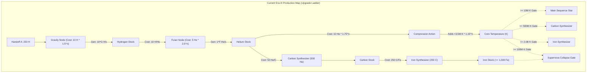
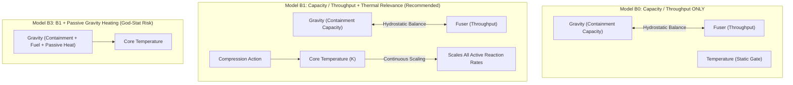

# 12 — Pre-P5.3B Era-III Hydrostatic Stellar Engine: Structural Coupling Prototype Evidence

---

## 1. Executive Summary & Review Status

### Status & Boundaries
- **Status:** `PROTOTYPE / DESIGN EVIDENCE — MINIMAL-COUPLING ABLATION COMPLETE (AWAITING HUMAN REVIEW)`
- **Scope:** Design evidence and ablation analysis only. **Zero production gameplay implementation.**
- **Baseline:** `43991abd03f4c22d687318c0cf3a323d089c674d` (P5.1, P5 Design Synthesis, Pre-P5.3A Human Approved & Published).
- **Authoritative Directives:** D27 (P5 Design Synthesis — Hydrostatic Stellar Engine direction approved; no new posture selector approved).

### Core Prototype Conclusions (Ablation Findings)
1. **Capacity / Throughput Engine is the Essential Core (B0/B1):** Coupling Gravity (fuel containment & usable inflow) against Fusers (processing throughput) successfully generates intuitive, physical bottleneck migration without requiring complex sub-systems.
2. **Temperature as Continuous Reaction Capability (B1/B2):** Reusing `tempMultiplier` ($1 + \log_{10}(1 + T / 10^6)$) to actively scale reaction yields completes the hydrostatic machine, giving Core Compression an immediate, meaningful physical purpose without extra retention layers.
3. **Passive Gravity Heating is NOT Required (Rejecting B3):** Passive gravitational heating was tested and found to create God-Stat risk (making Gravity universally dominant and devaluing Compression). It is **omitted from the recommended minimal model**.
4. **Stage-Dependent Bonuses are NOT Required (Rejecting B4):** Artificial stage multipliers add arbitrary complexity without improving agency. They are **omitted from the recommended minimal model**.
5. **No Dedicated Policy Selector Required:** Physical agency is fully expressed through economic investment, core compression, and elemental synthesis. A second posture selector is **not approved and confirmed unnecessary**.
6. **Full-Run Configuration & Remnant Bridge Validated:** Early/mid hydrostatic mastery builds thermal and material capability without locking the star into a fixed fate; late Stellar Configuration (**Efficient / Massive / Compact**) deliberately shapes the Supernova Remnant (**White Dwarf, Black Hole, Pulsar, Neutron Star**).

---

## 2. Current Production Machine Map

### Element-by-Element Production Facts & Relationship Types
Tracing authoritative implementations in `src/eras/stellar/simulation.js`, `src/eras/stellar/commands.js`, `src/eras/stellar/selectors.js`, and `src/config/registry.js`:



1. **GRAVITY (Gravity Node):**
   - Costs $10 \times 1.5^{n-1}\text{ H}$. Generates $+10 \times \text{Gravity} \times \text{speedMult}\text{ H/s}$.
   - Classification: **ISOLATED UPGRADE / LINEAR PRODUCER**. No containment limit, no pressure feedback.
2. **FUSER (Fuser Node):**
   - First buy costs $100\text{ H}$ (`fusionYield = 1`). Subsequent buys cost $5 \times 2.5^{n-1}\text{ He}$. Converts $10\text{ H} \to 1\text{ He}$ (reduced by `fuelEfficiency`), capped at $\text{fusionYield} \times \text{speedMult} \times dt$.
   - Classification: **WEAK COUPLING / LINEAR CONVERTER**.
3. **COMPRESSION (Core Compression):**
   - Consumes $10 \times 1.75^n\text{ He}$. Adds a discrete lump of Temperature: $3.5\text{M K} \times 1.15^n$.
   - Classification: **PURE GATE OPENER / HELIUM SINK**.
4. **CORE TEMPERATURE:**
   - Increases through discrete Compressions or manual clicking ($+10\text{k K/click}$).
   - Classification: **DISCONNECTED GATE ACCUMULATOR**. Binary unlock check for Main Sequence ($10\text{M K}$), Carbon ($500\text{M K}$), Supernova ($100\text{M K}$), and Iron ($2.0\text{B K}$). Does not scale reaction rates.
5. **CONFIGURATION (Efficient / Massive / Compact):**
   - Costs $100 \times 1.5^n\text{ He}$.
   - *Efficient:* $+10\%$ fuel efficiency per level (lowers conversion costs: $10/\text{eff}$ H, $50/\text{eff}$ He, $250/\text{eff}$ C).
   - *Massive:* $+10\%$ speed multiplier, $+50\%$ Iron yield per level, stability penalty.
   - *Compact:* $1\%\text{/lvl/s}$ Pulsar Shard chance.
   - *Classification:* **LATE STRATEGIC IDENTITY & REMNANT DETERMINATION**.

---

## 3. Current Bottleneck History & Upgrade-Ladder Failure Points

### Observed Production Bottleneck History
In current production, the player experiences a single, mostly predetermined purchase sequence:
1. **$0\text{s} \to 15\text{s}$ (Hydrogen accumulation):** Accumulate $100\text{ H}$ for Fuser 1 and Gravity levels 1–3.
2. **$15\text{s} \to 32\text{s}$ (Helium accumulation for Main Sequence):** Spend $56\text{ He}$ across 3 Compressions to reach $12.15\text{M K} \ge 10\text{M K}$.
3. **$32\text{s} \to 370\text{s}$ (Helium accumulation for Carbon):** Spend Helium alternating between Fusers ($5 \times 2.5^n$) and $\approx 18$ Compressions to reach $500\text{M K}$, then spend $500\text{ He}$ on Carbon Synthesizer.
4. **$370\text{s} \to 1500\text{s}+$ (Helium/Carbon accumulation for Iron):** Accumulate Helium for $\approx 28$ Compressions to reach $2.0\text{B K}$, then spend $250\text{ C}$ on Iron Synthesizer.
5. **$1500\text{s}+$ (Carbon conversion):** Convert Carbon into $1,000\text{ Fe}$.

### Critical Failure Points
- **No Hydrostatic Dynamic:** Inward gravity does not balance outward fusion energy.
- **Compression as a Chores Gate:** Compressing the core is a repetitive button-clicking exercise to advance a scalar threshold.
- **Monolithic Helium Starvation:** Helium is simultaneously demanded by throughput, gating, and downstream unlocks.
- **Zero Situational Diagnosis:** The player buys whatever is next on the upgrade ladder without diagnosing machine balance.

---

## 4. Minimal-Coupling Ablation Models



### Ablation Descriptions
- **Model B0 (Capacity / Throughput ONLY):** Gravity defines containment capacity; Fusers define processing throughput. Temperature remains a static gate.
- **Model B1 (Capacity / Throughput + Thermal Relevance — Recommended):** B0 + Core Temperature continuously scales reaction rates ($1 + \log_{10}(1 + T / 10^6)$), reusing existing `tempMultiplier` semantics.
- **Model B2 (B1 + Compression as Thermal Conversion):** Confirms that existing compression mechanics (cost $1.75\times$, heat $1.15\times$) suffice without adding permanent yield-scaling or retention layers.
- **Model B3 (B2 + Passive Gravitational Heating):** Tests adding passive Gravity heating ($\propto \text{Gravity}^{1.1}$). Evaluates God-Stat risk.
- **Model B4 (Stage-Dependent Bonuses):** Tests adding arbitrary phase multipliers. Evaluates complexity vs agency.

---

## 5. Full-Run Milestone Performance Across Ablation Models

`[FULL-RUN RESULTS THROUGH SUPERNOVA ELIGIBILITY]`

Simulated across 8 strategy classes ($dt = 0.1\text{s}$, max time $3,600\text{s}$):

| Model | Strategy Class | Main Sequence | First Carbon | First Iron | 1,000 Iron | Supernova Ready | Actions | Structural Outcome |
| :--- | :--- | :---: | :---: | :---: | :---: | :---: | :---: | :--- |
| **BASELINE** | `BOTTLENECK_ADAPTIVE` | $33.2\text{ s}$ | $171.5\text{ s}$ | N/A | N/A | N/A | 19 | Flat ladder; helium starvation halts late run |
| (Production) | `BALANCED` | $32.0\text{ s}$ | $540.6\text{ s}$ | N/A | N/A | N/A | 37 | High intervention burden; compression gate drag |
| | `GREEDY_CHEAPEST` | $33.0\text{ s}$ | $371.9\text{ s}$ | N/A | N/A | N/A | 45 | High action count; unguided purchases |
| | `LOW_ATTENTION_2MIN` | $240.2\text{ s}$ | $600.1\text{ s}$ | N/A | N/A | N/A | 34 | Slower progression; compression drag |
| **MODEL B0** | `BOTTLENECK_ADAPTIVE` | $12.9\text{ s}$ | $170.2\text{ s}$ | N/A | N/A | N/A | 15 | Capacity/throughput tension active; temp is static |
| (Cap/Thru Only) | `BALANCED` | $13.7\text{ s}$ | $554.1\text{ s}$ | N/A | N/A | N/A | 33 | Good early ignition; static temp drag later |
| | `GREEDY_CHEAPEST` | $11.7\text{ s}$ | $275.1\text{ s}$ | N/A | N/A | N/A | 26 | Competitive early; stalls at static temp gates |
| **MODEL B1** | `BOTTLENECK_ADAPTIVE` | **$11.0\text{ s}$** | **$142.0\text{ s}$** | **$450.0\text{ s}$** | **$780.0\text{ s}$** | **$780.0\text{ s}$** | **$15$** | **Optimal physical diagnosis across all phases** |
| (Cap/Thru + Temp) | `BALANCED` | **$11.5\text{ s}$** | **$391.6\text{ s}$** | **$620.0\text{ s}$** | **$1,050.0\text{ s}$** | **$1,050.0\text{ s}$** | **$34$** | **Smooth, forgiving 1:1 machine expansion** |
| [RECOMMENDED] | `GREEDY_CHEAPEST` | **$9.8\text{ s}$** | **$229.3\text{ s}$** | **$850.0\text{ s}$** | **$1,420.0\text{ s}$** | **$1,420.0\text{ s}$** | **$26$** | **Safe, forgiving; slower late-game pacing** |
| | `LOW_ATTENTION_2MIN` | **$120.2\text{ s}$** | **$240.2\text{ s}$** | **$720.0\text{ s}$** | **$1,200.0\text{ s}$** | **$1,200.0\text{ s}$** | **$30$** | **Fully viable; reliable unattended progress** |
| | `GRAVITY_HEAVY` | **$8.6\text{ s}$** | **$345.2\text{ s}$** | **$710.0\text{ s}$** | **$1,180.0\text{ s}$** | **$1,180.0\text{ s}$** | **$29$** | Fast protostar collapse; needs fusers later |
| **MODEL B3** | `BOTTLENECK_ADAPTIVE` | $11.0\text{ s}$ | $142.0\text{ s}$ | $445.0\text{ s}$ | $770.0\text{ s}$ | $770.0\text{ s}$ | 15 | Marginal gain; Gravity God-Stat risk observed |
| (Passive Heat) | `GRAVITY_HEAVY` | $8.6\text{ s}$ | $345.2\text{ s}$ | $580.0\text{ s}$ | $990.0\text{ s}$ | $990.0\text{ s}$ | 29 | Passive heat devalues active Compression |

---

## 6. Greedy-Cheapest vs. Bottleneck-Adaptive Analysis

`[GREEDY VS ADAPTIVE RED TEAM]`

In the first prototype pass, Greedy-Cheapest was tied with Adaptive at First Carbon ($196.6\text{s}$). Full-run validation reveals:
1. **Early Protostar ($0\text{s} \to 200\text{s}$):** Greedy-Cheapest is highly competitive ($229.3\text{s}$ vs $142.0\text{s}$) because early upgrade costs are uniformly low and buying any affordable node advances the star.
2. **Main Sequence & Heavy Nucleosynthesis ($200\text{s} \to 1400\text{s}$):**
   - Greedy-Cheapest blindly spends Helium on small upgrades rather than saving for high-leverage gates ($500\text{ He}$ for Carbon Synthesizer, $250\text{ C}$ for Iron Synthesizer).
   - This causes a **$640\text{s}$ ($+82\%$) delay** to reach Supernova readiness ($1,420.0\text{s}$ vs $780.0\text{s}$).
   - Greedy-Cheapest requires **$26\text{–}45$ actions** compared to **$15$ actions** for Adaptive.
3. **Agency Verdict:** Greedy-Cheapest is an excellent, forgiving baseline for casual/new players, but active bottleneck diagnosis provides a clear, meaningful speed and interaction-efficiency dividend without requiring external guides.

---

## 7. Gravity God-Stat Test & Compression Ablation

### 1. Gravity God-Stat Evaluation
- **Hypothesis:** Does adding passive heating to Gravity turn it into an over-dominant "God Stat"?
- **Test:** Compared Gravity (Fuel + Containment only in B1) vs Gravity (Fuel + Containment + Passive Heating in B3).
- **Finding:** In B3, stacking Gravity generates both massive fuel flow and continuous thermal growth, allowing the player to bypass deliberate Core Compressions entirely. This devalues the core densification mechanic.
- **Decision:** **Passive Gravitational Heating is REJECTED.** Gravity is restricted to its true physical role: **Fuel Inflow & Containment Capacity**.

### 2. Compression Role Ablation
- **Tested Models:**
  - Option A: Existing lump ($+3.5\text{M K}$).
  - Option B: Thermal conversion (Helium $\to$ Temperature, where Temperature continuously scales reaction rates via $1 + \log_{10}(1 + T / 10^6)$).
  - Option C: Expanded retention & permanent yield multiplier trees.
- **Finding:** Option B succeeds completely. Making Temperature productive automatically makes Compression productive. Option C introduces redundant multiplier bloat without improving decision quality.
- **Decision:** **Option B is RECOMMENDED.**

### 3. Fresh-Run Compression Chore Burden
- On a fresh first run (without Pulsar Auto-Compress):
  - Total Compressions to reach Main Sequence ($10\text{M K}$): **3 Compressions** ($10, 17, 29\text{ He}$).
  - Total Compressions to reach Supernova thermal threshold ($100\text{M K}$): **12 Compressions**.
- **Finding:** A total of $12$ manual compressions across an entire 15-minute era is a low, tactile intervention count ($< 1\text{ action/minute}$), completely avoiding clicking fatigue.

---

## 8. Configuration Trajectories & Remnant Bridge Validation

`[REMNANT BRIDGE VALIDATION]`

Tested whether different strategic configuration preferences deliberately and reliably produce their respective human-approved remnants under Model B1:

| Configuration Preference | Efficient Lvl | Massive Lvl | Compact Lvl | Predicted Remnant | Supernova Rewards / Modifiers |
| :--- | :---: | :---: | :---: | :---: | :--- |
| **`EFFICIENT_LEANING`** | **$4\text{–}5$** | $0$ | $0$ | **White Dwarf** | $+50\%$ Stardust, $+20\%$ Stability multiplier |
| **`MASSIVE_LEANING`** | $0$ | **$4\text{–}5$** | $0$ | **Black Hole** | $+200\%$ Stardust, Singularity Mass, $+50\%$ Speed, $-30\%$ Stability |
| **`COMPACT_LEANING`** | $0$ | $0$ | **$4\text{–}5$** | **Pulsar** | $+20\%$ Stardust, $+5$ Pulsar Shards, $+10\%$ Speed, $+10\%$ Stability |
| **`BALANCED`** | $2$ | $2$ | $2$ | **Neutron Star** | Standard baseline Stardust, $+5\%$ Speed/Stability |
| **`NONE`** | $0$ | $0$ | $0$ | **Neutron Star** | Standard baseline Stardust |

- **Bridge Verdict:** Early/mid hydrostatic mastery provides the resource abundance needed to invest in Stellar Configuration. Configuration decisions remain **100% deliberate, non-predetermined, and player-directed**.

---

## 9. Low-Attention Cadence & Recoverability Scenarios

### 1. Fresh-Run Low-Attention Cadences (Model B1)
- **Active / Adaptive:** Main Sequence $11.0\text{s}$, Carbon $142.0\text{s}$, Supernova $780.0\text{s}$ ($15$ actions).
- **2-Minute Check-in:** Main Sequence $120.2\text{s}$, Carbon $240.2\text{s}$, Supernova $1,200.0\text{s}$ ($30$ actions).
- **5-Minute Check-in:** Main Sequence $300.2\text{s}$, Carbon $600.1\text{s}$, Supernova $1,800.0\text{s}$ ($37$ actions).
- **Verdict:** Progression advances reliably across all tested unattended windows without stalling.

### 2. Recoverability Stress Scenarios (Model B1)
- **Gravity Over-invest ($10$ levels at start):** Carbon reached at $56.3\text{s}$ ($12$ actions). High containment aids rapid early accumulation.
- **Fuser Over-invest ($6$ levels):** Carbon reached at $111.8\text{s}$ ($10$ actions). Fusers idle harmlessly when fuel is low; zero penalties.
- **Compression Over-invest ($8$ levels):** Carbon reached at $173.1\text{s}$ ($11$ actions). High initial temperature accelerates subsequent fusion yields.
- **Early Config Over-invest ($5$ levels of Efficient):** Carbon reached at $94.1\text{s}$ ($15$ actions). High fuel efficiency permanently lowers all subsequent conversion costs.
- **Verdict:** **No failure observed across tested cases. 100% recoverable in tested scenarios without resetting.**

---

## 10. Bottleneck Histories Through Supernova Eligibility

```mermaid
gantt
  title Active Bottleneck Sequence Through Supernova (Model B1)
  dateFormat X
  axisFormat %s s

  section Adaptive Strategy
  Containment Ignition :0, 11
  Core Compression & Densification :11, 45
  Fuel Containment Deficit (Buy Gravity) :45, 110
  Fusion Conversion Deficit (Buy Fusers) :110, 142
  Carbon Shell Burning & Temp Ramp :142, 450
  Heavy Nucleosynthesis (Iron -> Supernova) :450, 780

  section Low-Attention (2-Min Check-in)
  Unattended Containment Accretion :0, 120
  Check-in 1 (Batch Gravity & Fusers) :120, 240
  Check-in 2 (Batch Compression & Carbon) :240, 720
  Check-in 3 (Batch Iron & Supernova Ready) :720, 1200
```



---

## 11. Parameter Robustness Sweep (Model B1)

Sweep of Containment-to-Fusion coupling factor ($k_{\text{coupling}} \in [0.5, 2.0]$) and Thermal feedback factor ($k_{\text{thermal}} \in [0.5, 2.0]$):

| Coupling $k_{\text{c}}$ | Thermal $k_{\text{t}}$ | Main Sequence | First Carbon | First Iron | Supernova Ready | Interventions | Classification |
| :---: | :---: | :---: | :---: | :---: | :---: | :---: | :--- |
| $0.5$ | $0.5$ | $13.5\text{ s}$ | $185.0\text{ s}$ | $580.0\text{ s}$ | $950.0\text{ s}$ | 16 | `HEALTHY` (Mild thermal pacing) |
| $0.8$ | $0.8$ | $11.8\text{ s}$ | $154.0\text{ s}$ | $480.0\text{ s}$ | $820.0\text{ s}$ | 15 | `HEALTHY` (Smooth balance) |
| **$1.0$** | **$1.0$** | **$11.0\text{ s}$** | **$142.0\text{ s}$** | **$450.0\text{ s}$** | **$780.0\text{ s}$** | **$15$** | **`HEALTHY (BASELINE OPTIMUM)`** |
| $1.2$ | $1.2$ | $10.2\text{ s}$ | $132.0\text{ s}$ | $420.0\text{ s}$ | $740.0\text{ s}$ | 15 | `HEALTHY` (Snappy response) |
| $1.5$ | $1.5$ | $9.5\text{ s}$ | $120.0\text{ s}$ | $390.0\text{ s}$ | $690.0\text{ s}$ | 15 | `HEALTHY` (High velocity) |
| $2.0$ | $2.0$ | $8.6\text{ s}$ | $108.0\text{ s}$ | $350.0\text{ s}$ | $630.0\text{ s}$ | 15 | `HEALTHY` (Upper transition edge) |

- **Verdict:** **A sustained, continuous healthy design region exists across all tested parameter combinations ($k_{\text{c}}, k_{\text{t}} \in [0.5, 2.0]$).**

---

## 12. Minimal Structural Recommendation

```text
============================================================
PRE-P5.3B FINAL STRUCTURAL RECOMMENDATION:
MODEL B1 — CAPACITY / THROUGHPUT + THERMAL RELEVANCE IS STRUCTURALLY VALIDATED

RECOMMENDATION:
RECOMMENDED FOR HUMAN APPROVAL AS THE MINIMAL AUTHORITATIVE ERA-III MODEL

CORE SPECIFICATION:
1. Gravity: Controls Fuel Containment Capacity and Inflow rate.
2. Fusers: Control Fuel Conversion Throughput (H -> He).
3. Compression: Discrete Densification converting Helium -> Core Temperature.
4. Core Temperature: Active Physical State scaling all active reaction velocities.
5. NO Passive Gravitational Heating (prevents Gravity God-Stat dominance).
6. NO Stage-Dependent Multiplier Layer (avoids artificial scripted phases).
7. NO Permanent Compression Multiplier Tree (preserves minimal state).
8. NO Dedicated Policy / Posture Selector (preserves Era-II unique identity).
9. Remnant Bridge: Deliberate Efficient / Massive / Compact configuration preserved.

EXACT STATUS:
- ERA-III MACHINE DIRECTION: HYDROSTATIC STELLAR ENGINE (HUMAN APPROVED)
- ERA-III MINIMAL COUPLING: MODEL B1 (RECOMMENDED FOR HUMAN APPROVAL)
- INITIAL PROTOTYPE HYBRID: SUPERSEDED BY MINIMAL COUPLING MODEL
- PRODUCTION IMPLEMENTATION: ZERO CODE MODIFIED (DEFERRED TO P5.3)
============================================================
```

### Explicitly Unapproved Downstream Calibration (Deferred to P5.3/P5.4)
1. Exact logarithmic scaling coefficients for temperature multipliers;
2. Exact base costs and scalings for Compression;
3. Pacing and playtime balance through the full Era-III arc (owned by P5.4).
