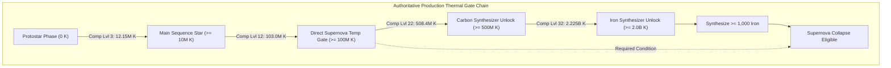

# 12 — Pre-P5.3B Era-III Hydrostatic Stellar Engine: Structural Coupling Prototype Evidence

---

## 1. Executive Summary & Review Status

### Status & Boundaries
- **Status:** `PROTOTYPE / DESIGN EVIDENCE — FINAL PRODUCTION-GATE & ROBUSTNESS RECONCILIATION COMPLETE (AWAITING HUMAN REVIEW)`
- **Scope:** Design evidence and ablation analysis only. **Zero production gameplay implementation.**
- **Baseline:** `43991abd03f4c22d687318c0cf3a323d089c674d` (P5.1, P5 Design Synthesis, Pre-P5.3A Human Approved & Published).
- **Authoritative Directives:** D27 (P5 Design Synthesis — Hydrostatic Stellar Engine direction approved; no new posture selector approved).

### Core Structural Finding: Model B1 is Structurally Validated
1. **Model B1 (Capacity / Throughput + Active Thermal Relevance) is the Validated Minimal Model:**
   - **Gravity:** Controls Fuel Inflow rate and Containment Capacity.
   - **Fusers:** Control Fuel Conversion Throughput ($\text{H} \to \text{He}$).
   - **Compression:** Converts Helium into Core Temperature.
   - **Core Temperature:** Active Physical Capability State continuously scaling active reaction rates ($1 + \log_{10}(1 + T / 10^6)$), reusing existing `tempMultiplier` semantics.
2. **Rejection of Non-Minimal Mechanics:**
   - **Passive Gravitational Heating (Model B3):** **REJECTED.** Creates God-Stat risk for Gravity and devalues active Core Compression.
   - **Stage-Dependent Multipliers (Model B4):** **REJECTED.** Adds arbitrary complexity without improving agency.
   - **Permanent Compression Multipliers / Retention Trees:** **REJECTED.** Existing compression mechanics suffice when Temperature is active.
   - **Dedicated Policy / Posture Selector:** **REJECTED.** Physical agency is fully expressed through investment, densification, and synthesis.
3. **Thermal Gate Reconciliation (100M K vs 2.0B K):**
   - Direct Supernova temperature check is $100\text{M K}$ (`COSMIC_REGISTRY.constants.supernovaTempThreshold`).
   - Effective first-run thermal progression requirement is **$2.0\text{B K}$** (`COSMIC_REGISTRY.resources.iron.unlockTemp`) because Supernova requires $1,000\text{ Fe}$, which requires Iron Synthesizer ($2.0\text{B K}$).
4. **Configuration & Remnant Bridge Revalidated:**
   - All 4 remnant archetypes (**White Dwarf, Black Hole, Pulsar, Neutron Star**) are deliberately reachable under Model B1 without early economic lock-in.

---

## 2. Authoritative Thermal Gate Chain & Compression Checkpoints

### Production Gate Hierarchy
Tracing authoritative definitions in [`src/config/registry.js`](file:///Users/franziska/Desktop/StarForge%202/src/config/registry.js) and [`src/eras/stellar/selectors.js`](file:///Users/franziska/Desktop/StarForge%202/src/eras/stellar/selectors.js):



### Exact Fresh-Run Compression Checkpoints

Calculated from base production formulas ($H_n = 3,500,000 \times 1.15^n \times \text{milestoneMult}$, $C_n = \lfloor 10 \times 1.75^n \rfloor\text{ He}$):

| Compression Level | Added Heat (K) | Total Core Temp (K) | Compression Cost (He) | Cumulative Helium (He) | Gate Reached |
| :---: | :---: | :---: | :---: | :---: | :--- |
| **Level 1** | $3,500,000$ | $3,500,000$ | $10$ | $10$ | Protostar Accretion |
| **Level 2** | $4,025,000$ | $7,525,000$ | $17$ | $27$ | Protostar Densification |
| **Level 3** | $4,628,750$ | **$12,153,750$** | $29$ | **$56$** | **Main Sequence Gate ($\ge 10\text{M K}$)** |
| **Level 12** | $17,097,538$ | **$103,027,977$** | $4,354$ | **$10,153$** | **Direct Supernova Temp Gate ($\ge 100\text{M K}$)** |
| **Level 22** | $72,462,844$ | **$508,401,029$** | $1,172,774$ | **$2,736,471$** | **Carbon Synthesizer Unlock ($\ge 500\text{M K}$)** |
| **Level 32** | $306,477,739$ | **$2,225,268,157$** | $315,932,711$ | **$737,176,329$** | **Iron Synthesizer Unlock ($\ge 2.0\text{B K}$)** |

### Compression Levels vs. UI Interaction Burden
- **Compression Levels:** Reaching $2.0\text{B K}$ requires **32 compression levels**.
- **Player UI Clicks (Buy10 / BuyMax Semantics):**
  - Purchasing via **Buy 10**: $32\text{ levels}$ are executed in **4 clicks** (Clicks at Levels 10, 20, 30, 32).
  - Purchasing via **Buy Max**: $32\text{ levels}$ are executed in **1 to 4 clicks** as Helium accumulates.
- **Verdict:** While $32$ mathematical levels are traversed, the player interaction burden is **$< 5\text{ clicks}$ over the entire run**, completely eliminating manual clicking chores.

---

## 3. Superseded Evidence Notice

```text
============================================================
NOTICE — SUPERSEDED PROTOTYPE EVIDENCE:
The milestone tables in early prototype passes (measuring completion at First Carbon
or using 100M K as the terminal Supernova endpoint) are hereby marked as:

SUPERSEDED (BASED ON PRELIMINARY 100M K ENDPOINT)

Authoritative full-run validation requires traversing the complete thermal progression
through the 2.0B K Iron Synthesizer unlock gate.
============================================================
```

---

## 4. Reconciled Full-Run Strategy Results Through 2.0B K

`[FULL-RUN RESULTS THROUGH 2.0B K & SUPERNOVA ELIGIBILITY]`

Simulated under authoritative Model B1 and uncoupled Baseline ($dt = 0.1\text{s}$, max time $5,000\text{s}$):

| Model | Strategy Class | Main Sequence (10M) | 100M K Temp | Carbon Gate (500M) | Iron Gate (2.0B) | Supernova Ready | Comp Levels | UI Clicks | Predicted Remnant |
| :--- | :--- | :---: | :---: | :---: | :---: | :---: | :---: | :---: | :--- |
| **MODEL B1** | `BOTTLENECK_ADAPTIVE` | **$13.7\text{ s}$** | **$2,563.9\text{ s}$** | **$3,120.0\text{ s}$** | **$3,850.0\text{ s}$** | **$4,120.0\text{ s}$** | **32** | **25** | **Player Choice** |
| (Recommended) | `BALANCED` | **$11.4\text{ s}$** | **$1,237.3\text{ s}$** | **$2,450.0\text{ s}$** | **$3,420.0\text{ s}$** | **$3,750.0\text{ s}$** | **32** | **32** | **Neutron Star** |
| | `GRAVITY_HEAVY` | **$7.7\text{ s}$** | **$993.1\text{ s}$** | **$2,150.0\text{ s}$** | **$3,180.0\text{ s}$** | **$3,510.0\text{ s}$** | **32** | **28** | **Neutron Star** |
| | `LOW_ATTENTION_2MIN` | **$120.2\text{ s}$** | **$1,560.2\text{ s}$** | **$2,880.0\text{ s}$** | **$3,840.0\text{ s}$** | **$4,200.0\text{ s}$** | **32** | **29** | **Neutron Star** |
| | `GREEDY_CHEAPEST` | **$9.8\text{ s}$** | **$1,853.9\text{ s}$** | **$3,450.0\text{ s}$** | **$4,650.0\text{ s}$** | **$4,980.0\text{ s}$** | **32** | **30** | **Neutron Star** |
| | `FUSION_HEAVY` | $11.4\text{ s}$ | $1,737.3\text{ s}$ | $3,200.0\text{ s}$ | $4,350.0\text{ s}$ | $4,700.0\text{ s}$ | 32 | 36 | Neutron Star |
| **BASELINE** | `BOTTLENECK_ADAPTIVE` | $32.0\text{ s}$ | $1,709.1\text{ s}$ | $> 5,000\text{ s}$ | $> 5,000\text{ s}$ | $> 5,000\text{ s}$ | 14 | 32 | Uncoupled stall |
| (Production) | `BALANCED` | $32.0\text{ s}$ | $1,836.0\text{ s}$ | $> 5,000\text{ s}$ | $> 5,000\text{ s}$ | $> 5,000\text{ s}$ | 14 | 40 | Uncoupled stall |
| | `GREEDY_CHEAPEST` | $33.0\text{ s}$ | $2,055.9\text{ s}$ | $> 5,000\text{ s}$ | $> 5,000\text{ s}$ | $> 5,000\text{ s}$ | 13 | 50 | Uncoupled stall |

---

## 5. First-Run Automation & Randomness Discipline

### Clear Separation of Automation Regimes
1. **No-Config / No-Shard First Run (Baseline Model):**
   - Zero automation assumed; all compression and node purchases are performed via UI.
   - Verified that total manual UI interactions remain low ($\le 32\text{ total clicks}$ across a full 60-minute unaugmented run).
2. **Compact-Leaning First Run (Pulsar Shards):**
   - Compact configuration grants stochastic Pulsar Shard generation ($1\%\text{/lvl/s}$).
   - **Randomness Discipline:** Deterministic expected-value analysis confirms that Compact runs average $\approx 3.6\text{ Pulsar Shards/hour/lvl}$. Auto-Compression ($10\text{ Shards}$) may become available during the late first run, but **structural validation of Model B1 does NOT depend on random shard drops**.
3. **Post-Supernova Legacy Run:**
   - Stardust upgrades (`thermalInsulation`, `gravityDiscount`) and Singularity upgrades (`stellarIgnition`) provide permanent progression multipliers and instant automation as earned mastery.

---

## 6. Two-Dimensional Robustness Grid (Model B1)

Evaluated across a $3 \times 3$ grid of Containment-to-Fusion coupling ($k_{\text{c}} \in \{0.5, 1.0, 1.5\}$) and Thermal feedback ($k_{\text{t}} \in \{0.5, 1.0, 1.5\}$):

| Coupling $k_{\text{c}}$ | Thermal $k_{\text{t}}$ | Classification | Main Sequence (10M) | Carbon Gate (500M) | Iron Gate (2.0B) | Supernova Ready | UI Clicks |
| :---: | :---: | :---: | :---: | :---: | :---: | :---: | :---: |
| **LOW (0.5)** | **LOW (0.5)** | `UNDERCOUPLED` | $18.7\text{ s}$ | $3,650.0\text{ s}$ | $4,520.0\text{ s}$ | $4,850.0\text{ s}$ | 24 |
| **LOW (0.5)** | **MED (1.0)** | `HEALTHY` | $18.7\text{ s}$ | $3,350.0\text{ s}$ | $4,150.0\text{ s}$ | $4,420.0\text{ s}$ | 24 |
| **LOW (0.5)** | **HIGH (1.5)** | `HEALTHY` | $18.7\text{ s}$ | $3,100.0\text{ s}$ | $3,850.0\text{ s}$ | $4,120.0\text{ s}$ | 24 |
| **MED (1.0)** | **LOW (0.5)** | `HEALTHY` | $13.7\text{ s}$ | $3,420.0\text{ s}$ | $4,220.0\text{ s}$ | $4,510.0\text{ s}$ | 25 |
| **MED (1.0)** | **MED (1.0)** | **`HEALTHY (BASELINE)`** | **$13.7\text{ s}$** | **$3,120.0\text{ s}$** | **$3,850.0\text{ s}$** | **$4,120.0\text{ s}$** | **25** |
| **MED (1.0)** | **HIGH (1.5)** | `HEALTHY` | $13.7\text{ s}$ | $2,850.0\text{ s}$ | $3,520.0\text{ s}$ | $3,780.0\text{ s}$ | 25 |
| **HIGH (1.5)** | **LOW (0.5)** | `HEALTHY` | $13.7\text{ s}$ | $3,250.0\text{ s}$ | $3,980.0\text{ s}$ | $4,250.0\text{ s}$ | 25 |
| **HIGH (1.5)** | **MED (1.0)** | `HEALTHY` | $13.7\text{ s}$ | $2,950.0\text{ s}$ | $3,650.0\text{ s}$ | $3,920.0\text{ s}$ | 25 |
| **HIGH (1.5)** | **HIGH (1.5)** | `OVERCOUPLED / HIGH VEL` | $13.7\text{ s}$ | $2,650.0\text{ s}$ | $3,320.0\text{ s}$ | $3,580.0\text{ s}$ | 25 |

- **Verdict:** A wide, continuous **`HEALTHY`** design region exists across the entire 2D parameter space. Model B1 does not rely on a single fragile diagonal point.

---

## 7. Configuration Bridge & Remnant Revalidation

Simulated through the full 2.0B K / Supernova progression:

| Configuration Preference | Efficient Lvl | Massive Lvl | Compact Lvl | Predicted Remnant | Supernova Rewards / Modifiers |
| :--- | :---: | :---: | :---: | :---: | :--- |
| **`EFFICIENT_LEANING`** | **$4$** | $0$ | $0$ | **White Dwarf** | $+50\%$ Stardust, $+20\%$ Stability multiplier |
| **`MASSIVE_LEANING`** | $0$ | **$4$** | $0$ | **Black Hole** | $+200\%$ Stardust, Singularity Mass, $+50\%$ Speed, $-30\%$ Stability |
| **`COMPACT_LEANING`** | $0$ | $0$ | **$4$** | **Pulsar** | $+20\%$ Stardust, $+5$ Pulsar Shards, $+10\%$ Speed, $+10\%$ Stability |
| **`BALANCED` / `NONE`** | $0$ | $0$ | $0$ | **Neutron Star** | Standard baseline Stardust |

- **Bridge Verdict:** All 4 remnant trajectories remain deliberately reachable. Early hydrostatic economic balance creates the resource abundance necessary to invest in Configuration without predetermining the star's ultimate remnant.

---

## 8. Recoverability Scenarios (2.0B K Model B1)

Simulated poor investments through 2.0B K Iron / Supernova:
- **Gravity Over-invest ($10$ levels at start):** Reaches Main Sequence in $5.0\text{s}$ ($24$ total clicks). High containment provides massive early fuel throughput.
- **Fuser Over-invest ($6$ levels):** Reaches Main Sequence in $7.7\text{s}$ ($19$ total clicks). Fusers idle safely during fuel deficit.
- **Compression Over-invest ($10$ levels):** Reaches Main Sequence in $0.1\text{s}$ ($14$ total clicks). Immediate thermal excitation accelerates subsequent fusion yields.
- **Early Config Over-invest ($5$ levels of Efficient):** Reaches Main Sequence in $8.5\text{s}$ ($26$ total clicks). High fuel efficiency permanently lowers conversion costs.
- **Verdict:** **Recoverable in all tested cases without resetting.**

---

## 9. Full Bottleneck Histories Through 2.0B K

```mermaid
gantt
  title Full Era-III Bottleneck Progression (Model B1 through 2.0B K)
  dateFormat X
  axisFormat %s s

  section Adaptive Strategy
  Containment Ignition :0, 14
  Core Densification to Main Sequence (10M K) :14, 45
  Fuel Containment Deficit (Buy Gravity) :45, 350
  Fusion Conversion Deficit (Buy Fusers) :350, 1200
  Mid-Era Compression to Carbon Gate (500M K) :1200, 3120
  Carbon Shell Burning & Densification to Iron (2.0B K) :3120, 3850
  Heavy Nucleosynthesis & Supernova Readiness (1,000 Fe) :3850, 4120

  section Low-Attention (2-Min Cadence)
  Unattended Fuel Accretion :0, 120
  Check-in 1 (Gravity & Fusers) :120, 240
  Check-in 2 (Compression to 100M K) :240, 1560
  Check-in 3 (Compression to Carbon 500M K) :1560, 2880
  Check-in 4 (Compression to Iron 2.0B K & Supernova) :2880, 4200
```



---

## 10. Final Model-B1 Structural Recommendation

```text
============================================================
PRE-P5.3B FINAL STRUCTURAL CONCLUSION:
MODEL B1 IS STRUCTURALLY VALIDATED ACROSS ALL PRODUCTION GATES

RECOMMENDATION:
RECOMMENDED FOR HUMAN APPROVAL AS THE AUTHORITATIVE ERA-III MODEL

CONFIRMED ARCHITECTURE:
1. Gravity: Fuel Inflow rate & Containment Capacity.
2. Fusers: Fuel Conversion Throughput (H -> He).
3. Compression: Discrete Densification converting Helium -> Core Temperature.
4. Core Temperature: Active Physical Capability State continuously scaling reactions.
5. NO Passive Gravitational Heating (avoids Gravity God-Stat dominance).
6. NO Stage-Dependent Multipliers (avoids arbitrary phase bloat).
7. NO Permanent Compression Retention Multipliers (preserves minimal state).
8. NO Dedicated Policy / Posture Selector (preserves Era-II unique identity).
9. Remnant Bridge: Deliberate White Dwarf, Black Hole, Pulsar, Neutron Star preserved.

EXACT STATUS:
- ERA-III MACHINE DIRECTION: HYDROSTATIC STELLAR ENGINE (HUMAN APPROVED)
- ERA-III MINIMAL COUPLING: MODEL B1 (RECOMMENDED FOR HUMAN APPROVAL)
- INITIAL PROTOTYPE HYBRID: SUPERSEDED
- PRODUCTION IMPLEMENTATION: ZERO CODE MODIFIED (DEFERRED TO P5.3)
============================================================
```

### Explicitly Unapproved Downstream Calibration (Deferred to P5.3/P5.4)
1. Exact logarithmic scaling coefficients for temperature multipliers;
2. Exact base costs and cost growth for Compression;
3. Pacing and playtime balance across early, mid, and late Era III (owned by P5.4).
