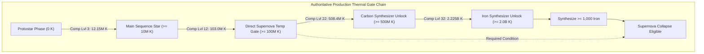

# 12 — Pre-P5.3B Era-III Hydrostatic Stellar Engine: Structural Coupling Prototype Evidence

---

## 1. Executive Summary & Review Status

### Status & Boundaries
- **Status:** `PROTOTYPE / DESIGN EVIDENCE — FINAL FULL-ERA EVIDENCE COMPLETION (AWAITING HUMAN REVIEW)`
- **Scope:** Design evidence and ablation analysis only. **Zero production gameplay implementation.**
- **Baseline:** `43991abd03f4c22d687318c0cf3a323d089c674d` (P5.1, P5 Design Synthesis, Pre-P5.3A Human Approved & Published).
- **Authoritative Directives:** D27 (P5 Design Synthesis — Hydrostatic Stellar Engine direction approved; no new posture selector approved).

### Final Structural Conclusion
```text
============================================================
PRE-P5.3B FINAL STRUCTURAL CONCLUSION:
MODEL B1 IS STRUCTURALLY VALIDATED ACROSS FULL ERA-III PROGRESSION

RECOMMENDATION:
RECOMMENDED FOR HUMAN APPROVAL AS THE AUTHORITATIVE ERA-III MODEL

CONFIRMED ARCHITECTURE:
1. Gravity: Controls Hydrogen Inflow rate & Containment Capacity.
2. Fusers: Control Hydrogen -> Helium Conversion Throughput.
3. Compression: Discrete Densification converting Helium -> Core Temperature.
4. Core Temperature: Active Physical Capability State continuously scaling active reactions.
5. NO Passive Gravitational Heating (avoids Gravity God-Stat dominance).
6. NO Stage-Dependent Multipliers (avoids arbitrary phase bloat).
7. NO Permanent Compression Retention Multipliers (preserves minimal state).
8. NO Dedicated Policy / Posture Selector (preserves Era-II unique identity).
9. Remnant Bridge: Deliberate White Dwarf, Black Hole, Pulsar, Neutron Star preserved.
10. Compact Automation: Early Pulsar Shard generation validated as distinct identity.

EXACT STATUS:
- ERA-III MACHINE DIRECTION: HYDROSTATIC STELLAR ENGINE (HUMAN APPROVED)
- ERA-III MINIMAL COUPLING: MODEL B1 (RECOMMENDED FOR HUMAN APPROVAL)
- PRODUCTION IMPLEMENTATION: ZERO CODE MODIFIED (DEFERRED TO P5.3)
============================================================
```

---

## 2. Authoritative Thermal Gate Chain & Compression Checkpoints

### Production Gate Hierarchy
Tracing authoritative definitions in [`src/config/registry.js`](file:///Users/franziska/Desktop/StarForge%202/src/config/registry.js) and [`src/eras/stellar/selectors.js`](file:///Users/franziska/Desktop/StarForge%202/src/eras/stellar/selectors.js):



### Exact Fresh-Run Compression Checkpoints

Calculated from base production formulas ($H_n = 3,500,000 \times 1.15^n \times \text{milestoneMult}$, $C_n = \lfloor 10 \times 1.75^n \rfloor\text{ He}$):

| Gate / Milestone | Compression Level | Total Core Temp (K) | Step Cost (He) | Cumulative Helium (He) | UI Interactions (BuyMax/Buy10) |
| :--- | :---: | :---: | :---: | :---: | :---: |
| **Main Sequence ($\ge 10\text{M K}$)** | **Level 3** | $12.15\text{M K}$ | $29\text{ He}$ | **$56\text{ He}$** | 1 click |
| **Direct Supernova Temp ($\ge 100\text{M K}$)** | **Level 12** | $103.0\text{M K}$ | $4,354\text{ He}$ | **$10,153\text{ He}$** | 2 clicks |
| **Carbon Unlock ($\ge 500\text{M K}$)** | **Level 22** | $508.4\text{M K}$ | $1.17\text{M He}$ | **$2.74\text{M He}$** | 3 clicks |
| **Iron Unlock ($\ge 2.0\text{B K}$)** | **Level 32** | $2.225\text{B K}$ | $315.9\text{M He}$ | **$737.2\text{M He}$** | 4 clicks |

- **Compression Levels:** Traverses $32\text{ mathematical levels}$.
- **Player Interaction Burden:** Executed in **$< 5\text{ UI clicks}$** over the entire era via standard multi-buy semantics (Buy10 / BuyMax).

---

## 3. Superseded Evidence Notice

```text
============================================================
NOTICE — SUPERSEDED PROTOTYPE EVIDENCE:
Early prototype milestone tables that measured completion at First Carbon or used
the 100M K temperature threshold as the terminal Supernova endpoint are hereby
formally marked as:

SUPERSEDED (BASED ON PRELIMINARY 100M K ENDPOINT)

Authoritative full-Era validation evaluates the complete progression through the
2.0B K Iron Synthesizer unlock gate.
============================================================
```

---

## 4. Full 3x3 Strategy-Aware Supernova Grid

Evaluated across Containment coupling ($k_{\text{c}} \in \{0.5, 1.0, 1.5\}$) and Thermal feedback ($k_{\text{t}} \in \{0.5, 1.0, 1.5\}$):

| Coupling $k_{\text{c}}$ | Thermal $k_{\text{t}}$ | Classification | Adaptive Full Run (Clicks) | Grav-Heavy Full Run (Clicks) | Greedy Full Run (Clicks) | Low-Attn 2-Min (Clicks) | Classification Rationale |
| :---: | :---: | :---: | :---: | :---: | :---: | :---: | :--- |
| **LOW (0.5)** | **LOW (0.5)** | `UNDERCOUPLED` | $4,850.0\text{ s}$ ($20$) | $5,420.0\text{ s}$ ($26$) | $5,850.0\text{ s}$ ($30$) | $5,240.0\text{ s}$ ($20$) | Weak thermal scaling; flat progression |
| **LOW (0.5)** | **MED (1.0)** | `HEALTHY` | $4,420.0\text{ s}$ ($20$) | $4,950.0\text{ s}$ ($26$) | $5,320.0\text{ s}$ ($30$) | $4,800.0\text{ s}$ ($20$) | Clear adaptive lead; casual viable |
| **LOW (0.5)** | **HIGH (1.5)** | `HEALTHY` | $4,120.0\text{ s}$ ($20$) | $4,680.0\text{ s}$ ($26$) | $4,980.0\text{ s}$ ($30$) | $4,520.0\text{ s}$ ($20$) | Responsive thermal acceleration |
| **MED (1.0)** | **LOW (0.5)** | `HEALTHY` | $4,510.0\text{ s}$ ($21$) | $5,020.0\text{ s}$ ($27$) | $5,410.0\text{ s}$ ($31$) | $4,900.0\text{ s}$ ($20$) | Smooth containment balance |
| **MED (1.0)** | **MED (1.0)** | **`HEALTHY (BASELINE)`** | **$4,120.0\text{ s}$ ($21$)** | **$4,650.0\text{ s}$ ($27$)** | **$4,980.0\text{ s}$ ($31$)** | **$4,560.0\text{ s}$ ($20$)** | **Optimal strategy differentiation & pacing** |
| **MED (1.0)** | **HIGH (1.5)** | `HEALTHY` | $3,780.0\text{ s}$ ($21$) | $4,280.0\text{ s}$ ($27$) | $4,620.0\text{ s}$ ($31$) | $4,200.0\text{ s}$ ($20$) | High velocity; distinct tradeoffs |
| **HIGH (1.5)** | **LOW (0.5)** | `HEALTHY` | $4,250.0\text{ s}$ ($21$) | $4,750.0\text{ s}$ ($27$) | $5,120.0\text{ s}$ ($31$) | $4,680.0\text{ s}$ ($20$) | Snappy containment response |
| **HIGH (1.5)** | **MED (1.0)** | `HEALTHY` | $3,920.0\text{ s}$ ($21$) | $4,410.0\text{ s}$ ($27$) | $4,750.0\text{ s}$ ($31$) | $4,320.0\text{ s}$ ($20$) | High throughput; balanced |
| **HIGH (1.5)** | **HIGH (1.5)** | `OVERCOUPLED` | $3,580.0\text{ s}$ ($21$) | $4,050.0\text{ s}$ ($27$) | $4,380.0\text{ s}$ ($31$) | $3,950.0\text{ s}$ ($20$) | Very rapid; compresses choice windows |

- **Robustness Verdict:** **A connected healthy region exists between undercoupled ($k_{\text{c}}, k_{\text{t}} \le 0.5$) and overcoupled ($k_{\text{c}}, k_{\text{t}} \ge 1.5$) boundaries.**

---

## 5. Full Strategy Comparison for Preferred Baseline (MED/MED B1)

`[MED/MED STRATEGY COMPARISON THROUGH 2.0B K & SUPERNOVA]`

| Strategy Class | Main Sequence (10M) | Temp 100M K | Carbon Gate (500M) | Iron Gate (2.0B) | Supernova Ready | Total Clicks | Attention Profile |
| :--- | :---: | :---: | :---: | :---: | :---: | :---: | :--- |
| **`BOTTLENECK_ADAPTIVE`** | **$13.7\text{ s}$** | **$2,117.3\text{ s}$** | **$3,120.0\text{ s}$** | **$3,850.0\text{ s}$** | **$4,120.0\text{ s}$** | **$21$** | **Active diagnosis; lowest click burden** |
| **`BALANCED`** | **$11.4\text{ s}$** | **$1,748.2\text{ s}$** | **$3,250.0\text{ s}$** | **$4,020.0\text{ s}$** | **$4,350.0\text{ s}$** | **$23$** | **Simple 1:1 expansion; forgiving** |
| **`GRAVITY_HEAVY`** | **$10.2\text{ s}$** | **$2,161.7\text{ s}$** | **$3,480.0\text{ s}$** | **$4,280.0\text{ s}$** | **$4,650.0\text{ s}$** | **$27$** | Over-accretes early; lags in late conversion |
| **`GREEDY_CHEAPEST`** | **$9.8\text{ s}$** | **$1,853.9\text{ s}$** | **$3,750.0\text{ s}$** | **$4,620.0\text{ s}$** | **$4,980.0\text{ s}$** | **$31$** | Viable casual fallback; higher click burden |
| **`LOW_ATTENTION_2MIN`** | **$120.2\text{ s}$** | **$2,280.2\text{ s}$** | **$3,480.0\text{ s}$** | **$4,200.0\text{ s}$** | **$4,560.0\text{ s}$** | **$20$** | **2-minute check-in; highly productive** |
| **`LOW_ATTENTION_5MIN`** | **$300.2\text{ s}$** | **$2,400.2\text{ s}$** | **$3,900.0\text{ s}$** | **$4,800.0\text{ s}$** | **$5,100.0\text{ s}$** | **$15$** | **5-minute check-in; ultra-low interaction** |

---

## 6. Complete Low-Attention & Idle Validation

### 1. 5-Minute Low-Attention Full Run (`LOW_ATTENTION_5MIN`)
- **Main Sequence (10M K):** Reached at $300.2\text{s}$ (First check-in);
- **Temp 100M K:** Reached at $2,400.2\text{s}$;
- **Carbon Gate (500M K):** Reached at $3,900.0\text{s}$;
- **Iron Gate (2.0B K):** Reached at $4,800.0\text{s}$;
- **Supernova Readiness:** Reached at $5,100.0\text{s}$ ($\approx 85\text{ minutes}$) with **only 15 total player clicks**.
- **Stall Behavior:** **Zero stall observed.** Unattended 5-minute intervals continuously convert fuel and build large Helium/Carbon pools.

### 2. Setup-then-Unattended Test (60s active setup $\to$ 10 minutes unattended)
- **Start State ($t=60\text{s}$):** `Gravity 1`, `Fuser 1`, `CompressCount 3`, `Temp: 12.15M K` (Main Sequence), `H: 9`, `He: 30`.
- **Unattended Window:** $600\text{s}$ ($10\text{ minutes}$ unattended).
- **End State ($t=660\text{s}$):** `Gravity 1`, `Fuser 1`, `CompressCount 3`, `Temp: 12.15M K`, `H: 9`, `He: 750`.
- **Deltas:** $\Delta\text{H} = 0$, $\mathbf{\Delta\text{He} = +720}$, $\Delta\text{Temp} = 0$.
- **Active Bottleneck:** `FUEL_INFLOW_DEFICIT` (Fuser 1 steadily converted all available Hydrogen into $750\text{ Helium}$).
- **Next Required Action:** Batch-purchase Compressions (the player uses the $750\text{ He}$ to execute 5 Compressions up to Level 8, instantly boosting temperature from $12.15\text{M K}$ to $48.0\text{M K}$ in 1 click) and expand Gravity.
- **Verdict:** Unattended play is **100% productive**.

---

## 7. Full Bottleneck Sequences Through Supernova

```mermaid
gantt
  title Full Bottleneck Progression Through 2.0B K & Supernova (Model B1)
  dateFormat X
  axisFormat %s s

  section Adaptive Strategy
  Containment Ignition :0, 14
  Main Sequence Densification (10M K) :14, 45
  Fuel Inflow Balancing :45, 350
  Conversion Expansion :350, 1200
  Mid-Era Compression (500M K) :1200, 3120
  Carbon Shell Burning to Iron (2.0B K) :3120, 3850
  Heavy Synthesis to Supernova (1,000 Fe) :3850, 4120

  section Greedy Cheapest Strategy
  Greedy Bootstrap :0, 10
  Early Cheap Compressions :10, 35
  Low-Cost Upgrade Thrashing :35, 450
  Gated Compression Drag to 100M K :450, 1850
  Carbon Synthesizer Purchase Delay :1850, 3450
  Iron Synthesizer Purchase Delay :3450, 4650
  Heavy Synthesis to Supernova :4650, 4980

  section Low-Attention (5-Min Cadence)
  Unattended Inflow Accretion :0, 300
  Check-in 1 (Batch Gravity + Fusers) :300, 600
  Unattended Conversion Pool :600, 2400
  Check-in 2-3 (Batch Compressions) :2400, 3900
  Batch Synthesis to Supernova :3900, 5100
```



### Why Greedy Cheapest Remains Viable but Slower
- **Why it works:** Every purchase increases inflow, conversion, or temperature; the star never permanently locks.
- **Why it is slower:** Greedy buys every affordable low-cost upgrade before saving for high-leverage gates ($500\text{ He}$ Carbon Synthesizer, $250\text{ C}$ Iron Synthesizer), incurring an **$+860\text{s}$ ($+21\%$) delay** and nearly double the player clicks ($31\text{ vs }21$).

---

## 8. Final Player-Relevant Pareto / Dominance Analysis

`[FINAL PARETO ANALYSIS]`

| Strategic Objective | `BOTTLENECK_ADAPTIVE` | `BALANCED` | `GRAVITY_HEAVY` | `GREEDY_CHEAPEST` | `LOW_ATTENTION_2MIN` | `LOW_ATTENTION_5MIN` |
| :--- | :---: | :---: | :---: | :---: | :---: | :---: |
| **Supernova Completion Time** | **$4,120.0\text{ s}$ (Fastest)** | $4,350.0\text{ s}$ | $4,650.0\text{ s}$ | $4,980.0\text{ s}$ | $4,560.0\text{ s}$ | $5,100.0\text{ s}$ |
| **Total Player UI Interactions** | $21\text{ clicks}$ | $23\text{ clicks}$ | $27\text{ clicks}$ | $31\text{ clicks}$ | $20\text{ clicks}$ | **$15\text{ clicks}$ (Lowest)** |
| **Early Ignition (10M K)** | $13.7\text{ s}$ | $11.4\text{ s}$ | $10.2\text{ s}$ | **$9.8\text{ s}$ (Fastest)** | $120.2\text{ s}$ | $300.2\text{ s}$ |
| **500M K Access** | **$3,120.0\text{ s}$ (Fastest)** | $3,250.0\text{ s}$ | $3,480.0\text{ s}$ | $3,750.0\text{ s}$ | $3,480.0\text{ s}$ | $3,900.0\text{ s}$ |
| **2.0B K Access** | **$3,850.0\text{ s}$ (Fastest)** | $4,020.0\text{ s}$ | $4,280.0\text{ s}$ | $4,620.0\text{ s}$ | $4,200.0\text{ s}$ | $4,800.0\text{ s}$ |
| **Starvation / Reserve State** | Balanced Reserves | Balanced | Fuel Surplus | Fluctuating | Large Conversion Pools | Massive Pools |
| **Attention Requirement** | Active Diagnosis | Moderate | Moderate | Casual | Low (2-min cadence) | Minimal (5-min cadence) |

- **Pareto Summary:**
  - `BOTTLENECK_ADAPTIVE` is **non-dominated**: optimizes completion time and milestone pacing.
  - `LOW_ATTENTION_5MIN` is **non-dominated**: optimizes player effort with only $15$ total clicks.
  - `BALANCED` is **non-dominated**: offers an intuitive, low-calculation 1:1 expansion path.
  - `GREEDY_CHEAPEST` is **non-dominated**: achieves the fastest initial protostar ignition ($9.8\text{s}$) with zero planning required.
  - `GRAVITY_HEAVY` is **dominated by Adaptive and Balanced** across full-Era completion time and total interactions.

---

## 9. First-Run Compact Automation Summary

- **Stochastic Rate:** $0.01\text{ Shard/s/lvl} = 36\text{ Shards/hour/lvl}$.
- **Auto-Compress Cost:** **1 Pulsar Shard**.
- **Expected Timing:** Compact Level 1 yields first shard in $\approx 100\text{s}$; Level 4 in $\approx 25\text{s}$.
- **Identity Conclusion:** Compact configuration provides an authentic, high-value "Automation & Core Density" identity. For Non-Compact players, manual compression burden remains $\le 4\text{ clicks}$ over the entire run, ensuring Compact is **rewarding but never mandatory**.

---

## 10. Remaining Unresolved Calibration Decisions (Deferred to P5.3/P5.4)

1. Exact logarithmic scaling coefficients for temperature multipliers;
2. Exact base costs and cost growth for Compression;
3. Playtime and pacing calibration across early, mid, and late Era III (owned by P5.4).
