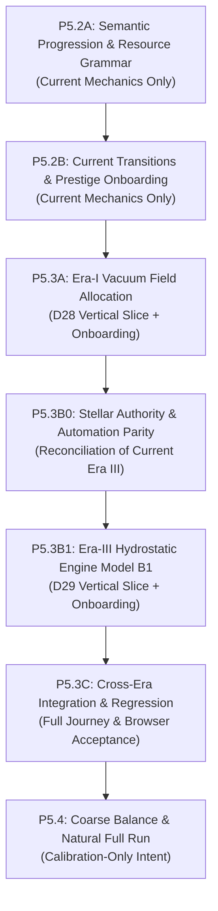

# 13 — P5 Implementation Execution Plan: Core Loop & Product Cohesion

---

## 0. Executive Summary & Baseline

### Status & Guardrails
- **Status:** `HUMAN APPROVED — PUBLISHED IMPLEMENTATION EXECUTION CONTRACT`
- **Scope:** Execution Architecture and Implementation Planning. **Zero gameplay implementation** in this document.
- **Baseline:** `690bbb72bdb4febfaaa225deeffc84c3c81b4f79` (matches `star/main` published baseline).
- **Save Version:** `17` (strictly preserved without version bump).
- **Precedent Decisions:** D01–D31 are authoritative (D30 and D31 approved).

---

## 1. Architectural Invariants

Every phase of P5 must strictly preserve the following architectural contracts:

1. **One Authoritative Runtime State:** `src/core/state.js` owns the canonical `gameState`. Full state replacements use `replaceRuntimeState()`.
2. **One Production / Headless / Offline Tick Path:** `advanceGameTick()` in `src/core/runtimeTick.js` is the single execution boundary for simulation and progression.
3. **Commands Own Gameplay Mutation:** All player actions and purchases enter through engine command handlers organized by era. UI and presentation layers dispatch commands.
4. **Authoritative Eligibility Outside UI:** Domain eligibility selectors define readiness and requirements shared by commands, UI, and bots.
5. **Presentation Selectors Do Not Mutate:** Cosmos, resource, and Forge presentation selectors are pure read-only projections.
6. **Progressive Disclosure & Contextual Feedback:** Mechanics and destinations appear when relevant. No generic toast stacks, modal spam, or blocking tutorial carousels (D07, D08).
7. **Offline / Low-Attention Safety:** All mechanics must support low-attention and unattended progression through deterministic ticks without requiring rapid switching or active babysitting (D27 §5).

---

## 2. Current Production Owner Map

### Era I — Quantum Foam

| Subsystem / Concern | Owner File(s) | Key Functions / Fields | Current Production Reality |
| :--- | :--- | :--- | :--- |
| **State Factory** | [`src/state/createInitialState.js:66–186`](file:///Users/franziska/Desktop/StarForge%202/src/state/createInitialState.js#L66-L186) | `createInitialState()` | Initializes `era1.{currentAct, quantumFoam, unfoldCount}`, `coherence`, `eraITemperature`, `inflatonMultiplier`, `resources.{quantumFluctuations, energyDensity}`, `upgrades.quantum.*`, `discoveries`, `stats.{maxQF, highestHarmony}`. **No allocation field exists.** |
| **Schema Normalization** | [`src/state/schema.js:5–158`](file:///Users/franziska/Desktop/StarForge%202/src/state/schema.js#L5-L158) | `ensureStateShape()` | Normalizes `coherence` (0–1 to 0–100); strips legacy `asymmetryBias`. |
| **Commands** | [`src/eras/quantum/commands.js:8–130`](file:///Users/franziska/Desktop/StarForge%202/src/eras/quantum/commands.js#L8-L130) | `quantumCommandHandlers` | `CLICK_CORE`, `BUY_UPGRADE`, `TRIGGER_INFLATION`. |
| **Simulation** | [`src/eras/quantum/simulation.js:5–31`](file:///Users/franziska/Desktop/StarForge%202/src/eras/quantum/simulation.js#L5-L31) | `simulateQuantumEra(state, dt)` | Consumes `getQuantumFluctuationRate(state)` and `getEnergyDensityRate(state)`; handles temperature cooling. |
| **Coherence Helpers** | [`src/eras/quantum/coherence.js:1–35`](file:///Users/franziska/Desktop/StarForge%202/src/eras/quantum/coherence.js#L1-L35) | `getVacuumCoherence`, `setVacuumCoherence`, `getVacuumCoherenceRates` | Passive rate: $0.1\,\%/\text{s}$; observation gain: $0.5 \times (1 - 0.08c)\,\%/\text{click}$. Checks `isVacuumCoherenceRelevant` and `isInflationPreparationRelevant`. |
| **Rate Calculation** | [`src/core/economy.js:25–97`](file:///Users/franziska/Desktop/StarForge%202/src/core/economy.js#L25-L97) | `getQuantumFluctuationRate`, `getEnergyDensityRate`, `getFundamentalLawSynergy` | Sums law contributions with milestone multipliers, synergy multiplier, inflaton multiplier, and artifact boosts. |
| **Inflation Eligibility** | [`src/eras/quantum/inflation.js:4–22`](file:///Users/franziska/Desktop/StarForge%202/src/eras/quantum/inflation.js#L4-L22) | `getInflationEligibility(state)` | Requires $\text{QF} \ge 100{,}000$, $\text{ED} \ge 50{,}000$, $\text{Coherence} \ge 100\%$. |
| **runtimeTick Integration** | [`src/core/runtimeTick.js:23–54`](file:///Users/franziska/Desktop/StarForge%202/src/core/runtimeTick.js#L23-L54) | `advanceGameTick` | Applies passive coherence recovery; checks narrative milestones. |
| **Cosmos Presentation** | [`src/engine/cosmosPresentation.js:25–87`](file:///Users/franziska/Desktop/StarForge%202/src/engine/cosmosPresentation.js#L25-L87) | `getEraOnePresentation(state)` | Modes: `observation → formation → stabilization → inflation`. `posture` is hardcoded `null`. |
| **Resource Presentation** | [`src/engine/resourcePresentation.js:39–72`](file:///Users/franziska/Desktop/StarForge%202/src/engine/resourcePresentation.js#L39-L72) | `getEraResourcePresentation(state)` | Primary: `quantumFluctuations`; Support: `energyDensity`, `coherence`. |
| **Forge Presentation** | [`src/ui/forgePresentation.js:9–68`](file:///Users/franziska/Desktop/StarForge%202/src/ui/forgePresentation.js#L9-L68) | `renderQuantumShop` | 5 Fundamental Law cards with progressive QF discovery. |
| **Objective Chain** | [`src/core/objectiveDefinitions.js:6–42`](file:///Users/franziska/Desktop/StarForge%202/src/core/objectiveDefinitions.js#L6-L42) | `OBJECTIVE_DEFINITIONS` | 4 monotonic objectives: Initialize Core → Establish Gravity → Synthesize Density → Trigger Inflation. |
| **Chrono / Narrative** | [`src/core/runtimeTick.js:40–53`](file:///Users/franziska/Desktop/StarForge%202/src/core/runtimeTick.js#L40-L53), [`src/ui/codex.js:9–52`](file:///Users/franziska/Desktop/StarForge%202/src/ui/codex.js#L9-L52) | `appendHistoryEntry`, `corruptText` | 6 QF discovery milestones; text glitch corruption inversely proportional to coherence. |
| **Core Visual Semantics** | [`src/ui/canvasCore.js:228–260`](file:///Users/franziska/Desktop/StarForge%202/src/ui/canvasCore.js#L228-L260) | `drawEra1(cx, cy)` | Radial bloom + 3 orbiting force rings driven by law levels. |

---

### Era III — Stellar Dawn

| Subsystem / Concern | Owner File(s) | Key Functions / Fields | Current Production Reality |
| :--- | :--- | :--- | :--- |
| **State Factory** | [`src/state/createInitialState.js:14–34`](file:///Users/franziska/Desktop/StarForge%202/src/state/createInitialState.js#L14-L34) | `getInitialEra3State()` | Initializes `era3.{gravity, gravityCost, fusionYield, fuserCost*, fusersEnabled, temperature, compressCost, tempMultiplier, stage, lifetimeCarbonThisRun, carbonYield, carbonCost*, ironYield, ironCost*}`. Root resources: `hydrogen, helium, carbon, iron`. Currencies: `stardust, pulsarShards, singularityMass`. Upgrades: `stellar, stardust, pulsar, singularity`. |
| **Commands** | [`src/eras/stellar/commands.js:8–313`](file:///Users/franziska/Desktop/StarForge%202/src/eras/stellar/commands.js#L8-L313) | `stellarCommandHandlers` | `CLICK_CORE_ERA3`, `BUY_UPGRADE_STELLAR`, `BUY_CORE_NODE` (`gravity, fuser, compress, carbon, iron`), `TRIGGER_SUPERNOVA`, `TRIGGER_GALACTIC_IGNITION`. |
| **Simulation** | [`src/eras/stellar/simulation.js:5–131`](file:///Users/franziska/Desktop/StarForge%202/src/eras/stellar/simulation.js#L5-L131) | `simulateStellarEra(state, dt, context)` | Advances H gen, Auto-Fusion, Carbon/Iron synthesis, Compact Shard drops, Gravity AutoBuyer, AutoCompress, Flares. |
| **Selectors** | [`src/eras/stellar/selectors.js:1–208`](file:///Users/franziska/Desktop/StarForge%202/src/eras/stellar/selectors.js#L1-L208) | `getStellarRates`, `getSupernovaEligibility`, `getGalacticIgnitionEligibility`, `getSupernovaOutcome` | Pure rate, threshold, and outcome evaluations. |
| **Economy Helpers** | [`src/core/economy.js:193–245`](file:///Users/franziska/Desktop/StarForge%202/src/core/economy.js#L193-L245) | `getHydrogenGenRate`, `getCompressionHeatYield`, `getCompressionScaling`, `getCompressionsCompleted`, `recalcTempMultiplier` | Shared formulas (with identified presentation/simulation drift). |
| **Cosmos Presentation** | [`src/engine/cosmosPresentation.js:440–507`](file:///Users/franziska/Desktop/StarForge%202/src/engine/cosmosPresentation.js#L440-L507) | `getEraThreePresentation(state)` | Modes: `protostar → stellar-progression → supernova-ready`. Displays Core Temp, next threshold, contextual actions. |
| **Resource Presentation** | [`src/engine/resourcePresentation.js:107–152`](file:///Users/franziska/Desktop/StarForge%202/src/engine/resourcePresentation.js#L107-L152) | `getEraResourcePresentation(state)` | **Primary slot is empty**. Support: `hydrogen, helium, carbon` (or `iron, carbon, helium`). Details: `hydrogen` (when Iron active). |
| **Forge Presentation** | [`src/ui/viewport.js:1109–1234`](file:///Users/franziska/Desktop/StarForge%202/src/ui/viewport.js#L1109-L1234) | `renderStellarNodeButtons` | 5 node cards: Gravity, Auto-Fuser, Compress Core, Carbon Fusion, Iron Fusion. |
| **Offline Behavior** | [`src/core/offline.js:20–96`](file:///Users/franziska/Desktop/StarForge%202/src/core/offline.js#L20-L96), [`src/core/offlineSummary.js:21–167`](file:///Users/franziska/Desktop/StarForge%202/src/core/offlineSummary.js#L21-L167) | `OFFLINE_TICK_CONTEXT` | 1s chunks up to 8h; disables AutoBuyer, AutoCompress, Shards, Flares. |

---

## 3. Stellar Production & Presentation Authority Matrix

To prepare for P5.3B0 reconciliation, every declared or displayed Era-III modifier was audited across the codebase:

| Category / Modifier | Declared Product Effect (Registry / UI) | Applied in Simulation? | Applied in Commands? | Applied in Selectors? | Displayed in UI? | Current Classification | Recommended Action in P5.3B0 |
| :--- | :--- | :--- | :--- | :--- | :--- | :--- | :--- |
| **Gravity Base Gen** | $\text{gravity} \times 10$ H/s | ✅ `simulation.js:23` | N/A | ✅ `selectors.js:28` | ✅ `viewport.js:1120` | `CONSISTENT` | Retain as authoritative baseline. |
| **Massive Speed** | $+10\%$ rate per Massive level | ✅ `simulation.js:15` | N/A | ✅ `selectors.js:22` | ✅ Via selectors | `CONSISTENT` | Retain as authoritative. |
| **Legacy 2nd Run Mult** | Multiplies speedMult | ✅ `simulation.js:18` | N/A | ✅ `selectors.js:24` | ✅ Via selectors | `CONSISTENT` | Retain as authoritative. |
| **Gravity Milestones** | $+5\%$ per 10 Gravity levels | ❌ Missing | N/A | ❌ Missing | ⚠️ `economy.js:200` | `DRIFT` | Align simulation + selectors to match economy milestone helper. |
| **Carbon Gravity Mult** | $+2\%$ H gen per Carbon | ❌ Missing | N/A | ❌ Missing | ⚠️ `economy.js:197` | `DRIFT` | Evaluate whether Carbon boost belongs in base simulation or B1. |
| **Stardust Amount Mult** | $+50\%$ H gen per Stardust | ❌ Missing | N/A | ❌ Missing | ⚠️ `economy.js:196` | `DRIFT` | Audit: stardust is meta currency; reconcile whether active in-run. |
| **First Supernova Ach** | Achievement multiplier | ❌ Missing | N/A | ❌ Missing | ⚠️ `economy.js:195` | `DRIFT` | Apply achievement multiplier in simulation & selectors. |
| **Dark Gravity** | $+0.05$ exponent per level | ❌ Missing | N/A | ❌ Missing | ⚠️ `economy.js:201` | `DRIFT` | Connect Singularity upgrade to simulation & selectors. |
| **Celestial Card `hydrogenGen`** | $+10\%$ per card level | ❌ Missing | N/A | ❌ Missing | ⚠️ `economy.js:202` | `DRIFT` | Connect card multiplier to simulation & selectors. |
| **Cosmic Constant `G` (H Gen)** | $+20\%$ H gen per G level | ❌ Missing | N/A | ❌ Missing | ⚠️ `economy.js:194` | `DRIFT` | Connect G constant to simulation & selectors. |
| **Temperature Mult (H Gen)** | Multiplies H gen | ❌ Missing | N/A | ❌ Missing | ⚠️ `economy.js:200` | `DRIFT / D29 PRECURSOR` | Reconcile: D29 routes Temp to reaction capability, not H gen. |
| **Base Fusion Cost** | 10 H per 1 He | ✅ `simulation.js:31` | N/A | ✅ `selectors.js:32` | ✅ `viewport.js:1138` | `CONSISTENT` | Authoritative base. |
| **Efficient Fuel Efficiency** | $+10\%$ fuel eff per level | ✅ `simulation.js:14` | N/A | ✅ `selectors.js:20` | ✅ Via selectors | `CONSISTENT` | Authoritative modifier. |
| **Stardust `fusionDiscount`** | Reduces H cost by 2/lvl | ❌ Missing | N/A | ❌ Missing | ⚠️ `economy.js:206` | `DEAD / LEGACY` | `getFusionCost()` was for manual fusion (now auto-fused). Reconcile. |
| **Stardust Helium Yield Boost** | Displayed $+25\%$ per Stardust | ❌ Missing | N/A | ❌ Missing | ⚠️ `viewport.js:1797` | `DISPLAY-ONLY DRIFT` | UI displays effective yield with stardust boost, but simulation does not apply it. |
| **Massive Iron Bonus** | $+50\%$ Iron yield per Massive | ✅ `simulation.js:61` | N/A | ✅ `selectors.js:49` | ✅ Via selectors | `CONSISTENT` | Authoritative modifier. |
| **Pulsar `autoSynthesize`** | $+100\%$ C/Fe velocity | ❌ Missing | N/A | ❌ Missing | ❌ Missing | `DEAD / UNAPPLIED` | Declared in registry:179 but nowhere implemented. Connect or clean up. |
| **Compression Base Heat** | Base 3.5M K $\times 1.15^n$ | ⚠️ Manual only | ✅ `commands.js:127` | N/A | ✅ `economy.js:220` | `PARITY DEFECT` | Manual compression uses formula; AutoCompress uses hardcoded +100 K. |
| **Stardust `thermalInsulation`** | $+20\%$ heat per level | ⚠️ Manual only | ✅ via `economy.js` | N/A | ✅ `economy.js:224` | `CONSISTENT (MANUAL)` | Connect to AutoCompress via shared helper. |
| **Iron Heat Coefficient** | $+5\%$ heat per Iron | ⚠️ Manual only | ✅ via `economy.js` | N/A | ✅ `economy.js:225` | `CONSISTENT (MANUAL)` | Connect to AutoCompress via shared helper. |
| **Singularity `stellarIgnition`** | $+0.05$ exponent on heat | ⚠️ Manual only | ✅ via `economy.js` | N/A | ✅ `economy.js:228` | `CONSISTENT (MANUAL)` | Connect to AutoCompress via shared helper. |
| **Celestial Card `compressionHeat`** | $+15\%$ heat per level | ⚠️ Manual only | ✅ via `economy.js` | N/A | ✅ `economy.js:229` | `CONSISTENT (MANUAL)` | Connect to AutoCompress via shared helper. |
| **Cosmic Constant `G` (Heat)** | $+20\%$ heat per G level | ⚠️ Manual only | ✅ via `economy.js` | N/A | ✅ `economy.js:221` | `CONSISTENT (MANUAL)` | Connect to AutoCompress via shared helper. |
| **Alpha Cost Scaling** | $+3\%$ compress cost per $\alpha$ | ✅ `simulation.js:105` | ✅ `commands.js:130` | N/A | ✅ `economy.js:210` | `CONSISTENT` | Authoritative. |
| **Alpha Fusion Yield** | $+30\%$ yield (He, C, Fe) | ❌ Missing | N/A | ❌ Missing | ❌ Missing | `DEAD / UNAPPLIED` | Declared in registry:194 but not in simulation. |
| **AutoCompress Heat** | Dynamic heat yield | ❌ Hardcoded +100 K | N/A | N/A | ❌ Broken | `CRITICAL PARITY DEFECT` | Must call `getCompressionHeatYield(state)`. |
| **AutoCompress Cadence** | $\sim 1/\text{s}/\text{lvl}$ when affordable | ⚠️ Probabilistic | N/A | N/A | ❌ Drift vs registry | `CADENCE DRIFT` | Audit whether probabilistic or deterministic rate is intended. |
| **Gravity AutoBuyer** | Buys Gravity if affordable | ✅ `simulation.js:81` | N/A | N/A | ✅ `viewport.js:1163` | `CONSISTENT` | Monotonic, uses correct discount scaling. |

---

## 4. Key Architectural & Debt Decisions

### 4A. `tempMultiplier` Ownership & State Preservation
- **Decision:** **KEEP `state.era3.tempMultiplier` in state for P5.**
- **Rationale:** Minimizes v17 schema compatibility risk and avoids coupling state cleanup with gameplay refactoring.
- **Consolidation:** Replace the three duplicate calculation sites ([`commands.js:14`](file:///Users/franziska/Desktop/StarForge%202/src/eras/stellar/commands.js#L14), [`commands.js:133`](file:///Users/franziska/Desktop/StarForge%202/src/eras/stellar/commands.js#L133), [`economy.js:18`](file:///Users/franziska/Desktop/StarForge%202/src/core/economy.js#L18)) with one authoritative pure helper `recalcTempMultiplier(state)`. All temperature-changing paths must invoke this helper.

### 4B. AutoCompress Two-Part Parity Reconciliation
1. **Heat Yield Parity:** AutoCompress currently adds hardcoded `+100 K` vs. manual compression's dynamic `3.5M+ K`. In P5.3B0, AutoCompress MUST call `getCompressionHeatYield(state)`, update `tempMultiplier`, update `stats.maxTemp`, and check Main Sequence stage promotion identically to manual `BUY_CORE_NODE compress`.
2. **Cadence Audit:** Distinguish Compact Shard generation (stochastic reward source: $0.01\,\text{Shard/s/lvl}$) from purchased Auto-Compressor (mastery automation: registry describes $\sim 1\,\text{comp/s/lvl}$ when affordable). Reconcile whether tick-based probability is legacy drift or intentional throttle. Regardless of cadence, mathematical parity with manual compression is mandatory.

### 4C. Compression Helper Single Authority
- Existing helpers `getCompressionHeatYield(state)` and `getCompressionScaling(state)` in `src/core/economy.js` are the authoritative formulas.
- Do NOT create a duplicate set of formulas. If moved into a stellar domain module, perform an intentional ownership migration with backwards-compatible re-exports.

### 4D. Era-I Rate Authority
- `getQuantumFluctuationRate(state)` and `getEnergyDensityRate(state)` in `src/core/economy.js` are the authoritative pure rate helpers.
- D28 Vacuum Allocation and Coherence Quality multipliers must be incorporated directly into these helpers. `simulateQuantumEra()` and UI presentation both consume these helpers. No duplicate rate formulas inside simulation.
- `getVacuumCoherenceRates(state)` in `src/eras/quantum/coherence.js` owns allocation-aware passive stabilization semantics. `runtimeTick.js` applies the returned rate without duplicating formulas.

### 4E. Save Version Decision: Retain Save Version 17
- D28 requires only one additive field: `era1.vacuumAllocation` (string enum: `'PROPAGATION' | 'BALANCED' | 'STABILIZATION'`).
- `ensureStateShape()` in `src/state/schema.js` will supply the default `'BALANCED'` for existing v17 saves on load.
- No save version bump to v18. No migration function required.

---

## 5. Revised Execution Sequence



### Rationale for Sequence Order:
1. **P5.2 precedes P5.3:** Establishes clean presentation grammar and onboarding foundations using current code, guaranteeing that production remains fully coherent and reviewable before new mechanics are introduced.
2. **P5.3A precedes P5.3B:** Era I is a smaller, lower-risk vertical slice. It validates additive v17 state normalization, mechanic introduction via Objective/Chrono/Cosmos, and accessible discrete control integration before touching the drift-heavy Stellar domain.
3. **P5.3B0 precedes P5.3B1:** Separates current Stellar drift/debt fixes from D29 Model B1 structural coupling, ensuring B1 builds on an internally truthful baseline.
4. **P5.3C precedes P5.4:** Verifies end-to-end multi-era stability before fine-tuning numerical balance.
5. **P5.4 is Calibration-Only:** Focuses on pacing and balance. If full-run testing uncovers structural defects, the appropriate P5.3 slice is reopened rather than tuned around.

---

## 6. Detailed Phase Contracts

---

### P5.2A — Semantic Progression & Resource Grammar Foundation

| Contract Dimension | Specification |
| :--- | :--- |
| **Purpose** | Establish stable, consistent semantic slot assignments and presentation grammar across Eras I–III using **currently implemented mechanics only**. |
| **In Scope** | - Stable Objective, Primary State, Support Resource, Details, and Meta currency assignments.<br>- Cross-era location consistency (Header banner, Cosmos Primary panel, Resource HUD regions).<br>- Audit and align current Objective, Chrono, and Codex ownership.<br>- Current transition presentation cleanup.<br>- Standardize visible whole-number flooring for resource balances. |
| **Out of Scope** | - **NO** Vacuum Allocation objectives or UI controls.<br>- **NO** Hydrostatic B1 bottleneck instructions.<br>- **NO** presentation claiming unimplemented B1 rates.<br>- **NO** gameplay state or simulation changes. |
| **Files Involved** | `src/engine/resourcePresentation.js`, `src/engine/cosmosPresentation.js`, `src/core/objectiveDefinitions.js`, `src/ui/resourceHud.js`, `src/ui/viewport.js`. |
| **State / Schema Impact** | None. |
| **Accessibility Impact** | Ensure all normalized resource slots and labels maintain accessible ARIA attributes and ≥44px touch targets. |
| **Testing Plan** | - Unit tests for resource presentation output across Eras I, II, III.<br>- Characterization tests verifying existing objectives complete under current mechanics.<br>- Browser layout tests at desktop and 390px mobile widths. |
| **Human Review Gate** | Review normalized layout and resource slot consistency. |
| **Rollback Boundary** | Revert presentation selector changes; zero gameplay risk. |

---

### P5.2B — Current Transitions & Prestige Onboarding

| Contract Dimension | Specification |
| :--- | :--- |
| **Purpose** | Enhance player onboarding for existing cosmic transitions (Inflation, Recombination, Stellar Dawn, First Supernova / Legacy) using existing narrative and contextual surfaces. |
| **In Scope** | - Contextual transition briefings explaining: *What Changes, What Is Sacrificed, What Persists, What Is Gained, Why It Matters*.<br>- Contextual Cosmos and Legacy explanations for existing mechanics.<br>- Chrono milestone messages and Codex archive entries for current transitions.<br>- Clear distinction between repeatable Supernova (Legacy reset) and permanent Galactic Ignition (Era IV gate). |
| **Out of Scope** | - Generic toast notifications, modal spam, or blocking tutorial carousels.<br>- Onboarding for unimplemented D28/D29 mechanics (onboarding travels with the vertical slice). |
| **Files Involved** | `src/content/codex.js`, `src/engine/cosmosPresentation.js`, `src/core/runtimeTick.js` (milestone text), `src/ui/viewport.js` (transition card text). |
| **State / Schema Impact** | None. |
| **Accessibility Impact** | Verify transition explanations are readable by screen readers and respect reduced-motion settings. |
| **Testing Plan** | - Unit tests for Codex entry unlock conditions.<br>- Playwright browser tests verifying transition cards and briefings render correctly upon reaching eligibility. |
| **Human Review Gate** | Review narrative clarity and transition communication. |
| **Rollback Boundary** | Revert narrative/presentation text changes. |

---

### P5.3A — Era-I Vacuum Field Allocation Vertical Slice

| Contract Dimension | Specification |
| :--- | :--- |
| **Purpose** | Implement the approved D28 structural mechanic: **Vacuum Field Allocation** (Coherence as System Quality) with full vertical-slice integration. |
| **In Scope** | - Additive state field `era1.vacuumAllocation` with safe default `'BALANCED'`.<br>- Normalization in `schema.js` (no save bump).<br>- Engine command `SET_VACUUM_ALLOCATION`.<br>- Incorporate allocation and coherence quality feedback into `getQuantumFluctuationRate`, `getEnergyDensityRate`, and `getVacuumCoherenceRates`.<br>- 3-state discrete allocation UI in Cosmos (`#cosmos-posture-controller` or dedicated field controller).<br>- Visual field allocation styling (visually distinct from Era-II plasma postures).<br>- Core visual modulation in `canvasCore.js`.<br>- Mechanic onboarding: Chrono milestone and Codex entry revealed upon Vacuum Resonance unlock.<br>- Non-blocking objective integration (placed at/after unlock point, never blocking earlier play).<br>- Centralized provisional calibration constants in `COSMIC_REGISTRY.eraIAllocation`. |
| **Out of Scope** | - Continuous slider controls.<br>- Era-III changes.<br>- Final pacing / duration calibration (P5.4). |
| **Files Involved** | `src/state/createInitialState.js`, `src/state/schema.js`, `src/eras/quantum/commands.js`, `src/eras/quantum/coherence.js`, `src/eras/quantum/simulation.js`, `src/core/economy.js`, `src/core/runtimeTick.js`, `src/config/registry.js`, `src/engine/cosmosPresentation.js`, `src/ui/cosmosExperience.js`, `src/ui/canvasCore.js`, `src/content/codex.js`, `src/core/objectiveDefinitions.js`. |
| **State / Schema Impact** | Additive `era1.vacuumAllocation`. Normalized to default on load. Save version stays 17. |
| **Offline Contract** | Allocation persists. Offline ticks advance using active allocation. Coherence quality feedback applies deterministically. No automated mode switching or inflation triggers during offline catch-up. |
| **Testing Plan** | - **Domain / Unit:** `tests/era1_allocation.test.js` [NEW] (command validation, state mutation, eligibility gating).<br>- **Rate Authority:** Verify `getQuantumFluctuationRate` reflects allocation and quality feedback.<br>- **Structural Characterization:** Verify PROPAGATION favors immediate throughput; STABILIZATION favors coherence; BALANCED safely progresses unattended; all modes recoverable; rapid toggling provides no advantage.<br>- **Persistence:** Verify v17 save loading defaults missing allocation; verify saved allocation roundtrips.<br>- **Browser:** `tests/browser/era1_allocation.spec.js` [NEW] (control rendering, ARIA attributes, keyboard navigation, safe-area geometry). |
| **Human Review Gate** | Human approval of 3-state discrete control surface (Gate 1). |
| **Rollback Boundary** | Revert `era1.vacuumAllocation` state and `SET_VACUUM_ALLOCATION` command. `schema.js` continues to clean state safely. |

---

### P5.3B0 — Stellar Authority & Automation Parity Reconciliation

| Contract Dimension | Specification |
| :--- | :--- |
| **Purpose** | Reconcile current Era-III runtime simulation, economy helpers, presentation selectors, and automation to be internally truthful and consistent **before** implementing Model B1. |
| **In Scope** | - Resolve confirmed simulation/presentation drift identified in the Authority Matrix.<br>- Consolidate `tempMultiplier` calculation behind single authoritative helper `recalcTempMultiplier(state)`.<br>- **AutoCompress Parity:** Connect AutoCompress to `getCompressionHeatYield(state)`, update `tempMultiplier`, `stats.maxTemp`, and stage promotion identically to manual compression.<br>- Reconcile AutoCompress execution cadence (probabilistic vs. deterministic rate).<br>- Reconcile Hydrogen rate presentation (`getStellarRates` vs `getHydrogenGenRate`) to eliminate false displayed rates.<br>- Connect active declared modifiers (Gravity milestones, first-Supernova achievement, Singularity upgrades) where verified active.<br>- Clean up dead / unapplied legacy references (e.g. `autoSynthesize` or `fusionDiscount`). |
| **Out of Scope** | - **NO** new B1 containment capacity.<br>- **NO** new B1 Temperature reaction coupling.<br>- **NO** new bottleneck selector.<br>- **NO** balance tuning. |
| **Files Involved** | `src/eras/stellar/simulation.js`, `src/eras/stellar/commands.js`, `src/eras/stellar/selectors.js`, `src/core/economy.js`, `src/ui/viewport.js`, `src/config/registry.js`. |
| **State / Schema Impact** | None. `state.era3.tempMultiplier` retained. |
| **Testing Plan** | - Unit tests verifying manual and automated compression yield identical heat and state updates.<br>- Parity tests verifying `getStellarRates` matches actual simulation deltas.<br>- Characterization tests ensuring Era-III progression remains stable under reconciled rates. |
| **Human Review Gate** | Only required if technical inspection uncovers multiple conflicting product interpretations. |
| **Rollback Boundary** | Revert reconciliation changes; domain remains isolated. |

---

### P5.3B1 — Era-III Hydrostatic Engine Model B1 Vertical Slice

| Contract Dimension | Specification |
| :--- | :--- |
| **Purpose** | Implement the approved D29 structural architecture: **Hydrostatic Stellar Engine — Model B1** (Capacity / Throughput + Thermal Capability). |
| **In Scope** | - **Gravity:** Controls Hydrogen inflow rate and fuel containment capacity.<br>- **Fusers:** Control Hydrogen $\to$ Helium conversion throughput.<br>- **Compression:** Converts accumulated Helium into Core Temperature via authoritative heat yield.<br>- **Core Temperature:** Active physical capability state continuously scaling reaction velocities across active burning layers while retaining authoritative threshold gates ($10\text{M K}$, $500\text{M K}$, $2.0\text{B K}$, $100\text{M K}$).<br>- **B1 Machine Snapshot / Rate Model:** Pure read-only helper distinguishing nominal capacity from realized stock-limited production.<br>- **Bottleneck Selector:** Pure selector `getStellarBottleneck(state)` deriving current limiting constraint (never stored as state).<br>- **Cosmos & Forge Presentation:** Visual communication of H supply vs Fusion demand, Core Temp progression, and bottleneck diagnostics.<br>- **Configuration & Remnant Preservation:** Efficient / Massive / Compact identities and Supernova remnant outcomes strictly preserved.<br>- **Compact Automation Identity:** Early stochastic Pulsar Shard drops ($0.01\,\text{Shard/s/lvl}$) and low-cost Auto-Compression ($1\,\text{Shard}$).<br>- **Mechanic Onboarding:** Objective, Chrono, and Codex updates explaining hydrostatic engine operation. |
| **Out of Scope** | - **NO** passive Gravity heating.<br>- **NO** stage-dependent lifecycle multiplier layer.<br>- **NO** permanent Compression retention multiplier tree.<br>- **NO** new currency.<br>- **NO** dedicated policy / posture selector. |
| **Files Involved** | `src/eras/stellar/simulation.js`, `src/eras/stellar/commands.js`, `src/eras/stellar/selectors.js`, `src/eras/stellar/helpers.js` (if justified), `src/engine/cosmosPresentation.js`, `src/engine/resourcePresentation.js`, `src/ui/viewport.js`, `src/ui/canvasCore.js`, `src/content/codex.js`, `src/core/objectiveDefinitions.js`. |
| **State / Schema Impact** | None. Operates on existing Era III state fields. |
| **Offline Contract** | B1 simulation advances deterministically through `advanceGameTick()`. AutoCompress and shard drops remain suppressed offline. No automated Supernova or Galactic Ignition. |
| **Testing Plan** | - **Structural Tests:** Verify Gravity affects inflow/containment; Fusers govern throughput; actual fusion is stock-limited; Temperature scales reaction velocity; Compression increases temperature.<br>- **Bottleneck Tests:** Verify derived bottleneck shifts when investments resolve constraints.<br>- **Strategy Robustness:** Verify Gravity-heavy is not dominant; Greedy/Adaptive play remains viable; Remnant outcomes preserved.<br>- **Full-Run Gateway Tests:** Verify progression to 2B K, 1,000 Fe, and Supernova completes reliably. |
| **Human Review Gate** | Human approval of Era-III Primary Semantic Slot (Gate 2). |
| **Rollback Boundary** | Revert B1 coupling changes to the clean P5.3B0 baseline. |

---

### P5.3C — Cross-Era Integration & Regression

| Contract Dimension | Specification |
| :--- | :--- |
| **Purpose** | Comprehensive cross-era validation, full journey testing, and browser acceptance across Eras I–III. |
| **In Scope** | - Full automated journey: Era I (with Vacuum Allocation) $\to$ Era II (with Postures) $\to$ Era III (with Hydrostatic Engine) $\to$ Supernova $\to$ Second Run $\to$ Galactic Ignition.<br>- Persistence & Migration: Cold save/load roundtrips, offline catch-up, playtest preset switching.<br>- Browser Acceptance: Playwright suite covering desktop and 390px mobile viewports, keyboard navigation, CRT effects, reduced-motion compliance.<br>- Performance profiling: Verify 10Hz scheduler and RAF render loop operate without layout thrashing or frame drops. |
| **Out of Scope** | - New feature development.<br>- Balance tuning. |
| **Files Involved** | Test files (`tests/*`, `tests/browser/*`, `tests/simulation/*`). No production modifications unless regressions are found. |
| **Human Review Gate** | Complete automated test suite PASS; playtest run confirmation. |
| **Rollback Boundary** | Identify and fix specific regressions without altering phase contracts. |

---

### P5.4 — Coarse Balance & Natural Full Run

| Contract Dimension | Specification |
| :--- | :--- |
| **Purpose** | Final pacing calibration, duration targets, resource curves, cost curves, and route parity. |
| **Governance Contract** | **P5.4 is INTENDED to be calibration-only.** All adjustments modify centralized registry constants (`src/config/registry.js`). If full-run evidence reveals a structural defect, stop, classify the issue, and **reopen the relevant P5.3 structural slice** rather than masking it through number tuning. |
| **In Scope** | - Era duration targets and transition pacing.<br>- Linear / logarithmic curve parameter calibration.<br>- Route parity (e.g. Era-II Cooling vs. Proton synthesis; Era-III archetype balance).<br>- Bot telemetry profile characterization. |
| **Out of Scope** | - Structural code refactoring or new mechanics. |
| **Files Involved** | `src/config/registry.js`, test characterization fixtures. |
| **Human Review Gate** | Full playthrough review and pacing approval. |

---

## 7. File Touch Map

| File Path | Phase Touch | Classification | Scope & Rationale |
| :--- | :--- | :--- | :--- |
| `src/state/createInitialState.js` | P5.3A | `LIKELY MODIFY` | Add `era1.vacuumAllocation: 'BALANCED'`. |
| `src/state/schema.js` | P5.3A | `LIKELY MODIFY` | Normalize and validate `era1.vacuumAllocation`. |
| `src/state/migrations.js` | — | `UNCHANGED` | Save version stays 17. No migration needed. |
| `src/state/serialization.js` | — | `UNCHANGED` | String enum serializes cleanly. |
| `src/core/state.js` | — | `UNCHANGED` | Runtime state management unchanged. |
| `src/core/runtimeTick.js` | P5.2B, P5.3A | `LIKELY MODIFY` | P5.2B: Milestone text. P5.3A: Apply authoritative coherence rate. |
| `src/core/timeline.js` | — | `UNCHANGED` | Era dispatch unchanged. |
| `src/core/economy.js` | P5.3A, P5.3B0 | `LIKELY MODIFY` | P5.3A: Add allocation/coherence to QF/ED rates. P5.3B0: Reconcile temp and rate helpers. |
| `src/core/objectives.js` | — | `UNCHANGED` | Progression engine unchanged. |
| `src/core/objectiveDefinitions.js` | P5.2A, P5.3A, P5.3B1 | `LIKELY MODIFY` | P5.2A: Current wording. P5.3A: Allocation objective. P5.3B1: B1 objective text. |
| `src/config/registry.js` | P5.3A, P5.3B0, P5.4 | `LIKELY MODIFY` | P5.3A: `eraIAllocation` namespace. P5.3B0: Reconcile definitions. P5.4: Calibration. |
| `src/eras/quantum/commands.js` | P5.3A | `LIKELY MODIFY` | Add `SET_VACUUM_ALLOCATION` command handler. |
| `src/eras/quantum/coherence.js` | P5.3A | `LIKELY MODIFY` | Add allocation-aware passive rate calculation. |
| `src/eras/quantum/simulation.js` | P5.3A | `LIKELY MODIFY` | Consume authoritative rate helpers. |
| `src/eras/quantum/inflation.js` | — | `UNCHANGED` | Inflation prerequisites unchanged. |
| `src/eras/plasma/*` | — | `UNCHANGED` | Era II remains untouched per D27 §2. |
| `src/eras/stellar/commands.js` | P5.3B0, P5.3B1 | `LIKELY MODIFY` | P5.3B0: Use shared temp helper. P5.3B1: Model B1 command integration. |
| `src/eras/stellar/simulation.js` | P5.3B0, P5.3B1 | `LIKELY MODIFY` | P5.3B0: AutoCompress & rate fixes. P5.3B1: B1 coupling & containment. |
| `src/eras/stellar/selectors.js` | P5.3B0, P5.3B1 | `LIKELY MODIFY` | P5.3B0: Reconcile rates. P5.3B1: Bottleneck selector & B1 snapshot. |
| `src/eras/stellar/helpers.js` | P5.3B0 / P5.3B1 | `NEW FILE JUSTIFIED` | Pure helpers for tempMultiplier, heat yield, containment, and reaction velocity. |
| `src/engine/cosmosPresentation.js` | P5.2A, P5.2B, P5.3A, P5.3B1 | `LIKELY MODIFY` | Progressive presentation updates per phase. |
| `src/engine/resourcePresentation.js` | P5.2A, P5.3B1 | `LIKELY MODIFY` | P5.2A: Slot stabilization. P5.3B1: Primary slot Core Temp. |
| `src/engine/instance.js` | — | `UNCHANGED` | Command aggregator unchanged. |
| `src/engine/dispatch.js` | — | `UNCHANGED` | Dispatch facade unchanged. |
| `src/ui/viewport.js` | P5.2A, P5.3A, P5.3B0, P5.3B1 | `LIKELY MODIFY` | UI controller updates per phase. |
| `src/ui/cosmosExperience.js` | P5.3A, P5.3B1 | `LIKELY MODIFY` | Render Era-I allocation controller and Era-III diagnostics. |
| `src/ui/forgePresentation.js` | P5.2A, P5.3B1 | `POSSIBLE MODIFY` | Card effect descriptions and badges. |
| `src/ui/canvasCore.js` | P5.3A, P5.3B1 | `POSSIBLE MODIFY` | Semantic visual causality for Era I and Era III. |
| `src/content/codex.js` | P5.2B, P5.3A, P5.3B1 | `LIKELY MODIFY` | Narrative and mechanic archive entries. |
| `index.html` | — | `UNCHANGED` | Existing containers sufficient. |
| `src/core/economy.js:394–399` | — | `DEBT DO NOT TOUCH` | BuyMax 10k sentinel loop (accepted debt per D26). |

---

## 8. Risk Register

| # | Risk Description | Likelihood | Impact | Mitigation Strategy | Verification / Test Contract |
| :--- | :--- | :--- | :--- | :--- | :--- |
| **R1** | **Era-I Allocation Fake Choice:** One allocation mode universally dominates, eliminating meaningful player agency. | `LOW` | `HIGH` | PRE-P5.3A validated a sustained healthy design region ($k \in [0.5, 1.5]$). Coherence quality curve creates genuine intertemporal tradeoff. | Characterization test matrix evaluating PROPAGATION, BALANCED, and STABILIZATION across varying run cadences. |
| **R2** | **Stellar Declared Modifier Drift:** Simulation and UI disagree on active production multipliers. | `MEDIUM` | `HIGH` | P5.3B0 dedicated authority reconciliation before B1 implementation. Single snapshot helper feeds both simulation and presentation. | Parity test comparing `getStellarRates` against actual 10-second simulation deltas. |
| **R3** | **AutoCompress Parity Defect:** AutoCompress remains underpowered (+100 K) or cadence causes sudden balance spikes. | `LOW` | `HIGH` | Mandatory shared `getCompressionHeatYield(state)` for both manual and automated paths in P5.3B0. | Unit test asserting identical heat yield and state mutation between manual click and auto-compress tick. |
| **R4** | **Unimplemented Onboarding Shipping Early:** P5.2 ships objectives or text referencing mechanics that do not yet exist. | `LOW` | `HIGH` | Strict phase separation: P5.2 uses current mechanics only; mechanic onboarding travels strictly with P5.3A / P5.3B1 vertical slices. | Code and text review audit during P5.2 human review gate. |
| **R5** | **Monotonic Objective Block:** Era-I objective chain blocks player on "Use Allocation" before Vacuum Resonance is unlocked. | `LOW` | `HIGH` | Allocation objective placed at/after unlock threshold, or introduced via non-blocking Chrono/Cosmos surfaces. | Automated fresh-start bot test verifying progression never stalls at the objective gate. |
| **R6** | **Nominal Capacity vs. Realized Output Confusion:** Bottleneck selector or presentation confuses theoretical fuser throughput with stock-limited fusion. | `MEDIUM` | `MEDIUM` | B1 snapshot helper explicitly computes both nominal capacity and realized production based on available fuel. | Unit tests evaluating bottleneck classification under empty, balanced, and flooded fuel states. |
| **R7** | **B1 Gravity God-Stat Dominance:** Gravity investment trivializes all other Stellar upgrades. | `LOW` | `HIGH` | D29 explicitly rejected passive Gravity heating. Fuel containment capacity enforces diminishing returns. | Dynamic agency test comparing Gravity-heavy vs. balanced bottleneck-clearing strategies. |
| **R8** | **Save Schema Corruption on Load:** Adding `era1.vacuumAllocation` breaks deserialization of existing v17 saves. | `LOW` | `HIGH` | Additive field normalized in `ensureStateShape()`. No version bump. Safe default `'BALANCED'`. | Persistence test loading historical v17 save fixtures and verifying clean normalization without error. |
| **R9** | **P5.4 Masking Structural Defects:** Calibration phase tunes numbers around a broken structural mechanic instead of fixing it. | `LOW` | `HIGH` | Explicit P5.4 governance rule: if full-run tests fail structurally, stop and reopen the relevant P5.3 slice. | Telemetry test asserting core mechanical invariants independently of completion time. |
| **R10** | **Mobile Layout Clipping at 390px:** New allocation controls or resource slots cause horizontal scroll or touch target violation. | `LOW` | `MEDIUM` | Use existing `#cosmos-posture-controller` container. Touch targets $\ge 44\text{px}$. Safe-area clearance maintained. | Playwright mobile layout geometry spec at $390 \times 844\text{px}$. |

---

## 9. Testing & Quality Assurance Plan

### Automated Test Matrix by Phase

| Lane | Phase | Target Test Files | Scope & Assertions |
| :--- | :--- | :--- | :--- |
| **Unit / Domain** | P5.2A | `tests/ui_resource_hierarchy.test.js`, `tests/ui_cosmos.test.js` | Verify stable resource slot assignments across all 3 eras under current mechanics. |
| **Unit / Domain** | P5.2B | `tests/codex.test.js`, `tests/transitions.test.js` | Verify transition briefings and narrative entries unlock at correct milestones. |
| **Unit / Domain** | P5.3A | `tests/era1_allocation.test.js` [NEW] | `SET_VACUUM_ALLOCATION` command validation, eligibility gating, and state mutation. |
| **Domain Rates** | P5.3A | `tests/economy.test.js`, `tests/era1_coherence.test.js` | Verify `getQuantumFluctuationRate` and `getVacuumCoherenceRates` incorporate allocation. |
| **Characterization** | P5.3A | `tests/era1_progression.test.js` | Verify: (1) PROPAGATION yields higher QF; (2) STABILIZATION yields higher coherence; (3) BALANCED safely progresses unattended; (4) all modes recoverable; (5) rapid toggle provides no exploit. |
| **Unit / Parity** | P5.3B0 | `tests/era3_autocompress_parity.test.js` [NEW] | Manual and AutoCompress use identical cost, scaling, heat yield, and state updates. |
| **Unit / Parity** | P5.3B0 | `tests/era3_stellar_simulation.test.js` | Verify `getStellarRates` strictly matches simulation production across all resources. |
| **Domain / B1** | P5.3B1 | `tests/era3_b1_coupling.test.js` [NEW] | Gravity containment, Fuser throughput, Temperature reaction scaling, and stock limitation. |
| **Domain / Selectors**| P5.3B1 | `tests/era3_bottleneck.test.js` [NEW] | Pure `getStellarBottleneck` derivation across fuel-limited, conversion-limited, and thermal states. |
| **Integration** | P5.3C | `tests/simulation/bot_longrun.test.js` | Headless bot executes full Eras I $\to$ II $\to$ III $\to$ Supernova $\to$ Galactic Ignition journey. |
| **Browser E2E** | P5.3C | `tests/browser/era1_allocation.spec.js` [NEW] | Allocation UI renders, supports keyboard navigation, respects ARIA contracts, and persists. |
| **Browser E2E** | P5.3C | `tests/browser/layout_geometry.spec.js` | 390px mobile layout verification: zero horizontal scroll, touch targets $\ge 44\text{px}$. |

---

## 10. Human Decision Gates & Technical Status

All Product Gates for P5 have been formally reviewed and approved by Human Review:

### Gate 1: Era-I Control Surface (D30)
- **Approved Decision:** **3-State Discrete Field Allocation** (`PROPAGATION`, `BALANCED`, `STABILIZATION`) with `BALANCED` as authoritative safe default.
- **Durable Meaning:**
  - PROPAGATION favors immediate Fundamental-Law / QF / ED throughput.
  - STABILIZATION favors Vacuum Coherence / system-quality investment.
  - BALANCED is the safe neutral / low-attention default.
  - The control represents physical field allocation, visually and semantically distinct from Era-II plasma postures.
  - No continuous slider, no cooldown, no switching penalty, no rapid-toggle reward.
- **Status:** `HUMAN APPROVED (D30) — IMPLEMENTATION SCHEDULED FOR P5.3A`

### Gate 2: Era-III Primary Semantic Slot (D31)
- **Approved Decision:** **Core Temperature** assigned to `#resource-primary-region` in Era III.
- **Durable Meaning:**
  - Era III currently has no Primary resource/state in that slot.
  - D29 defines Core Temperature as the active physical capability state of the Hydrostatic Stellar Engine.
  - Improves cross-era semantic-location consistency without requiring DOM restructuring.
  - Hydrogen, Helium, Carbon, and Iron remain dynamically assigned to Support and Detail roles.
- **Status:** `HUMAN APPROVED (D31) — SEMANTIC PRIMARY SLOT IMPLEMENTED IN P5.2A (B1 Coupling & Diagnostics Scheduled for P5.3B1)`

### Technical Status & Remaining Boundaries:
1. **P5.2A Complete & Human Approved:** Semantic Progression & Resource Grammar Foundation implemented and verified across 56 test files (371 unit tests) and 27 Playwright browser tests. D31 Core Temperature Primary semantic slot active in production. Gameplay semantics unchanged; no gameplay/state/simulation authority modified.
2. **Stellar Authority Reconciliation:** Handled strictly as a **technical investigation** in P5.3B0 before B1 coupling.
3. **Exact Calibration Unresolved:** Exact numerical multipliers, quality curves, containment scaling, and pacing remain deliberately unresolved and belong to P5.4 coarse balancing.
4. **P5.2B Next:** Current Transitions & First Supernova / Legacy Onboarding (Current mechanics only).
5. **Non-Blocking Presentation Debt:** `getMetaResources()` returns `[]` to remove current-run HUD meta duplication while Legacy owns persistent currencies; dormant `#meta-resource-summary` DOM and rendering helpers remain non-disruptive cleanup debt.

---

```
P5 IMPLEMENTATION PLAN
TARGET FILE: docs/13_P5_IMPLEMENTATION_PLAN.md
STATUS: HUMAN APPROVED — PUBLISHED EXECUTION CONTRACT (P5.2A PUBLISHED & HUMAN APPROVED)
```
